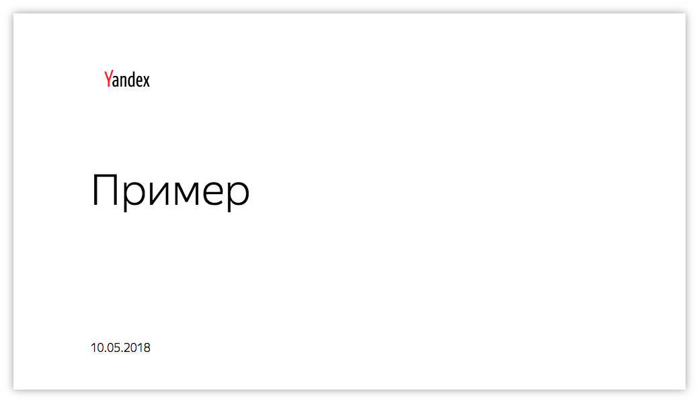
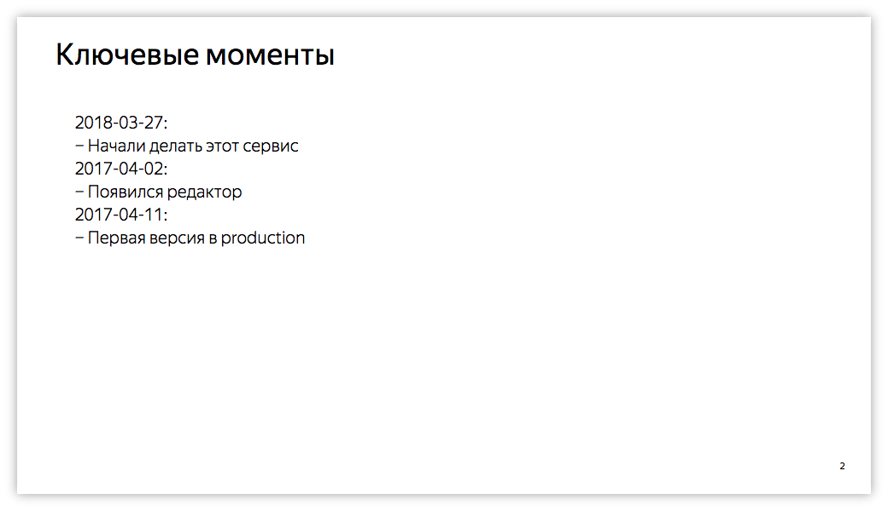
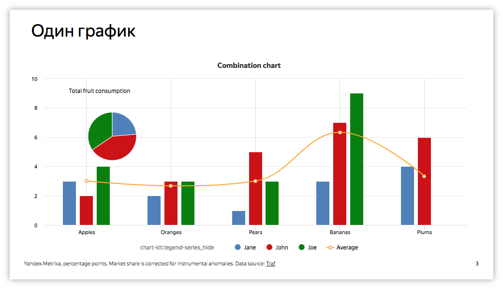
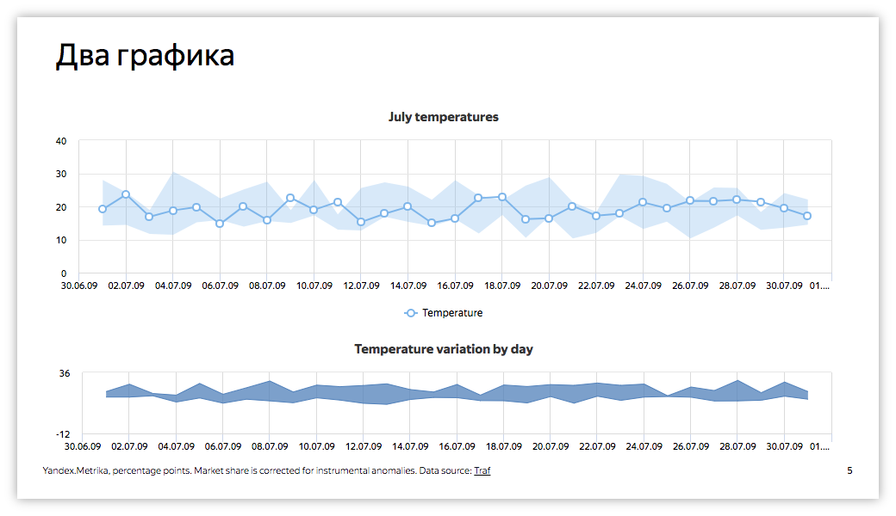
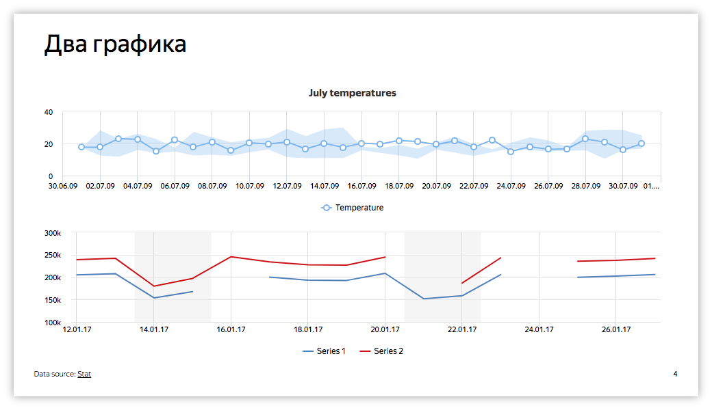
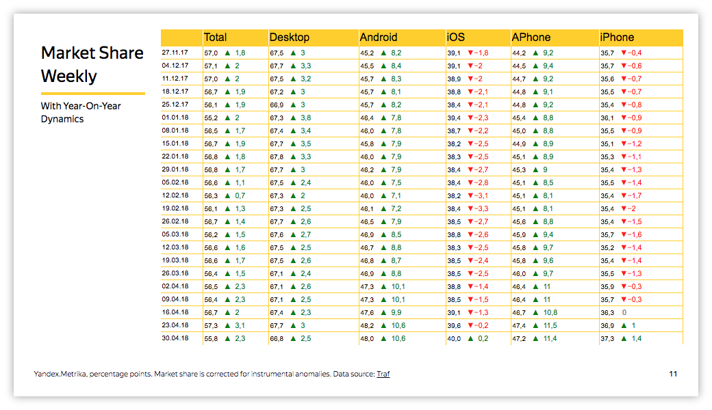

# Шаблоны

Шаблон представляет собой объект с информацией для рендеринга какой-либо презентации.
Он имеет общие поля вроде имени, логина создателя, etc. Самое главное – код шаблона. Это JSON код,
по которому будет рендериться презентация. Шаблоны бывают **публичные** или **приватные**.

#### Публичный {#public}

**Публичный** шаблон видят все пользователи. Все могут редактировать его текст и рендерить его. Но только создатель может редактировать имя, удалять и менять на **приватный**.

#### Приватный {#private}

**Приватный** видит только создатель. Соответственно все манипуляции с ним может делать только он.

### Слайды {#slides}

Шаблон состоит из слайдов. Код шаблона выглядит примерно так:
```json
{
  "slides": [
    ...
  ]
}
```

Слайды нумеруются автоматически.

Каждый элемент массива `slides` описывает слайд. Ниже описаны существующие типы слайдов.
Если вам необходим новый тип слайда, сообщите об этом разработчику.

### Title {#title}

Title служит для генерирования титульной страницы презентации. Не нумеруется.

|Параметр|Тип|Описание
|:---|:---|:---
|title*|String|Отображаемый текст

\* -- обязательные параметры

Пример:
```json
{
    "type": "Title",
    "props": {
      "title": "Пример"
    }
}
```



### Comments {#comments}

Comments служит для генерирования страницы с комментариями по презентации.

|Параметр|Тип|Описание
|:---|:---|:---
|title*|String|Заголовок слайда
|comments*|Array or String|Если массив, то отображаемый текст построчно. Если строка, то путь к текстовому ChartKit виджету, текст из которого будет отображен.

\* -- обязательные параметры

Пример:
```json
{
  "type": "Comment",
  "props": {
    "title": "Ключевые моменты",
    "comments": [
      "2018-03-27:",
      "− Начали делать этот сервис",
      "2017-04-02:",
      "− Появился редактор",
      "2017-04-11:",
      "− Первая версия в production"
    ]
  }
}
```


### OneChart {#oneChart}

OneChart служит для генерирования страницы с одним графиком (на всю страницу).

|Параметр|Тип|Описание
|:---|:---|:---
|title*|String|Заголовок слайда
|source*|String|Путь к графику
|footer|String|Содержимое футера

\* -- обязательные параметры

Пример:
```json
{
    "type": "OneChart",
    "props": {
      "title": "Один график",
      "source": "/preview/editor/Examples/visual-types/combo-chart"
    }
}
```


### TwoCharts {#twoCharts}

TwoCharts служит для генерирования страницы с двумя графиками (один под другим).

|Параметр|Тип|Описание
|:---|:---|:---
|title*|String|Заголовок слайда
|upperSource*|String|Путь к верхнему графику
|lowerSource*|String|Путь к нижнему графику
|upperHeight|Number|Высота верхнего графика в пикселях
|lowerHeight|Number|Высота нижнего графика в пикселях
|footer|String|Содержимое футера

\* -- обязательные параметры

Пример:
```json
{
  "type": "TwoCharts",
  "props": {
    "title": "Два графика",
    "upperSource": "/preview/editor/Examples/visual-types/area-range-line",
    "lowerSource": "/preview/editor/Examples/visual-types/area-range"
  }
}
```


Пример c дополнительными опциями:
```json
{
  "type": "TwoCharts",
  "props": {
    "title": "Два графика",
    "upperSource": "/preview/editor/Examples/visual-types/area-range-line",
    "lowerSource": "/preview/editor/Examples/line-connect-nulls-false",
    "upperHeight": 210,
    "lowerHeight": 210,
    "footer": "Data source: <a href='https://stat.yandex-team.ru'>Stat</a>"
  }
}
```


### Table {#table}

Table служит для генерирования страницы с таблицей.

|Параметр|Тип|Описание
|:---|:---|:---
|title*|String|Заголовок слайда
|footer|String|Содержимое футера

\* -- обязательные параметры

Пример:
```json
{
  "type": "Table",
  "props": {
    "title": "Market Share Weekly",
    "source": "/preview/editor/dalamar/share_table?scale=w",
    "text": "With Year-On-Year Dynamics"
  }
}
```

