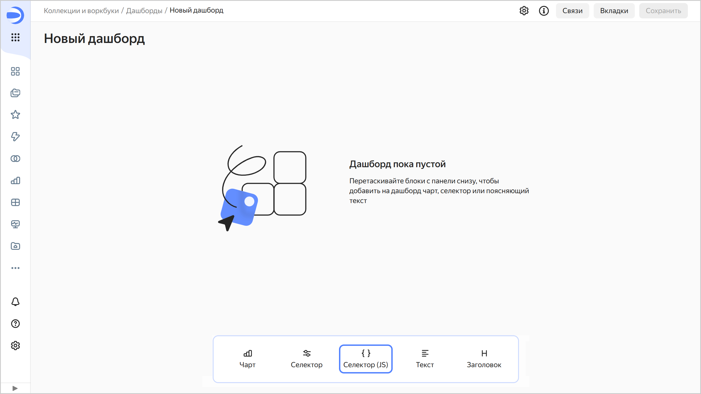
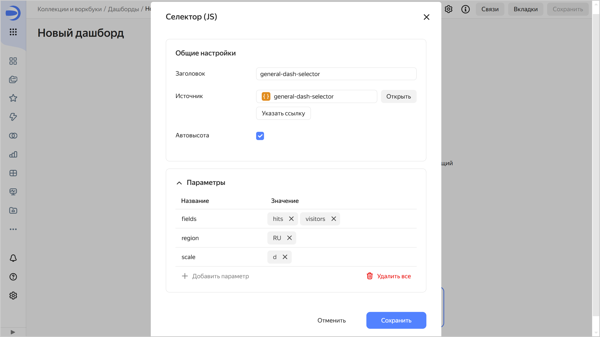

# Добавление селектора JS на дашборд



Перед добавлением селектора убедитесь, что у вас есть право доступа `{{ permission-write }}` или `{{ permission-admin }}` на дашборд. Подробнее в разделе [{#T}](../../security/manage-access.md).

Чтобы добавить [селектор](./widgets/controls.md) на дашборд:

1. На панели слева нажмите  **Дашборды** и выберите нужный дашборд.
1. В верхней части страницы нажмите **Редактировать**.
1. На панели в нижней части страницы выберите виджет **Селектор (JS)**.

   

1. Укажите параметры селектора:

   * **Заголовок** — используется для выбора селектора при установлении связи с другими виджетами.
   * **Источник** — задает селектор, созданный в Editor. Выберите селектор:

     

     - Из списка объектов

       Нажмите **Выбрать** и выберите селектор из списка объектов. Если селектор уже выбран, вы можете перейти к его редактированию. Для этого нажмите **Открыть** справа от селектора.

     - По ссылке

       Нажмите **Указать ссылку**. В поле ввода вставьте ссылку на нужный селектор и ниже нажмите **OK**.

     

   * **Автовысота** — включает автоматическую высоту для виджета на дашборде.
   * **Параметры** — устанавливает список параметров селектора и их значения по умолчанию. Для корректной работы виджета укажите здесь параметры селектора, перечисленные на вкладке [Params](./tabs.md#params).

     

1. Нажмите **Добавить**. Виджет отобразится на дашборде.
