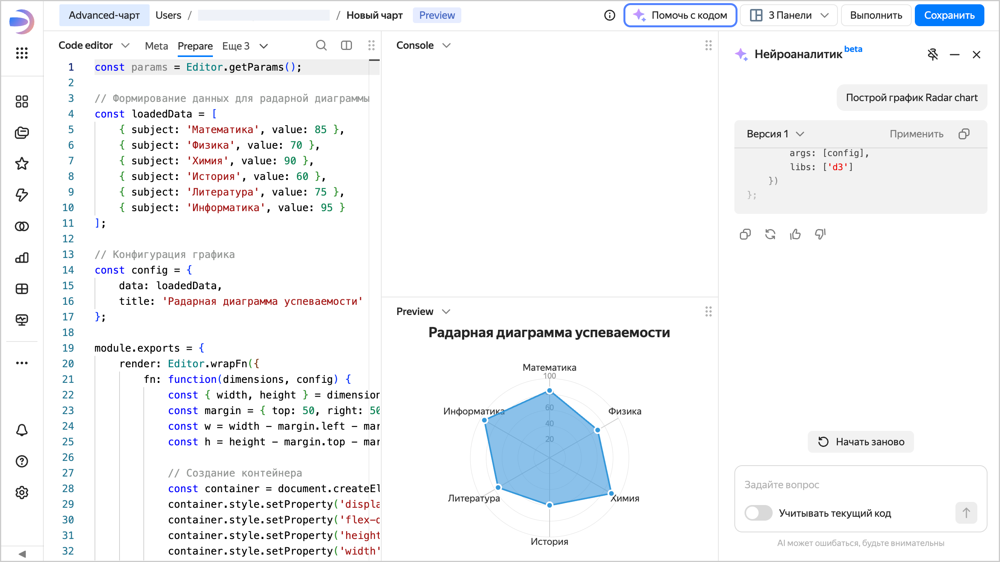

# Нейроаналитик в Editor



Функциональность находится на стадии бета-тестирования.





Нейроаналитик ускоряет и упрощает создание и редактирование визуализаций в Editor. Доступен для трех типов визуализаций: [Таблица](./widgets/table.md), [Markdown](./widgets/markdown.md) и [Advanced-чарт](./widgets/advanced.md). Нейроаналитик работает только с вкладкой **Prepare**.

Чтобы включить Нейроаналитик, в Editor вверху нажмите кнопку **Помочь с кодом** — справа откроется вкладка **Нейроаналитик**.





AI-помощник в Editor поможет создать чарты с нуля, оптимизировать структуру, исправить ошибки. Просто детально опишите график, который хотите получить, а AI поможет реализовать его в коде.

Используйте опции:

* Внизу вкладки включите опцию **Учитывать код** — помощник проанализирует ваш текущий код на вкладке [Prepare](./tabs.md#prepare) и предложит контекстные правки.
* Внизу вкладки нажмите кнопку **Применить**, чтобы заменить содержимое вкладки **Prepare** на код, который сгенерировал AI. Вы сразу увидите разницу между текущими изменениями и сохраненной версией.



Изменения, внесенные через Нейроаналитик, пока не сохраняются в локальной истории Editor. Чаще сохраняйте черновые версии, чтобы не потерять прогресс.

