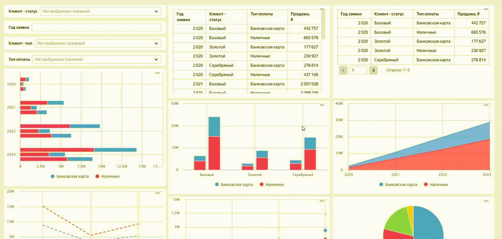
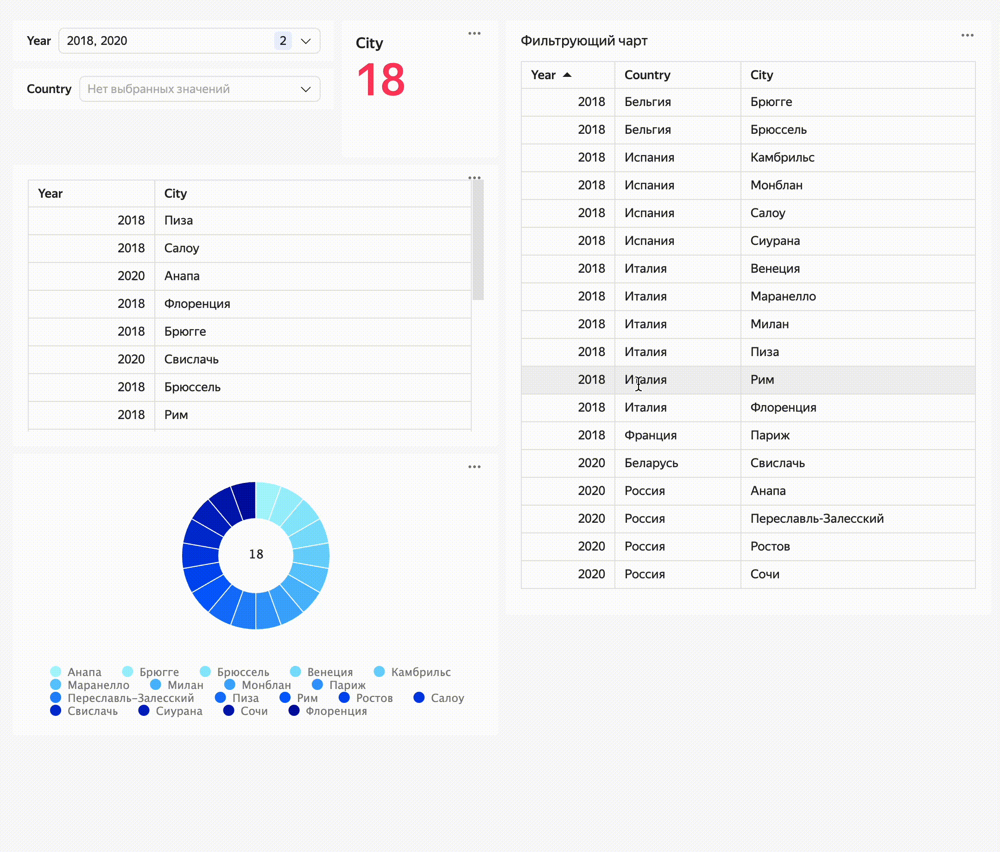

# Кросс-фильтрация

Фильтрующие параметры используются для фильтрации чартов чартами. В этом случае один чарт работает как селектор для других чартов.

Когда фильтрующий чарт открывается с дашборда для редактирования или в новой вкладке, фильтрующие параметры подсвечиваются.

По умолчанию при открытии фильтрующего чарта из панели навигации фильтрация не работает. Для отладки можно добавить в `url` страницы зарезервированный параметр `_action_params=1`.

* Фильтрация чартом других чартов:

  

* Фильтрация таблицей других чартов:

  

#### Пример {#example}

* [Фильтрация для визуализации Таблица](https://datalens.yandex/uw4m2h7evlwog?tab=Ow#Таблица)

* [Фильтрация для визуализации График (Gravity Charts)](https://datalens.yandex/uw4m2h7evlwog-primery-iz-dokumentacii-dlya-editor?tab=Ow#График%20Gravity%20Сharts)

* [Фильтрация для визуализации Advanced-чарт](https://datalens.yandex/uw4m2h7evlwog?tab=Ow#Advanced%20чарт)
