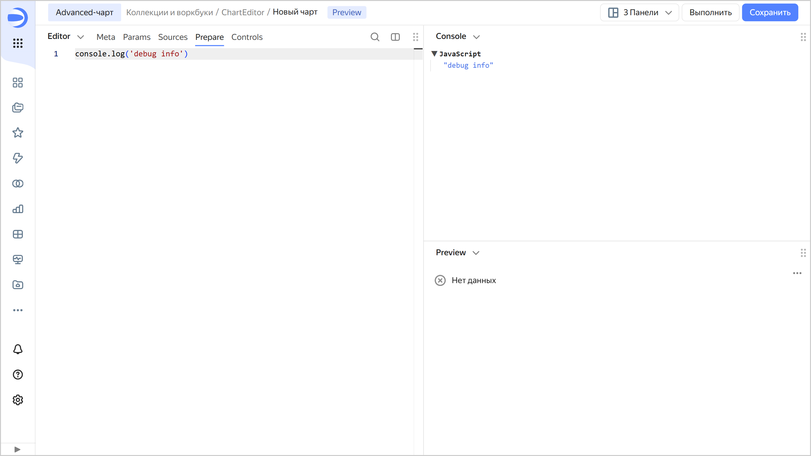

# Отладка чартов в Editor

Отладочная информация и ошибки при исполнении чарта доступны на панели **Console**.

Чтобы вывести дополнительную информацию в нужном месте кода, используйте функцию `console.log(value)`. Код в функциях, обернутых в `Editor.wrapFn`, исполняется на клиенте. При использовании `console.log` внутри этих функций логи будут выводиться в консоль браузера.
