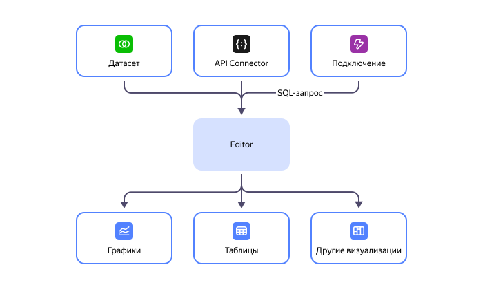
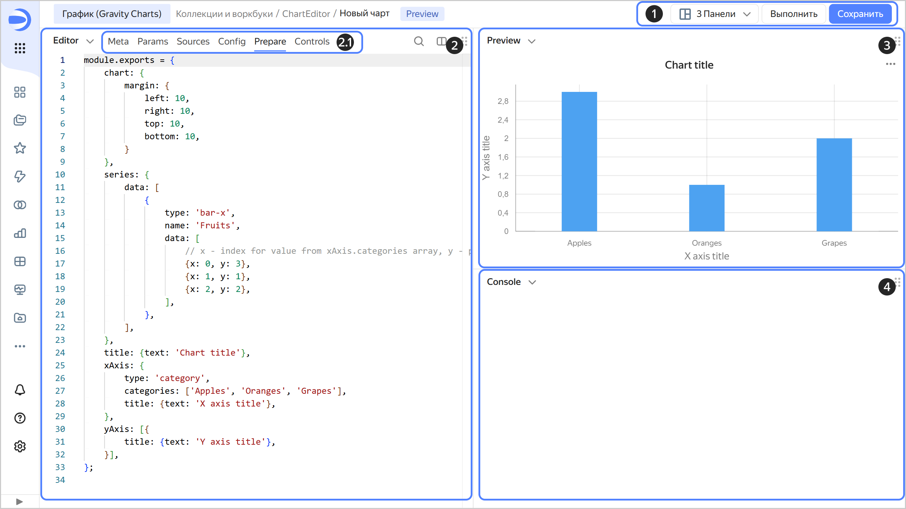

# Чарты в Editor



**Editor** — редактор для создания визуализации данных и селекторов с помощью кода на JavaScript. Editor позволяет загружать данные из одного или нескольких источников, управлять параметрами чартов и настраивать визуализации. В качестве источников данных вы можете использовать датасеты и подключения.

## Интерфейс {#interface}

Интерфейс страницы создания чарта состоит из следующих блоков:

1. Контролы:

   * Управление панелями интерфейса — вы можете выбрать количество и расположение панелей интерфейса. Для каждой панели доступно отображение **CodeEditor**, **Preview** или **Console**.
   * Обновление превью чарта — после каждого изменения кода чарта для просмотра результата нажимайте **Выполнить** или сочетание клавиш `Ctrl` (`Cmd`) + `Enter`. Это действие не приводит к сохранению чарта.
   * Сохранение чарта — вы можете сохранить чарт как обычно или создать черновую версию.

1. Панель редактора кода **CodeEditor** — для просмотра и изменения содержимого вкладок чарта. Подробнее о работе вкладок (2.1 на скриншоте) см. в разделе [{#T}](./tabs.md).

1. Панель предпросмотра чарта **Preview**.
1. Панель вывода дополнительной отладочной информации **Console**.

Если Editor открыт с указанием параметров в URL, под панелью контролов появится панель с переопределенными параметрами.

#### Что дальше {#see-also}

* [{#T}](./quickstart/index.md)
