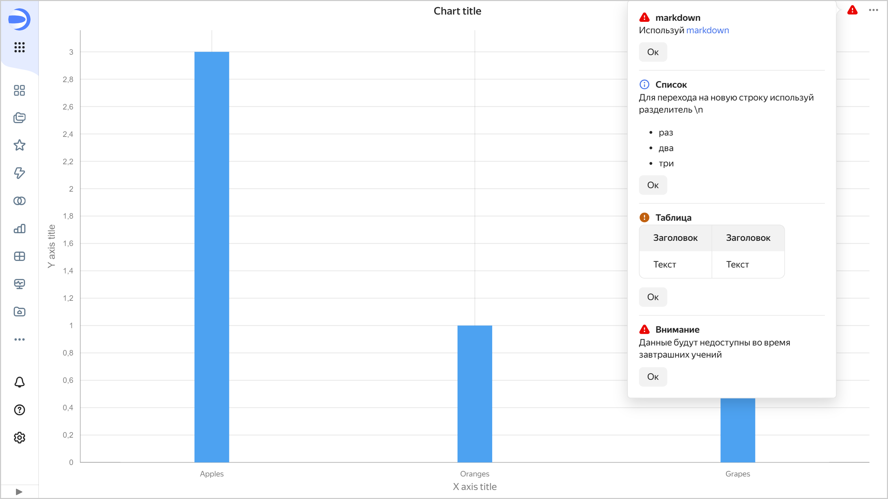

# Уведомления



Чтобы сообщить информацию пользователю, просматривающему ваш чарт, используйте механизм уведомлений в Editor.

* [Добавление уведомления в чарт](#add-notification-to-chart)
* [Ограничения](#restrictions)

## Добавление уведомления в чарт {#add-notification-to-chart}

Чтобы создать уведомление, используйте метод [Editor.setChartsInsights(args)](./methods.md#set-insights) на вкладке [Prepare](./tabs.md#prepare).

Значок уведомления отображается в правом верхнем углу чарта рядом со значком . При нажатии на этот значок вы увидите все уведомления, которые не скрыты. Чтобы скрыть уведомление, нажмите **Ок**. Уведомление не будет отображаться у вас следующие две недели, а потом появится снова. Видимость уведомления для других пользователей не изменится.

Значок уведомления зависит от типа уведомления: `critical`, `warning` и `info`. Если в чарт добавлено более одного уведомления, в свернутом виде будет отображен только значок уведомления с максимальным приоритетом. Например если есть уведомления уровня `critical`, `warning` и `info`, отображается значок `critical`, если `warning` и `info` — значок `warning`.

## Ограничения {#restrictions}

* Уведомление можно добавить только через Editor. Wizard и QL-чарты не поддерживают уведомления.
* Уведомление привязано к конкретному чарту. Если необходимо разместить одно и то же уведомление для разных графиков, добавьте его на вкладку [Prepare](./tabs.md#prepare) в коде каждого графика.
* Нет возможности добавить уведомление для [селекторов](./widgets/controls.md).
* Нет возможности выбрать пользователя, которому показывать уведомление: сообщение увидят все пользователи.
* Скрыть уведомление можно только на две недели.
* Пользователь может скрыть уведомление только для себя. Для других пользователей видимость его не изменится.
* Нет возможности настроить период повторного отображения уведомления.
* Нет возможности показать уведомление заданное число раз для конкретного пользователя.
* Значок уведомления появляется только после отрисовки графика или появления ошибки. Нельзя настроить вывод уведомления только при получении ошибки.

#### Пример {#notification-example}

[Пример чарта с уведомлениями](https://datalens.yandex/nvkfwnekf9xy9#Editor.%20setChartsInsights(args))
