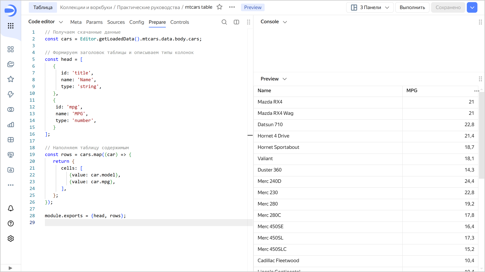

# Построение таблицы на основе API Connector

Следуя данной инструкции, вы построите в Editor таблицу на основе подключения API Connector.

В качестве источника данных будет использоваться статичный JSON-файл, расположенный по адресу: `https://storage.yandexcloud.net/datalens-public-demo-assets/data/mtcars.json`, однако в случае с полноценными API процесс будет аналогичен.

## Перед началом работы {#before-you-begin}



## Создайте воркбук {#create-workbook}

1. Перейдите на [главную страницу]({{ link-datalens-main }}) {{ datalens-short-name }}.
1. На панели слева выберите  **Коллекции и воркбуки**.
1. В правом верхнем углу нажмите **Создать** → **Создать воркбук**.
1. Введите название [воркбука](../../../workbooks-collections/index.md) — `Практические руководства`.
1. Нажмите кнопку **Создать**.

## Создайте подключение API Connector {#create-api-connector}

1. Перейдите в созданный на предыдущем шаге воркбук и нажмите **Создать** → **Подключение**.

1. В разделе **Файлы и сервисы** выберите **API Connector**.

1. Укажите параметры подключения:

   * **Имя хоста** — `storage.yandexcloud.net`;
   * **Порт** — `443`;
   * **URL путь** — `datalens-public-demo-assets/data/`.

   Остальные параметры оставьте без изменений. 
   
1. Нажмите **Создать подключение**. Введите название подключения и нажмите **Создать**.

1. Перейдите в воркбук `Практические руководства` и на вкладке **Подключения** найдите созданное подключение.

1. Скопируйте идентификатор подключения: рядом с ним нажмите на  → **Копировать ID**. Идентификатор будет скопирован в буфер обмена.

## Создайте чарт в Editor {#create-chart}

1. В воркбуке в правом верхнем углу нажмите **Создать** → **Чарт в Editor**. На открывшейся странице выберите тип визуализации **Таблица**.

1. Свяжите чарт с подключением: для этого перейдите на вкладку **Meta** и добавьте ID подключения в `links`:

   ```javascript
   {
       "links": {
   	     "mtcars": "<id_подключения>"
       }
   }
   ```

   Где:
   * `<id_подключения>` — идентификатор подключения, скопированный на предыдущем шаге.
   * `mtcars` — произвольное имя-алиас, которое вы присваиваете подключению, с помощью которого запрашиваете данные для чарта из источника.

   
   
   Вкладка **Meta** нужна для описания служебной информации о списке связанных сущностей. Эта информация используется для определения, с какими подключениями и датасетами связан чарт, а также для диалога связанных объектов, при копировании воркбука и при публикации в Public.

   

1. Получите данные из источника. Для этого перейдите на вкладку **Source** и укажите:

   ```javascript
   module.exports = {
       mtcars: {

		   // Указываем, в какое подключение ходим за данными
		   // Используем тут имя, которое мы дали подключению на табе Meta
           apiConnectionId: Editor.getId("mtcars"),

		   // Указываем путь до API-метода/страницы в источнике
           path: "/mtcars.json",

		   // Метод запроса
           method: "GET",
       }
   };
   ```

1. Очистите содержимое вкладки **Config**: она содержит шаблон, не относящийся к нашему примеру.

1. На вкладке **Prepare** сформируйте таблицу:

   ```javascript
   // Получаем скачанные данные
   const cars = Editor.getLoadedData().mtcars.data.body.cars;

   // Формируем заголовок таблицы и описываем типы колонок
   const head = [
      {
         id: 'title',
         name: 'Name',
         type: 'string',
      },
      {
      	id: 'mpg',
      	name: 'MPG',
      	type: 'number',
      }
   ];

   // Наполняем таблицу содержимым
   const rows = cars.map((car) => {
      return {
         cells: [
            {value: car.model},
            {value: car.mpg},
         ],
      };
   });

   module.exports = {head, rows};
   ```

1. Вверху чарта нажмите **Выполнить**. В области предпросмотра отобразится простая таблица, которая выводит данные, получаемые из JSON API.

   

1. Чтобы сохранить чарт, в правом верхнем углу нажмите **Сохранить** и введите название чарта.