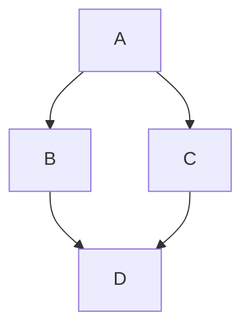
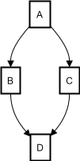

# Markdown

Визуализация для отрисовки Markdown — упрощенного языка разметки.

Поддерживается язык разметки [GitHub Flavored Markdown (GFM)](https://github.github.com/gfm/), за исключением вставок raw HTML , части плагинов и функциональности [Yandex Flavored Markdown](https://diplodoc.com/docs/ru/index-yfm).

Для отрисовки чарта используется библиотека [@diplodoc/transform](https://www.npmjs.com/package/@diplodoc/transform). Подробнее см. [документацию Diplodoc](https://diplodoc.com/docs/ru/tools/transform/).

## Доступные элементы разметки {#about-markdown}

- [Структура на вкладке Prepare](#prepare)
- [Разметка Markdown](#about-markdown)
    - [Заголовки](#headers)
    - [Начертания](#text-styles)
    - [Цвет текста](#text-color)
    - [Списки](#lists)
        - [Неупорядоченный список](#unordered-list)
        - [Упорядоченный список](#ordered-list)
    - [Таблицы](#tables)
    - [Каты](#cuts)
    - [Вкладки](#tabs)
    - [Аккордеон](#accordion)
    - [Ссылки](#links)
    - [Вставка кода](#code)
    - [Изображения](#images)
    - [Эмодзи](#emoji)
    - [Диаграммы Mermaid](#mermaid)
    - [Всплывающие подсказки](#term)

## Структура на вкладке Prepare {#prepare}

В результате выполнения вкладки **Prepare** должны быть экспортированы данные для отрисовки Markdown.

### Доступные методы {#available-methods}

* **`Editor.getParams()`** — возвращает объект с нормализованными параметрами.

* **`Editor.getLoadedData()`** — возвращает объект с данными, запрошенными на вкладке **Sources**.


### Пример {#example}

```js
// формируем текст

const inline = 'Для вставки кода внутри предложений нужно заключать этот код в апострофы'
                + '`<html class="ie no-js">`.';

const text = `
# Заголовок h1
## Заголовок h2
### Заголовок h3
#### Заголовок h4

${inline}
`;

// экспортируем данные для отрисовки
module.exports = {
    markdown: text
};
```

## Разметка Markdown {#about-markdown}

### Заголовки {#headers}

Чтобы создать заголовок, используйте знак (#), например:

```markdown
# Заголовок h1
## Заголовок h2
### Заголовок h3
#### Заголовок h4
```

Заголовок страницы оформляется h1-заголовком. Далее — разделы (h2) и подразделы по уровням вложенности.  Нельзя пропускать вложенность заголовков.

### Начертания {#text-styles}

Чтобы задать для текста **полужирное начертание**, заключите его в двойные звездочки:

```markdown
Этот текст **жирный**.
```

Чтобы задать для текста _курсивное начертание_, заключите его в знаки подчеркивания:

```markdown
Этот текст _наклонный_.
```

Чтобы задать для текста _**полужирное и курсивное**_ начертание, заключите его одновременно в двойные звездочки и знаки подчеркивания:

```markdown
Этот текст _**жирный и наклонный**_.
Этот текст **_жирный и наклонный_**.
```

Чтобы сделать текст ~~зачеркнутым~~, заключите его в две тильды (~~):

```markdown
Этот текст ~~зачеркнутый~~.
```

Чтобы сделать текст <u>подчеркнутым</u>, заключите его в два плюса (++):

```markdown
Этот текст ++подчеркнутый++.
```

Чтобы сделать текст в <sub>нижнем</sub> регистре, заключите его в знаки тильды (~):

```markdown
Этот текст в ~нижнем~ регистре.
```

Чтобы сделать текст в ^верхнем^ регистре, заключите его в знаки (^):

```markdown
Этот текст в ^верхнем^ регистре.
```

Чтобы сделать текст <samp>моноширинный</samp>, заключите его в знаки (##):

```markdown
Этот текст ##моноширинный##.
```

Чтобы сделать <mark>выделенный</mark> текст, заключите его в два знака равно (==):

```markdown
Этот текст ==выделенный==.
```

### Цвет текста {#text-color}

Вы можете задать цвет текста с помощью форматирования: `{цвет}(текст)`. Поддерживаются следующие значения цвета:

* gray — серый;
* yellow — желтый;
* orange — оранжевый;
* red — красный;
* green — зеленый;
* blue — синий;
* violet — фиолетовый.

Например, следующая разметка:

```markdown
Этот текст {green}(зеленого) цвета.
```

будет отображаться так:

Этот текст <font color=green>зеленого</font> цвета.

### Списки {#lists}

#### Неупорядоченный список {#unordered-list}

Неупорядоченный (маркированный) список можно отформатировать с помощью звездочек (*), дефисов (-) или знаков плюс (+). Например, следующая разметка Markdown:

```markdown
- Элемент 1
- Элемент 2
- Элемент 3
```

будет отображаться как:

- Элемент 1
- Элемент 2
- Элемент 3

Чтобы вложить один список в другой, добавьте отступ для элементов дочернего списка. Разметка:

```markdown
- Элемент 1
  - Элемент A
  - Элемент B
- Элемент 2
```

будет отображаться как:

- Элемент 1
  - Элемент A
  - Элемент B
- Элемент 2

#### Упорядоченный список {#ordered-list}

Упорядоченный (ступенчатый) список можно отформатировать с помощью соответствующих цифр. Разметка:

```
1. Первый пункт
1. Второй пункт
1. Третий пункт
```

будет отображаться как:

1. Первый пункт
2. Второй пункт
3. Третий пункт

Чтобы вложить один список в другой, добавьте отступ для элементов дочернего списка. Например:

```
1. Первый пункт
    1. Вложенный пункт
    1. Вложенный пункт
1. Второй пункт
```

### Таблицы {#tables}

Таблицы не входят в основную спецификацию Markdown, но их поддерживает GFM. Создавать таблицы можно с помощью символов вертикальной черты `|` и дефиса `-`. Дефисы позволяют создавать для каждого столбца заголовок. Вертикальные черты разделяют столбцы. Чтобы таблица правильно отображалась, добавьте перед ней пустую строку.

Разметка:

```markdown
Колонка по левому краю | Колонка по правому краю | Колонка по центру
:--- | ---: | :---:
Текст | Текст | Текст
```

будет отображаться как:

Колонка по левому краю | Колонка по правому краю | Колонка по центру
:--- | ---: | :---:
Текст | Текст | Текст

Если необходимо добавить в ячейку таблицы перенос строки или более сложный элемент (например, список или блок кода), воспользуйтесь альтернативной разметкой:
```
#|
|| **Заголовок1** | **Заголовок2** ||
|| Текст | Текст ||
|#
```

Пример разметки с переносами и списком:
```
#|
||Текст
на двух строчках
|
- Пункт 1
- Пункт 2
- Пункт 3
- Пункт 4||
|#
```
См. подробнее в [документации YFM](https://ydocs.tech/ru/syntax/tables/multiline).


### Каты {#cuts}

Используйте каты, чтобы скрыть часть контента, например дополнительную информацию или длинные блоки кода.

Разметка:

```markdown



Контент, который отобразится по нажатию.



```

будет отображаться так:



Контент, который отобразится по нажатию.



### Табы {#tabs}

Используйте табы для взаимоисключающих разделов. Например, чтобы разделить инструкции для разных ОС.

Разметка:

```markdown



- Название таба 1

  Текст таба 1.

  * Можно использовать списки.
  * И **другую** разметку.

- Название таба 2

  Текст таба 2.



```

будет отображаться так:



- Название таба 1

  Текст таба 1.

  * Можно использовать списки.
  * И **другую** разметку.

- Название таба 2

  Текст таба 2.



Чтобы элемент был раскрыт по умолчанию, добавьте к нему атрибут `{selected}`:

Разметка:

```markdown



- Название таба 1

  Текст таба 1.

- Название таба 2 {selected}

  Пункт будет открыт по умолчанию.

- Название таба 3

  Текст таба 3.



```

будет отображаться так:



- Название таба 1

  Текст таба 1.

- Название таба 2 {selected}

  Пункт будет открыт по умолчанию.

- Название таба 3

  Текст таба 3.



### Аккордеон {#accordion}

Аккордеон позволяет свернуть или раскрыть содержимое по вашему выбору и подходит для организации больших объемов информации.

Разметка:

```markdown


- Название пункта 1

  Контент для пункта 1.

- Название пункта 2

  Контент для пункта 2.
 
- Название пункта 3

  Контент для пункта 3.


```

будет отображаться так:



- Название пункта 1

  Контент для пункта 1.

- Название пункта 2

  Контент для пункта 2.
 
- Название пункта 3

  Контент для пункта 3.



Чтобы элемент был раскрыт по умолчанию, добавьте к нему атрибут {selected}.

Разметка:

```markdown


- Название пункта 1

  Контент для пункта 1.

- Название пункта 2 {selected}

  Пункт будет открыт по умолчанию.
 
- Название пункта 3

  Контент для пункта 3.


```

будет отображаться так:



- Название пункта 1

  Контент для пункта 1.

- Название пункта 2 {selected}

  Пункт будет открыт по умолчанию.
 
- Название пункта 3

  Контент для пункта 3.




### Ссылки {#links}

Синтаксис Markdown для встроенной ссылки состоит из `[текста ссылки] и `(URL-адреса)` :

`[DataLens](https://datalens.ru)`

[{{ datalens-short-name }}]({{ link-datalens-main }})

### Вставка кода {#code}

Markdown поддерживает как встраивание фрагментов кода в предложение, так и их размещение между предложениями в виде отдельных огражденных блоков.

```js
const a = 10;
```

Такая вставка преобразуется в код с подсветкой.

```js
const a = 10;
```

Код внутри строки `<html class="ie no-js">`.

```markdown
Для вставки кода внутри предложений нужно заключать этот код в апострофы `<html class="ie no-js">`.
```

### Перенос строки

Для переноса строки внутри абзаца нужно использовать два пробела ⋅⋅ в конце строки.

### Всплывающие подсказки {#term}

Всплывающие подсказки позволяют при нажатии на термине отображать связанное с ним по ключу термина определение. Разметка:

```markdown

[*term_key]: Определение термина, которое может включать в себя _базовую_ разметку:
* списки;
* ссылки;
* картинки и т.д.


Использование [термина](*term_key) в тексте.

```

будет отображаться так:

Использование `[термина](*term_key)` в тексте.



На данный момент использование всплывающих подсказок в блоках кода возможно, только если у блока кода не указан язык.



### Изображения {#images}

```markdown

```


### Эмодзи {#emoji}

Чтобы добавить эмодзи, введите ключевое слово и добавьте с двух сторон двоеточие (:). Список доступных ключевых слов можно посмотреть в визуальном редакторе.

Например, следующая разметка:

```markdown
Эмодзи :smiley:.
```

будет отображаться так:

Эмодзи 😀.

### Диаграммы Mermaid {#mermaid}

Mermaid — библиотека для создания диаграмм и блок-схем в браузере с помощью простого языка разметки. Она позволяет создавать диаграммы, используя синтаксис, похожий на Markdown.

Библиотека имеет множество встроенных шаблонов и функций для создания различных типов диаграмм, например: блок-схемы, графы, деревья, диаграммы Ганта, mind-карты, C4-диаграммы.

С помощью текстовых определений задается описание структуры, которое преобразуется в диаграмму. Разметка:

<pre><code>

</code></pre>

будет отображаться как:



См. подробнее в [документации Mermaid](https://mermaid.js.org/intro/).



При использовании Mermaid учитывайте следующие ограничения:

* отсутствует поддержка HTML;
* нельзя использовать атрибут `class` для стилизации диаграмм;
* нельзя использовать CSS-переменные для цветов;
* Markdown внутри блоков диаграмм поддерживается частично, например не работают ссылки.



## Примеры {#examples}


* [Markdown чарт с параметризацией](https://datalens.yandex/nvkfwnekf9xy9?tab=x6v#Markdown%20чарт%20с%20параметрами)
* [Диаграммы и блок-схемы Mermaid](https://datalens.yandex/nvkfwnekf9xy9?tab=x6v#Markdown%20чарт%20c%20Mermaid-диаграммами)

