# Агрегации в {{ datalens-short-name }}

В этом разделе описано, как работают агрегация и группировка данных в {{ datalens-short-name }}, как правильно формулировать выражения с агрегациями, а также приведены примеры SQL-запросов с использованием агрегации для {{ CH }}.

В качестве исходных данных будет использоваться файл [Selling.csv](https://storage.yandexcloud.net/doc-files/Selling.csv) с информацией о продажах в городах.

## Основные понятия из SQL {#basic-sql}

### Что такое агрегация {#what-is-aggregation}

В качестве исходных данных рассмотрим таблицу `Selling`, содержащую данные о продажах в городах:

| # | City | Category | Date | Sales | Profit | Day's discount |
| --- | --- | --- | --- | --- | --- | --- |
| 1 | Detroit | Office Supplies | 2014-01-02 |  10 | 7 | 0,05 |
| 2 | Portland | Office Supplies | 2014-04-05 | 14 | 10 | 0,00 |
| 3 | Portland | Office Supplies | 2014-01-21 | 20 | 12 | 0,20 |
| 4 | San Francisco | Office Supplies | 2014-03-11 | 8 | 3 | 0,10 |
| 5 | Detroit | Furniture | 2014-01-01 | 12 | 3 | 0,00 |
| 6 | Portland | Furniture | 2014-01-21 | 7 | 2 | 0,05 |
| 7 | San Francisco | Technology | 2014-01-02 | 7 | 3 | 0,10 |
| 8 | San Francisco | Technology | 2014-01-17 | 13 | 5 | 0,20 |

Агрегация применяется для расчета результирующих значений. Суть процесса агрегации — преобразовать большой набор строк в единственное значение. В SQL для этого применяются специальные агрегатные функции. К наиболее часто применяемым можно отнести функции `SUM`, `MIN`, `MAX`, `AVG` и `COUNT`. Каждая из этих функций оперирует значениями столбца некоторой таблицы и в результате создает единственное значение. Например, для функции `SUM` — это сумма всех значений в столбце, для функции `AVG` — среднее значение, для функции `MAX` — максимальное значение.

Различают два способа применения агрегатных функций, когда:

* агрегатные функции возвращают результирующее значение для [одной группы](#aggregation-without-group-by);
* агрегатные функции возвращают результирующее значение для [нескольких групп](#aggregation-with-group-by).

### Агрегация для одной группы {#aggregation-without-group-by}

В этом случае агрегатные функции рассчитывают и возвращают одно результирующее значение для всех строк, которые объединяются в единственную группу.

Например, чтобы получить сумму значений в столбце `Sales` из таблицы `Selling`, нужно выполнить запрос:

```sql
SELECT
    sum("Sales")
FROM "Selling"
```

Результат:

| Sales |
| --- |
| 91 |

### Агрегация для нескольких групп {#aggregation-with-group-by}

В этом случае весь набор строк, который возвращает запрос, разбивается на отдельные группы. Группа определяется значением столбца, по которому выполняется группировка. Агрегатные функции при таком способе рассчитывают и возвращают результирующее значение отдельно для каждой группы.

В SQL столбцы для группировки указываются в секции `GROUP BY`. Группировку можно производить как по одному столбцу, так и по нескольким.

**Примеры**

Вычисление суммы продаж по каждому городу:

```sql
SELECT
    "City",
    sum("Sales")
FROM "Selling"
GROUP BY "City"
```

Результат:

| City | Sales |
| --- | --- |
| Detroit | 22 |
| Portland | 41 |
| San Francisco | 28 |

Вычисление суммы продаж по каждому городу и категории товаров:

```sql
SELECT
    "City",
    "Category",
    sum("Sales")
FROM "Selling"
GROUP BY "City","Category"
```

Результат:

| City | Category | Sales |
| --- | --- | --- |
| Detroit | Office Supplies | 10 |
| Portland | Office Supplies | 34 |
| San Francisco | Office Supplies | 8 |
| Detroit | Furniture | 12 |
| Portland | Furniture | 7 |
| San Francisco | Technology | 20 |

### Ограничения {#sql-invalid-expressions}

При использовании агрегации с группировкой по нескольким группам нужно учитывать следующие ограничения:

* Столбцы, по которым делается выборка, должны быть указаны в секции `GROUP BY`:

    

    - Как можно

        ```sql
        SELECT
            "City",
            sum("Sales")
        FROM "Selling"
        GROUP BY "City"
        ```

    - Как нельзя

        ```sql
        SELECT
            "City",
            sum("Sales")
        FROM "Selling"
        GROUP BY "Category"
        ```
    
    

* Агрегированные и неагрегированные выражения нельзя использовать на одном уровне запроса:

    

    - Как можно

        ```sql
        SELECT
            "City",
            sum("Sales") as "Detroit Sales"
        FROM "Selling"
        WHERE "City" = 'Detroit'
        GROUP BY "City"

    - Как нельзя

        ```sql
        SELECT
            if("City" = 'Detroit', sum("Sales"), 0) as "Detroit Sales"
        FROM "Selling"
        GROUP BY "Category"
        ```
    
    
    
### Фильтрация {#aggregation-with-filter}

В запросах с использованием группировки и агрегатных функций можно применять фильтрацию. Фильтровать можно как исходный набор строк до агрегации, так и результирующие значения, которые вычисляют агрегатные функции.

Условия для фильтрации исходного набора строк указываются в секции `WHERE`:

```sql
SELECT
    "City",
    sum("Sales")
FROM "Selling"
WHERE "Category" = 'Furniture'
GROUP BY "City"
```

Результат:

| City | Sales |
| --- | --- |
| Detroit | 12 |
| Portland | 7 |

Для фильтрации агрегированных значений необходимо указать условие в секции `HAVING`. В этом случае запрос вернет только те строки, в которых результирующее значение агрегатной функции удовлетворяет заданному условию:

```sql
SELECT
    "City",
    "Category",
    sum("Sales")
FROM "Selling"
GROUP BY "City","Category"
HAVING sum("Sales") >= 10
```

Результат:

| City | Category | Sales |
| --- | --- | --- |
| Detroit | Office Supplies | 10 |
| Portland | Office Supplies | 34 |
| Detroit | Furniture | 12 |
| San Francisco | Technology | 20 |

## Агрегирование данных в {{ datalens-short-name }} {#datalens-aggregation}

### Измерения и показатели {#dimensions-and-measures}

В {{ datalens-short-name }} агрегация выполняется с помощью измерений и показателей.

[Показатель](dataset/data-model.md#field) — это поле датасета с заданным типом агрегации (например, сумма, среднее или количество). В датасете и в визарде показатели отображаются синим цветом. Обычно показатель — это бизнес-метрика, которая рассматривается в различных разрезах или группировках. Например, выручка, количество клиентов или средний чек.

[Измерение](dataset/data-model.md#field) — это поле датасета без указанной агрегации. Например, регион, продукт или категория. В датасете и в визарде измерения отображаются зеленым цветом. С помощью измерений выполняется группировка запроса в чарте (секция GROUP BY в SQL). Чтобы сгруппировать данные в чарте, необходимо перенести измерение в нужную секцию.

### Способы создания показателей {#create-measure}

Показатели можно добавлять как на уровне датасета, так и на уровне чарта. Предпочтительнее добавлять показатели на уровне датасета. Это позволяет переиспользовать их в разных чартах, а также ускорить отрисовку чарта.

#### Создание показателей на уровне датасета {#add-measure-in-dataset}

Добавить показатель на уровне датасета можно следующими способами:

  * В интерфейсе создания датасета на вкладке **Поля** выбрать тип агрегации для поля в столбце **Агрегация**.

      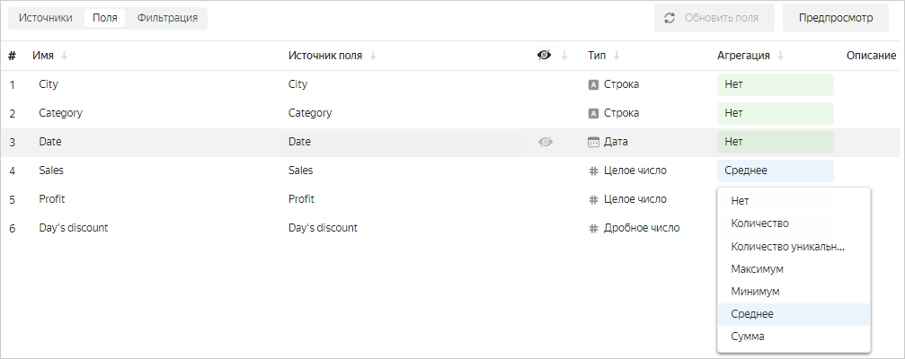

  * В интерфейсе создания датасета добавить [вычисляемое поле](calculations/index.md) с помощью [агрегатных функций](../function-ref/aggregation-functions.md). Подробнее в разделе [{#T}](calculations/index.md#how-to-create-calculated-field). В формуле вычисляемого поля можно использовать [подстановку ](#substituting-fields) других показателей.

      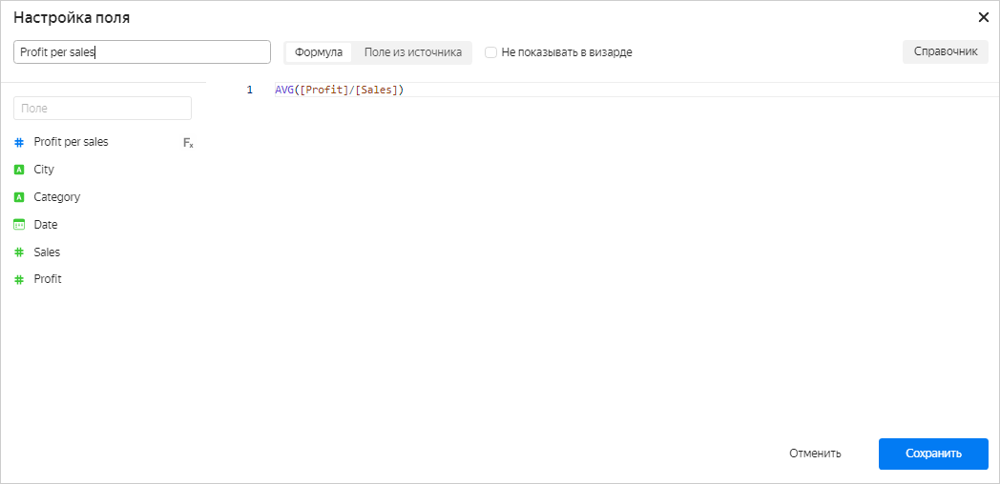

      При создании вычисляемого поля с помощью агрегатной функции ему присваивается тип агрегации **Авто**, который нельзя изменить.

#### Создание показателей на уровне чарта {#add-measure-in-chart}

Добавить показатель на уровне чарта можно следующими способами:

  * В визарде перетащить измерение в секцию для показателей и выбрать тип агрегации. Цвет поля при этом изменится с зеленого на синий.

      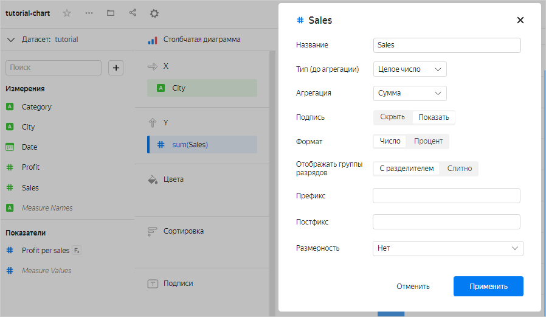
  
  * В визарде добавить [вычисляемое поле](calculations/index.md) с помощью [агрегатных функций](../function-ref/aggregation-functions.md). Подробнее в разделе [{#T}](calculations/index.md#how-to-create-calculated-field). В формуле вычисляемого поля можно использовать [подстановку ](#substituting-fields) других показателей.

Показатели могут состоять не только из одной агрегатной функции и иметь более сложные выражения. Например, в этом [чарте]({{ link-datalens-main }}/wizard/i55h82o0c6bgc) для расчета средней суммы продаж за день используется показатель `Sales per day`, вычисляемый по формуле `SUM([Sales])/COUNTD([Date])`.


### Использование измерений и показателей в чартах {#aggregation-in-charts}

При построении любого чарта в {{ datalens-short-name }} выполняется группировка и агрегация данных.
Рассмотрим таблицу [Selling](#what-is-aggregation), для которой необходимо посчитать сумму продаж (`Sales`) за все даты (`Date`) отдельно по каждому городу (`City`). Для этого нужно сгруппировать данные по полю `City`. При группировке строки объединяются таким образом, что в результате для каждого значения `City` будет ровно одна строка. Все исходные строки, где значения `City` совпадают и равны, образуют группу строк. В итоге получится три группы, по которым будет происходить суммирование значения `Sales`: 

* в группу `Detroit` попадут строки 1 и 5; 
* в группу `Portland` — строки 2, 3 и 6; 
* в группу `San Francisco` — строки 4, 7 и 8.

На примере чарта **Столбчатая диаграмма** результат будет выглядеть так:

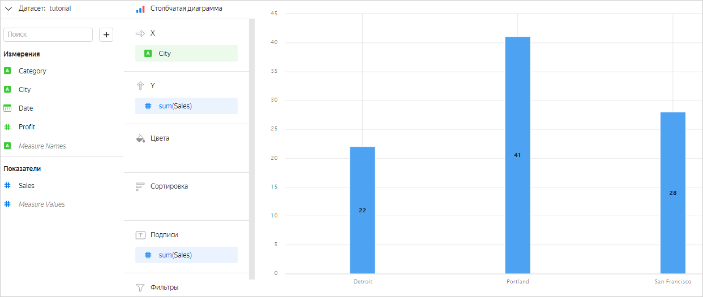

Можно сделать группировку не по одному полю, а по нескольким. Тогда каждая строка будет определяться набором значений всех полей, по которым производится группировка. Строк в конечном результате будет столько, сколько найдется уникальных наборов таких значений.
Например, при добавлении поля `Category` в секцию **Цвета** оно будет участвовать в группировке. Чарт будет выглядеть так:

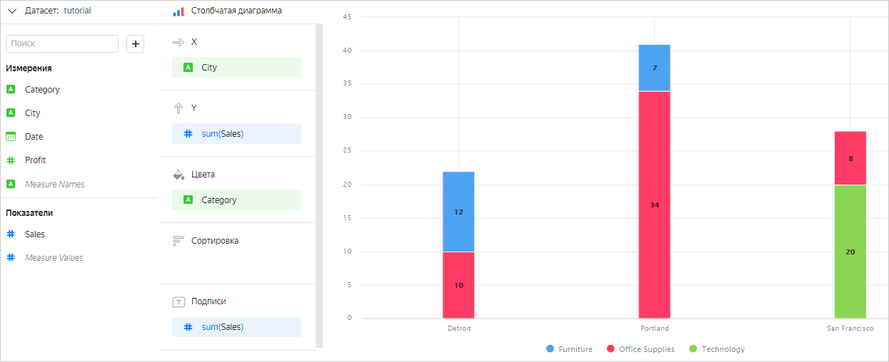



Измерения в секции **Цвета** также участвуют в группировке данных.



В некоторые секции чартов можно перенести только измерение или только показатель. Это зависит от [типа чарта](../visualization-ref/index.md). Например, в секцию **Y** [столбчатой диаграммы](../visualization-ref/bar-chart.md) можно перенести только показатель. Если перенести в эту секцию измерение, оно будет автоматически преобразовано в показатель с агрегацией **Количество уникальных**.

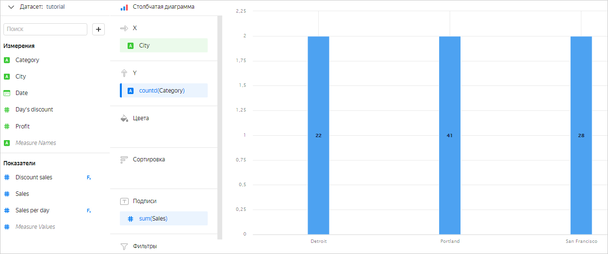

### Ограничения в выражениях {#datalens-invalid-expressions}

Как и в SQL, в {{ datalens-short-name }} вы не можете использовать в одном выражении агрегированные и неагрегированные значения.

Например, в [чарт]({{ link-datalens-main }}/wizard/i55h82o0c6bgc) с группировкой по измерениям `City` и `Category` нельзя добавить показатель `SUM([Sales]) * (1 - [Day's discount])` для расчета суммы продаж с учетом скидки. В этом случае измерения `City` и `Category` задают разбиение на группы, и поэтому имеют фиксированные значения в каждой группе. Для каждой группы можно рассчитать значение `SUM([Sales])`. Но поле `Day's discount` не является ни агрегацией, ни измерением в рамках группы. Оно не имеет фиксированного значения — в каждой строке группы оно может быть разным. Поэтому невозможно определить, какое конкретно значение поля `Day's discount` должно быть выбрано при вычислении показателя `SUM([Sales]) * (1 - [Day's discount])` для каждой группы. Получается, что выражение `SUM([Sales]) * (1 - [Day's discount])` вычислить невозможно. В {{ datalens-short-name }} в подобных случаях возникает ошибка `Inconsistent aggregation among operands`.

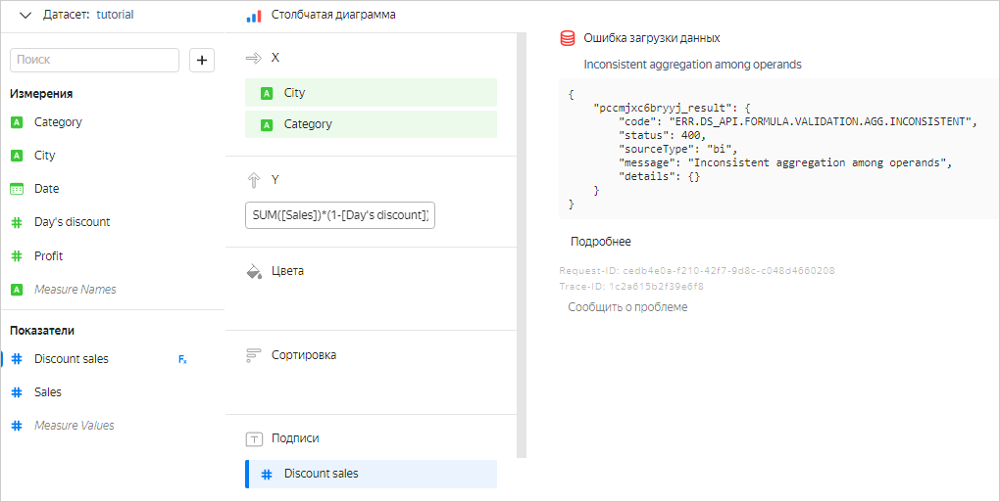

Этой ошибки можно избежать несколькими способами: 

  * Добавить поле `Day's discount` в секцию для измерений. В этом случае группировка будет происходить по измерениям `City`, `Category` и `Day's discount`, поэтому в каждой группе для расчета значения показателя `SUM([Sales]) * (1 - [Day's discount])` будет использоваться фиксированное значение поля `Day's discount`.

      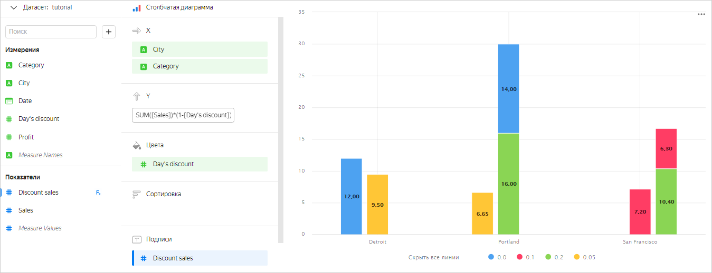

  * Указать тип агрегации для поля `Day's discount`. Тогда это поле станет показателем и исходная формула будет корректной.

      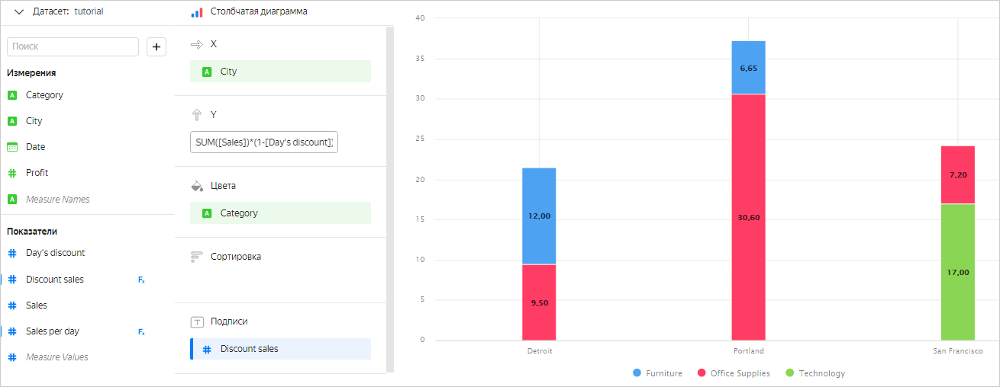

### Фильтрация измерений и показателей {#set-fiter}

В чартах можно фильтровать значения измерений и показателей. Для этого перенесите измерение или показатель в секцию **Фильтры** и задайте условия фильтрации:

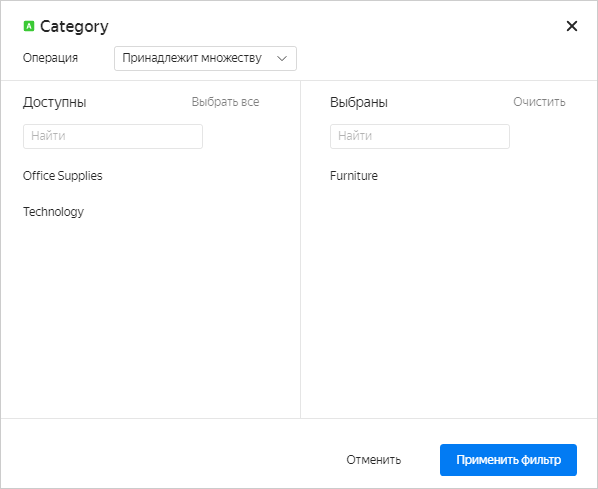

**Примеры**

Продажи по городам в категории `Furniture`:

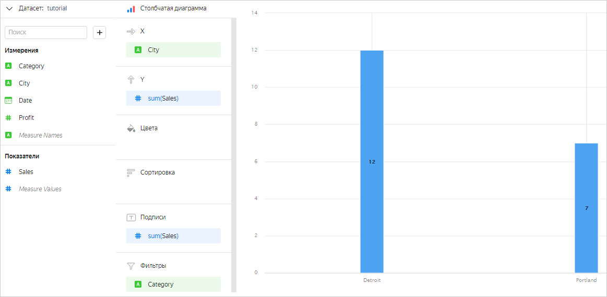

Продажи по городам и категориям, где показатель `SUM([Sales])` больше или равен 10:


### Подстановка полей {#substituting-fields}

При создании вычисляемых полей в формуле можно использовать уже созданные показатели. Эти показатели могут быть заданы как с помощью формулы, так и через интерфейс создания датасета. Создаваемое вычисляемое поле при этом получит тип агрегации **Авто**.

**Пример 1**

Поле `[TotalSales]` задано с помощью агрегатной функции `SUM([Sales])`. Тогда вычисляемое поле `[TotalSales]/10` будет иметь тип агрегации **Авто**.

При подстановке в вычисляемое поле показателя, заданного через интерфейс создания датасета, можно переопределить тип агрегации. Для этого используйте в формуле функцию с другим типом агрегации.

**Пример 2**

Для поля `[Sales]` в интерфейсе создания датасета указан тип агрегации **Сумма**. Тогда вычисляемое поле `AVG([Sales])` будет иметь тип агрегации **Авто** и рассчитываться как среднее. Агрегация **Сумма** при этом будет проигнорирована.
