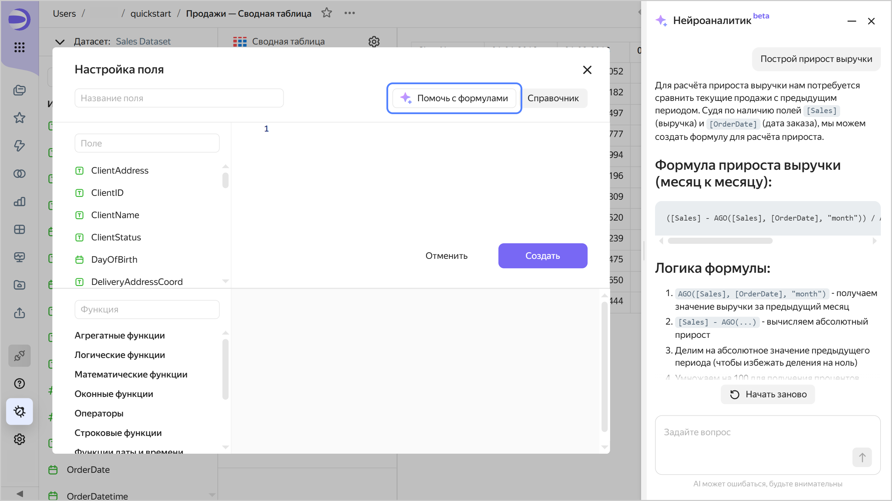

# Нейроаналитик для создания вычисляемых полей



Функциональность находится на стадии бета-тестирования.





Нейроаналитик ускоряет и упрощает создание и редактирование вычисляемых полей. Доступен в конструкторе вычисляемых полей на уровне чарта и датасета. С его помощью можно:

* быстро написать новую формулу;
* дополнить текущую формулу;
* разобраться в сложной логике формулы.

При работе в Нейроаналитике в качестве контекста передаются:

* текущая формула из конструктора;
* метаданные датасета;
* справочник функций;
* примеры вычисляемых полей.

Чтобы включить Нейроаналитик в датасете или чарте:

1. Откройте поле с формулой или добавьте новое.
1. Нажмите кнопку **Помочь с формулами** — справа откроется вкладка **Нейроаналитик**.

   * Выберите вопрос или задайте свой для поиска в документации.
   * Задайте вопрос по текущему датасету, например: «Построй прирост выручки». Нейроаналитик даст развернутый ответ, предложит возможные решения и примеры кода.

   

   

   

   Примеры запросов:

   * Построй регулярное выражение, которое вернет все цифры из поля «Номер заявки».
   * Построй прирост выручки.
   * Покрась отрицательные значения красным, а положительные — зеленым.
   * Расскажи, как работает текущая формула?