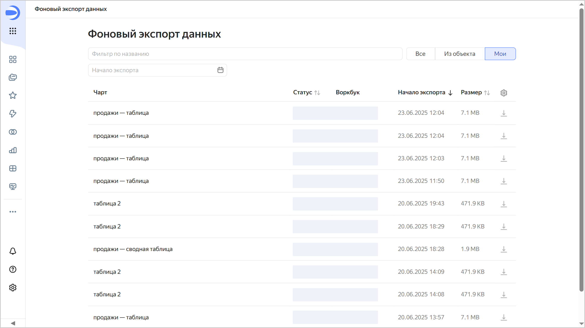
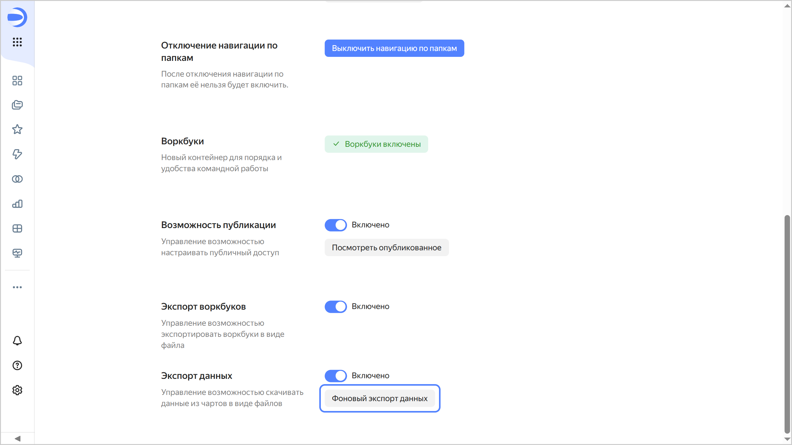
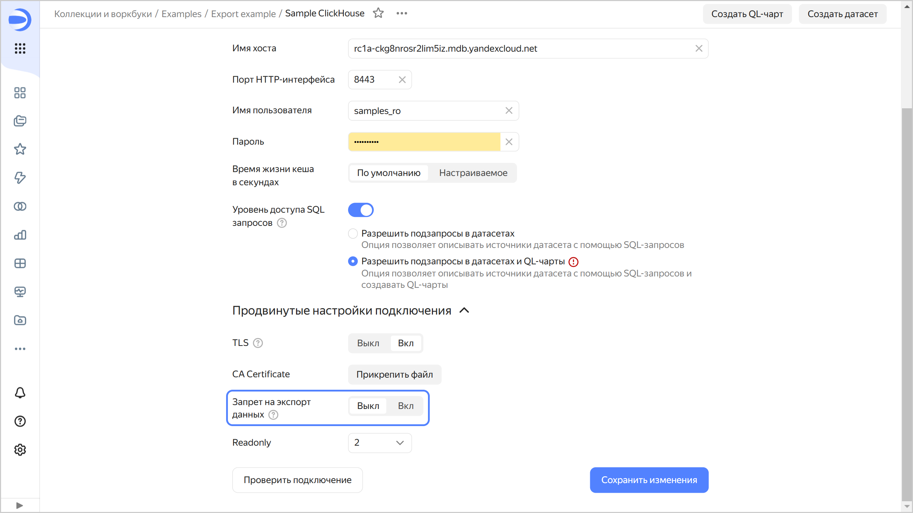
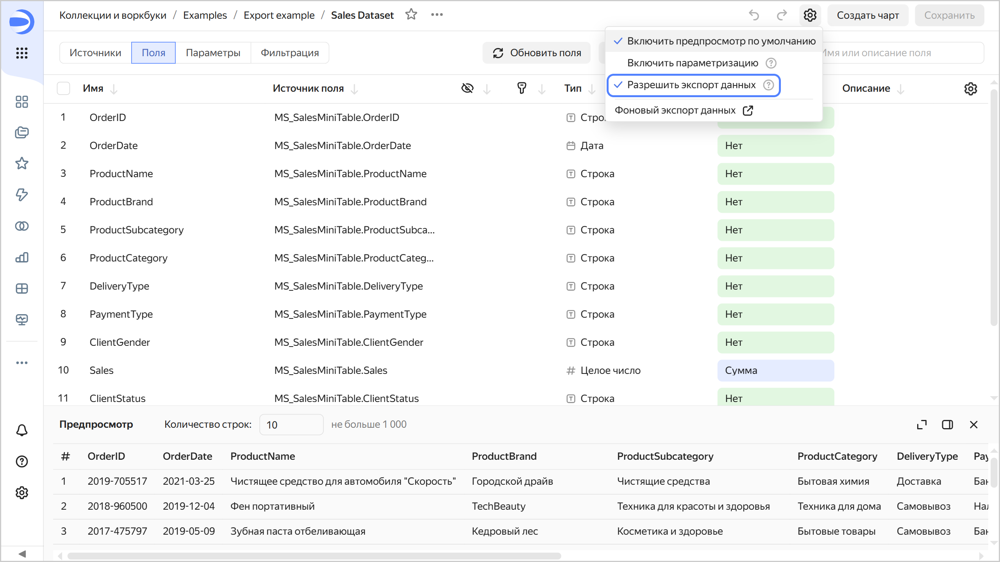

# Экспорт данных из чартов

В {{ datalens-short-name }} вы можете экспортировать данные из чартов:

* [Быстрый экспорт данных](#save-data), отображаемых на чарте (в рамках [лимитов на отображение](../limits.md#datalens-chart-data-limits)):

  * Доступен для всех типов чартов, кроме карт.

    * При включенной пагинации в таблицах экспортируются только данные с текущей страницы.
    * Для графиков экспортируются уже агрегированные данные, по которым построен чарт.

  * Доступны следующие форматы:

    * файл `XLSX`;
    * файл `CSV`;
    * `Markdown` в буфере обмена.

  * Загрузка файла начинается сразу.
  * Доступен во всех [тарифных планах](../../pricing.md#service-plans).

* [Экспорт данных в фоновом режиме](#background-export) с расширенными лимитами до 1 ГБ:

  * Доступен только для созданных в [визарде](./dataset-based-charts.md) [Таблиц](../../visualization-ref/table-chart.md) с включенной пагинацией. При этом экспортируются данные со всех страниц таблицы.
  * Формат: файл `CSV`.
  * Сначала в фоновом режиме формируется файл, затем генерируется ссылка для его скачивания. Подготовка файла занимает до 30 минут.
  * Доступен только в рамках [тарифного плана](../../pricing.md#service-plans) Business.

Любой пользователь с правами доступа к чарту может экспортировать из него данные, однако можно [отключить возможность экспорта данных](#disable-export).

## Быстрый экспорт данных из чарта {#save-data}

Чтобы экспортировать данные, отображаемые на чарте:

1. Откройте окно экспорта данных одним из способов:
   
   * Откройте чарт, из которого требуется экспортировать данные, и в правом верхнем углу чарта нажмите  →  **Сохранить как**.
   * На дашборде у чарта, из которого требуется экспортировать данные, вверху справа нажмите  →  **Сохранить как**.

1. Выберите формат, настройки скачивания и нажмите **Сохранить**.

   

   Если вы выбрали формат `CSV` и в открывшемся окне есть разделение на вкладки **Текущая страница** и **Все страницы**, оставайтесь на вкладке **Текущая страница**. Вкладка **Все страницы** предназначена для [фонового экспорта](#background-export).
  
   

Файл с данными сразу формируется и скачивается в браузере. Максимальный размер файла выгрузки — 50 МБ.

## Фоновый экспорт данных {#background-export}



* [Ограничения](#restrictions)
* [Экспортировать данные в фоновом режиме](#how-to-background-export)
* [Страница экспорта](#export-page)
* [История экспорта данных](#data-export-history)

Перед началом фонового экспорта данных проверьте, что:

* экспорт не [отключен](#data-export-disable) на уровне экземпляра {{ datalens-short-name }}, подключения или датасета;
* у пользователя есть право доступа `{{ permission-execute }}` на подключение и датасет, на основе которых создан чарт с экспортируемыми данными.

### Ограничения {#restrictions}

Для фонового экспорта действуют следующие ограничения:

* Недоступен в [QL-чартах](./ql-charts.md), в чартах, созданных в [Editor](../../charts/editor/index.md) и [непублично встроенных](../../security/private-embedded-objects.md) чартах.
* Недоступен для [мультидатасетных чартов](../data-join.md#datasets-chart).
* Недоступен в [сводных таблицах](../../visualization-ref/pivot-table-chart.md).
* В настройках таблицы должна быть включена [пагинация](./settings.md#common-settings).
* Минимальное количество страниц для выгрузки — 2.
* Максимальное количество строк в таблице — 1 000 000.
* Не поддерживаются [строка с итогами](../../visualization-ref/table-chart.md#add-totals) и [древовидная иерархия](../../dataset/data-types.md#how-to-create-tree). Древовидную иерархию можно экспортировать при отключенной пагинации.
* Не поддерживаются следующие подключения:

  * [{{ datalens-short-name }} Usage Analytics](../../operations/connection/create-usage-tracking.md)
  * [{{ speechsense-name }}](../../operations/connection/create-speechsense.md)
  * [{{ yandex-cloud }} Billing](../../operations/connection/create-cloud-billing.md)

* Максимальный размер файла выгрузки — 1 ГБ.
* Скачивание доступно в течение 1 суток с момента завершения операции экспорта.

### Экспортировать данные в фоновом режиме {#how-to-background-export}

Чтобы экспортировать данные в фоновом режиме:

1. Откройте окно экспорта данных одним из способов:
   
   * Откройте чарт, из которого требуется экспортировать данные, и в правом верхнем углу чарта нажмите  →  **Сохранить как** → **CSV**.
   * На дашборде у чарта, из которого требуется экспортировать данные, вверху справа нажмите  →  **Сохранить как** → **CSV**.

1. В окне экспорта для настройки **Страницы** укажите `Все`. При необходимости измените параметры файла экспорта: **Разделитель значений**, **Десятичный разделитель** и **Кодировка**. Вы также можете перейти к списку экспорта данных, нажав на кнопку **История экспорта**.
1. Нажмите кнопку **Сохранить**. Внизу отобразится сообщение, что экспорт запущен и ссылка на [страницу экспорта](#export-page), на которой отображается статус операции и ее подробности. После завершения экспорта отобразится сообщение **Экспорт чарта завершён** и появятся ссылки для скачивания файла и на страницу экспорта.
  
  Если экспортировать данные не удалось, отобразится сообщение об ошибке. Проверьте, что экспорт данных для данного чарта [не отключен](#data-export-disable) на всех уровнях, у пользователя есть необходимые права и повторите экспорт.

Пользователь, запустивший экспорт, может скачать готовый файл со страницы [истории экспорта данных](#data-export-history). Для скачивания необходимо наличие права доступа `{{ permission-execute }}` на подключение и датасет, на основе которых создан чарт с экспортируемыми данными.

### Страница экспорта {#export-page}

На странице представлена информация:

* Статус операции или наличие ошибки.
* Чарт, из которого экспортируются данные.
* Датасет, на базе которого построен чарт с экспортируемыми данными.
* Подключение, на базе которого построен чарт с экспортируемыми данными.
* Воркбук, в котором расположен чарт с экспортируемыми данными.
* Начало и продолжительность экспорта.
* Пользователь, запустивший экспорт и кнопка **Скопировать ID пользователя**.
* Кнопка **Скачать**, позволяющая скачать подготовленный файл с данными. Отображается после завершения операции экспорта. Доступна только для пользователя, запустившего экспорт, в течение 1 суток с момента завершения операции.

### История фонового экспорта данных {#data-export-history}

Вы можете открыть окно истории фонового экспорта данных одним из способов:

* На панели слева выберите  **Фоновый экспорт данных**.
* На панели слева выберите  **Настройки сервиса** и в разделе **Экспорт данных** нажмите кнопку **Фоновый экспорт данных**.
* Откройте окно [экспорта из чарта](#how-to-background-export) и нажмите кнопку **История экспорта**.
* После завершения экспорта в сообщении **Экспорт чарта завершён** перейдите по ссылке **Страница экспорта**.

На странице представлен список операций экспорта с информацией о каждой:

* Чарт, из которого экспортированы данные.
* Статус операции экспорта.
* Воркбук, в котором расположен чарт с экспортируемыми данными.
* Пользователь, запустивший операцию экспорта.
* Дата и время начала экспорта.
* Размер файла экспорта.

Чтобы скачать файл, в строке экспорта нажмите на значок . Чтобы настроить отображение колонок в списке, нажмите на значок  и отметьте требуемые колонки.

Вы можете настроить фильтры для отображения операций экспорта:

* Из выбранного объекта.
* По названию чарта, из которого экспортированы данные.
* По дате начала экспорта.

Пользователю с ролью `{{ roles-datalens-admin }}` в организации также доступна опция отображения экспортов `Все`. При ее выборе становится доступен список всех экспортов, созданных в организации, а также появляется дополнительный фильтр по автору экспорта.

## Отключить возможность экспорта данных {#data-export-disable}

По умолчанию пользователи могут экспортировать данные из чартов. Эту возможность можно отключить на уровне экземпляра {{ datalens-short-name }}, подключения или датасета:



- На уровне экземпляра

  Отключить возможность экспорта данных может пользователь с ролью `{{ roles-datalens-admin }}`. Настройка запрета на уровне экземпляра также запрещает [непубличное встраивание](../../security/private-embedded-objects.md) объектов экземпляра.
  
  1. На панели слева выберите  **Настройки сервиса**.
  1. Отключите опцию **Экспорт данных** (по умолчанию она включена).

     

  После запрета экспорта:
  
  * В интерфейсе чартов в меню  пункт экспорта данных будет недоступен, и пользователи не смогут экспортировать данные из этих чартов.
  * Останется возможность копировать данные из чартов и снимать скриншоты.

- На уровне подключения

  Отключить возможность экспорта данных может пользователь с правом доступа `{{ permission-write }}` на подключение.

  1. Перейдите на страницу подключения.
  1. В разделе **Продвинутые настройки подключения** включите настройку **Запрет на экспорт данных**.

     

     В подключениях к [Файлам](../../operations/connection/create-file.md), [Яндекс Документам](../../operations/connection/create-yadocs.md) и [Google Sheets](../../operations/connection/create-google-sheets.md) вверху справа нажмите значок  и снимите отметку с пункта **Разрешить экспорт данных**.

  После запрета экспорта:
  
  * В интерфейсе чартов на базе этого подключения в меню  пункт экспорта данных будет недоступен, и пользователи не смогут экспортировать данные из этих чартов.
  * Останется возможность копировать данные из чартов и снимать скриншоты.

- На уровне датасета
 
  Отключить возможность экспорта данных может пользователь с правом доступа `{{ permission-write }}` на датасет.
  
  1. Перейдите на страницу датасета.
  1. Вверху справа нажмите значок  и снимите отметку с пункта **Разрешить экспорт данных**.

     
  
  После запрета экспорта:
  
  * В интерфейсе чартов на базе этого датасета в меню  пункт экспорта данных будет недоступен, и пользователи не смогут экспортировать данные из этих чартов.
  * Останется возможность копировать данные из чартов и снимать скриншоты.


