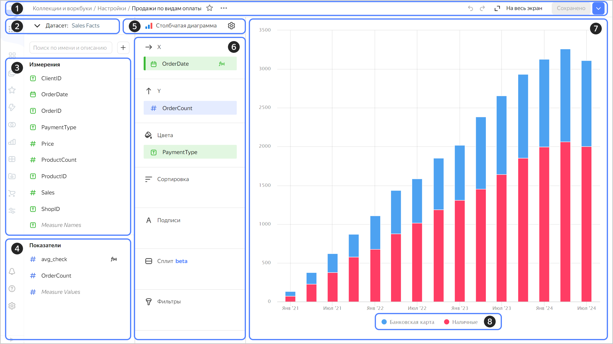

# Чарты в визарде

Чарты создаются в визарде на основе данных из одного датасета или нескольких датасетов (см. [{#T}](./multidataset-chart.md)).



Вы можете создать неограниченное количество чартов на базе одного датасета.

Рабочая область в интерфейсе визарда разделена на три основные панели:

1. Панель датасета, где отображаются доступные поля: **Измерения** и **Показатели**. Вы можете добавить в список [вычисляемое поле](../calculations/index.md).
1. Панель настройки визуализации, где можно выбрать [тип чарта](../../visualization-ref/index.md). Для каждого типа доступен свой набор секций (например, ось X, ось Y, фильтры и т. д.), куда можно перетаскивать поля. Подробнее в разделе [{#T}](settings.md).
1. Панель превью, где отображается визуализация.

Чарт позволяет провести быстрый анализ и проверить гипотезу. Также чарты можно сохранять и добавлять на дашборды в виде виджетов.



В {{ datalens-short-name }} существуют ограничения на количество строк данных, которое могут отобразить чарты. Ознакомьтесь с ними в разделе [{#T}](../limits.md).



При открытии чарта в визарде:

* Вверху (1) располагается общая информация: расположение, название, а также элементы управления и сохранения, общие для всех чартов.
* Ниже слева (2) можно выбрать [датасет](../../dataset/index.md) для построения виджета. После выбора датасета под ним появится список полей (3), которые доступны для использования в чарте. Поля разделены на группы: [Измерения (4) и Показатели (5)](../../dataset/data-model.md#field).
* Справа расположена кнопка выбора типа чарта (6) и значок  для открытия общих настроек (7). После выбора типа чарта, ниже появится список секций (8), состав которого зависит от выбранного типа чарта.
* Правую часть окна занимает область предпросмотра (9).

