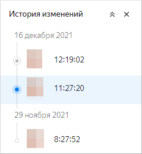
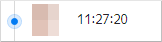
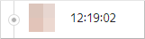
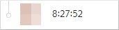

# Чарт

_Чарт_ — это визуализация данных из датасета в виде таблицы, диаграммы или картограммы.

В {{ datalens-short-name }} два вида чартов:

* [Чарты на основе датасета](#dataset-based-charts)
* [QL-чарты](#sql-charts)

## Чарты на основе датасета {#dataset-based-charts}

Чарты создаются в визарде на основе данных из одного датасета или нескольких датасетов (см. [мультидатасетные чарты](#multi-dataset-charts)).
Вы можете создать неограниченное количество чартов на базе одного датасета.

Рабочая область в интерфейсе визарда разделена на три основные панели:
1. Панель датасета, где отображаются доступные поля: **Измерения** и **Показатели**. Вы можете добавить в список [вычисляемое поле](../calculations/index.md).
1. Панель настройки визуализации, где можно выбрать [тип чарта](../../visualization-ref/index.md). Для каждого типа доступен свой набор секций (например, ось X, ось Y, фильтры и т. д.), куда можно перетаскивать поля. Подробнее в разделе [{#T}](settings.md).
1. Панель превью, где отображается визуализация.

Чарт позволяет провести быстрый анализ и проверить гипотезу. Также чарты можно сохранять и добавлять на дашборды в виде виджетов.



В {{ datalens-short-name }} существуют ограничения на количество строк данных, которое могут отобразить чарты. Ознакомьтесь с ними в разделе [{#T}](../limits.md).



### Мультидатасетные чарты {#multi-dataset-charts}

Мультидатасетные чарты — чарты, которые отображают данные из разных датасетов.

Запросы для каждого датасета отрабатываются независимо друг от друга. Вы не можете создавать вычисляемые поля над полями из нескольких датасетов.
При добавлении второго датасета {{ datalens-short-name }} автоматически устанавливается связь по первому совпадению имени полей и типа данных полей.

При этом вы можете:

* изменять связи;
* добавлять новые связи;
* удалять связи.



  Датасеты в чарте могут быть не связаны.



Особенности работы со связанными датасетами в чарте, кроме случаев использования слоев в геочарте:

* в одном чарте могут быть использованы любые показатели из датасетов вне зависимости от связей;
* в одном чарте можно использовать только связанные измерения;
* фильтры по связанным измерениям применяются ко всем датасетам;
* фильтры по несвязанным измерениям применяются только к своему датасету.

Особенности работы со связанными датасетами в геовизуализациях на разных слоях:

* в одном геослое могут быть использованы любые показатели из датасетов вне зависимости от связей;
* в одном геослое можно использовать только связанные измерения;
* фильтры в секции **Общие фильтры** по связанным измерениям применяются ко всем датасетам во всех слоях;
* фильтры в секции **Общие фильтры** по несвязанным измерениям применяются только к своему датасету во всех слоях;
* фильтры в секции **Фильтры слоя** по связанным измерениям применяются ко всем датасетам в рамках текущего слоя;
* фильтры в секции **Фильтры слоя** по несвязанным измерениям применяются только к своему датасету в рамках текущего слоя;
* ограничения на использование несвязанных измерений в разных слоях не предусмотрены.

## QL-чарты {#sql-charts}



_QL-чарты_ — чарты, созданные на основе подключения, если источник подключения — БД. Для построения таких чартов используется SQL-запрос. Запрос выполняется на SQL-диалекте исходной БД, что позволяет расширить возможности визуализации с помощью специфических для этой БД операций.



_QL-чарты_ — чарты, созданные на основе подключения, если источник подключения — БД, {{ prometheus-name }} или {{ monitoring-short-name }}. Для построения таких чартов используется прямой запрос в источник. В зависимости от типа чарта запрос выполняется на SQL-диалекте исходной БД, языке запросов {{ prometheus-name }} или {{ monitoring-short-name }}, что позволяет расширить возможности визуализации с помощью специфических операций.



При выполнении запроса отдельный объект [Датасет](../dataset/index.md) не создается — чарт генерируется сразу и отображается на панели превью.

В отличие от [чартов на основе датасета](#dataset-based-charts), в QL-чартах логика использования области визуализации смещена в сторону запроса в источник, то есть область визуализации только отображает данные из запроса.



Особенности QL-чартов:

* уменьшают нагрузку на БД благодаря прямым запросам;
* подходят только для запросов `SELECT`;
* позволяют применять операторы `JOIN`, `GROUP BY`, `SORT BY` и функции агрегации в SQL-запросе;
* предоставляют возможность параметризации любой части SQL-запроса;
* поддерживают ограниченный набор [типов визуализаций](../../visualization-ref/index.md);
* не поддерживают [материализацию](../dataset/settings.md#materialization) данных;
* не используют [RLS](../../security/row-level-security.md) и [вычисляемые поля](../calculations/index.md).





Поддерживаются следующие типы QL-чартов:

* **SQL**. Позволяют построить визуализацию, для которой можно гибко управлять набором данных с помощью параметров SQL-запроса в БД источника.

  Особенности чартов типа SQL:

  * уменьшают нагрузку на БД благодаря прямым запросам;
  * подходят только для запросов `SELECT`;
  * позволяют применять операторы `JOIN`, `GROUP BY`, `SORT BY` и функции агрегации в SQL-запросе;
  * предоставляют возможность параметризации любой части SQL-запроса;
  * поддерживают ограниченный набор [типов визуализаций](../../visualization-ref/index.md);
  * не используют [RLS](../../security/row-level-security.md) и [вычисляемые поля](../calculations/index.md).

    

* **{{ prometheus-name }}**. Позволяют построить график по данным {{ prometheus-name }} (см. [пример](https://datalens.yandex-team.ru/ql/ssvptrd5tqh0k)). Поверх этого источника не может быть построен датасет, работать с ним можно только с помощью QL-чартов.

  
  
* **{{ monitoring-short-name }}**. Позволяют построить график по данным {{ monitoring-full-name }} (см. [пример](https://datalens.yandex-team.ru/ql/99c6irbpsmam1)). Поверх этого источника не может быть построен датасет, работать с ним можно только с помощью QL-чартов. Также можно [экспортировать](../../operations/chart/export-from-monitoring.md) в {{ datalens-short-name }} готовый график из {{ monitoring-short-name }}. Его можно отредактировать, сохранить и разместить на дашборде.

  





Чтобы создать QL-чарт, перейдите к [инструкции](../../operations/chart/create-sql-chart.md).

## Типы чартов {#chart-types}

Все типы чартов {{ datalens-full-name }} представлены в [Справочнике визуализаций](../../visualization-ref/index.md).



## Настройка алертов {#alerting}



  Сейчас алерты работают в режиме тестирования MVP:

  * Алерты можно создать только в чартах типа **Линейная диаграмма** (кроме чартов, созданных в **Old Wizard**).
  * В уведомлениях указано время по UTC.
  * Отключить уведомления нельзя.



Алерты — это уведомления о событиях в чартах.

Уведомления приходят, когда значение графика на момент проверки превышает установленный порог. Проверка состояния графика выполняется один раз в 15 минут. Если значение графика остается за пределами установленного порога несколько проверок подряд, то придет только одно уведомление. Проверку на отсутствие значения создать нельзя.

В чарте обязательно должен быть временной ряд. Используйте [относительные даты](../../editor/params.md#relativedate), чтобы график изменялся с течением времени. По умолчанию время на графике указано по UTC.

Вы можете настроить алерт на одну или несколько линий. Линии должны быть на одной оси Y. Для линий по второй оси Y нужно создать новый алерт. В качестве идентификатора линии используйте `id`, `name` или `title`. Если `name` или `title` динамические (например, зависят от даты), то добавьте `id` временного ряда для однозначной идентификации.

Подробнее о создании алерта читайте в [инструкции](../../operations/chart/create-alert.md).

## Настройка фида комментариев {#comment-feed-setting}

Фид комментариев — это настройка чарта, позволяющая использовать один и тот же комментарий в разных чартах. В качестве фида рекомендуется использовать id канала комментария из другого чарта. Если в качестве фида указать произвольное значение, будет создан новый канал комментария, доступный в чарте.

Id канала комментария, создаваемого в визарде, совпадает с id чарта. Поэтому в чарте, где этот канал используется в качестве фида, будут отображаться все комментарии из исходного чарта.



При использовании фида комментарии из указанного канала становятся доступными для редактирования любому пользователю, имеющему доступ к чарту.



Подробнее об использовании фида для дублирования комментариев читайте в [инструкции](../../operations/chart/use-comments.md#feed-comment).





## Версионирование {#versioning}

Версионирование чарта — это возможность хранить историю изменений конфигурации чарта с помощью версий. Список версий доступен пользователям с минимальным правом доступа **{{ permission-read }}** на чарт.



В настоящее время версионирование доступно только для чартов [на основе датасета](#dataset-based-charts).



Чтобы перейти к списку версий, в верхней части экрана нажмите на значок  и выберите **История изменений**.

Чтобы перейти к выбранной версии, нажмите на нее в списке. Номер версии отобразится в значении параметра `revId` строки адреса чарта. При переходе по ссылке, содержащей номер версии в параметре `revId`, сразу откроется эта версия чарта.

### Виды версий {#version-types}

Различают следующие версии:

* **Актуальная**. Последняя сохраненная версия чарта. Отображается всем пользователям на дашбордах, а также при переходе из навигации или при открытии чарта из контекстного меню на редактирование с дашборда. Актуальной может быть только одна версия чарта.
  
  

  Если у пользователя есть право доступа **{{ permission-write }}**, он может сделать актуальной любую версию чарта.
  
  
  
  При актуализации любой версии, кроме черновой, создается новая версия чарта.

  
  
* **Черновик**. Версия, которая содержит несохраненные изменения чарта. Основные пользователи не видят изменений, которые вносятся в черновик. Это позволяет скрывать редактирование чарта до актуализации версии. Чарт может иметь только один черновик.

  

  Вы можете поделиться черновой версией чарта. Для этого передайте в ссылке номер ревизии в параметре `revId` (например, `?revId=zac5m4edoaqqr`).
  Чтобы создать черновую версию после редактирования чарта, в правом верхнем углу нажмите значок галочки и выберите **Сохранить как черновик**.

* **Неактуальная**. Версия, которая не является актуальной или черновиком.

  

### Создание новой версии {#version-create}

Новая версия автоматически создается после нажатия кнопки **Сохранить и сделать актуальной** в режиме редактирования чарта. Изменения конфигурации чарта, которые приводят к созданию новой версии:

* изменение настроек чарта, доступных при нажатии на значок  вверху экрана;
* добавление, переименование, удаление полей чарта;
* добавление, удаление полей в секции чарта.

### Ограничения {#restrictions}

* История изменений содержит только список версий чарта и включает: вид версии, дату и время сохранения и автора редактирования.
* Версии чарта не содержат изменений прав доступа (эта операция производится отдельно от редактирования самого чарта).
* В версиях не отображается список изменений. Доступен лишь просмотр сохраненного состояния конфигурации чарта.
* [Алерты](#alerting) относятся только к актуальной версии.

Настроенные [комментарии](#comment-feed-setting) будут отображаться на всех версиях. 





## Публикация чарта {#public-access}

Вы можете предоставить доступ к чарту для любого пользователя в интернете с помощью [{{ datalens-public }}](../datalens-public.md). Такой чарт становится публичным, любой пользователь может просмотреть его без авторизации.

Чтобы предоставить публичный доступ к чарту:







## Управление доступом {#access-management}

Вы можете настроить права доступа к чарту.

Чтобы настроить права доступа к чарту:



Подробнее о типах прав доступа в разделе [{#T}](../../security/index.md).

#### См. также {#see-also}

- [{#T}](../../operations/chart/create-chart.md)
- [{#T}](../../operations/chart/create-sql-chart.md)
- [{#T}](../../visualization-ref/index.md)
- [{#T}](../../operations/chart/export-from-monitoring.md)
- [{#T}](../../operations/chart/create-alert.md)
- [{#T}](../../operations/chart/publish.md)

