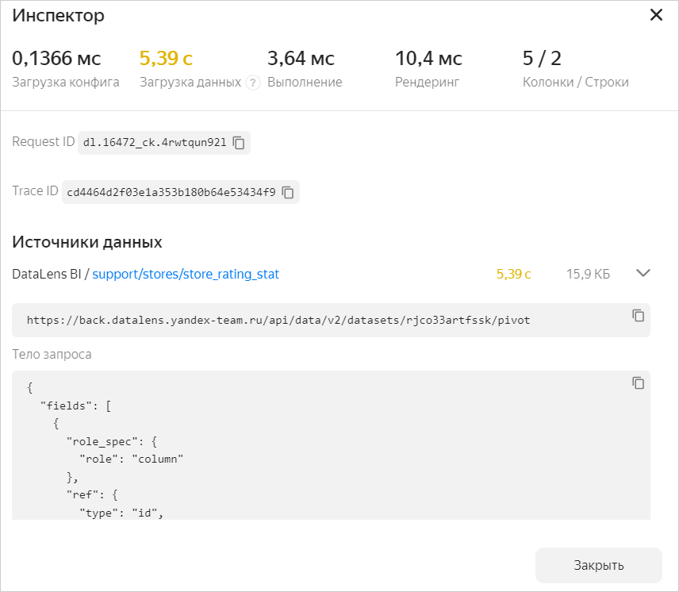

# Инспектор чартов

Если на дашборде расположено много чартов, которые долго загружают и обрабатывают данные, это может замедлить скорость работы всего дашборда. Проанализировать работу чарта можно с помощью инспектора.

Инспектор чартов — это инструмент {{ datalens-short-name }}, позволяющий диагностировать проблемы в загрузке данных и их рендеринге в браузере. С его помощью можно выявить причины медленной работы чарта, а также оптимизировать процесс получения данных и отрисовки чарта.

​Чтобы открыть инспектор чартов, в правом верхнем углу чарта нажмите значок  и выберите **Инспектор**.





В верхней части окна инспектора расположена информация о скорости выполнения основных операций. Значения, превышающие оптимальные, выделяются цветом (оранжевым или красным). Чтобы получить рекомендацию по оптимизации показателя, наведите указатель на значок вопроса рядом с его названием.

Основные показатели:

* **Загрузка конфига** — время загрузки конфигурации чарта, формирование запроса для него в источник. На этот показатель влияет только внутренняя логика работы сервиса. При высоких значениях (красного цвета) попробуйте перезагрузить чарт или открыть его позже. Если значения остаются высокими, обратитесь в [техническую поддержку]({{ link-console-support }}) {{ yandex-cloud }}. В сообщении укажите ссылку на чарт и приложите скриншоты окна инспектора.
* **Загрузка данных** — время выполнения запроса в источнике и передача их в {{ datalens-short-name }}. Обычно ключевой показатель в общем времени выполнения чарта. Чтобы улучшить этот показатель, обратите внимание на:

  * выбор источника данных — СУБД источника должна быть рассчитана на аналитический тип нагрузки;
  * организацию физической структуры источника — рационально используйте индексы, партицирование, сортировки, оптимально подбирайте типы таблиц и данных;
  * ресурсы (RAM/CPU), выделяемые на источник — они должны соответствовать объему данных и числу одновременно работающих пользователей;
  * сложность аналитических вычислений — в некоторых случаях целесообразно упростить запросы, использовать предварительно обработанные данные в источнике.

* **Выполнение** — время обработки в {{ datalens-short-name }} данных, полученных из источника. Старайтесь максимально перенести обработку данных из {{ datalens-short-name }} на сторону источника.
* **Рендеринг** — время отрисовки данных в чарте. При большом объеме выводимых данных используйте фильтры, группировки или пагинацию для ограничения визуализируемого набора данных.

Для некоторых типов чартов выводятся дополнительные показатели:

* **Колонки / Строки** — количество колонок и строк в таблице (для чартов типа **Таблица** и **Сводная таблица**);
* **API Яндекс Карт** — время на загрузку модулей, необходимых для работы Яндекс Карт (для чартов типа **Карта**).

Также в инспекторе отображаются идентификаторы запроса в источник (Request ID) и трассировки запроса (Trace ID).

В блоке **Источники данных** содержится информация об источниках, используемых в чарте:

* название источника;
* ссылка на источник;
* тело запроса в формате JSON;
* текст SQL-запроса, который был отправлен в источник (только при успешном выполнении SQL-запроса и отрисовке его результатов в чарте).

#### См. также {#see-also}

* [{#T}](../optimization_recommendations.md)