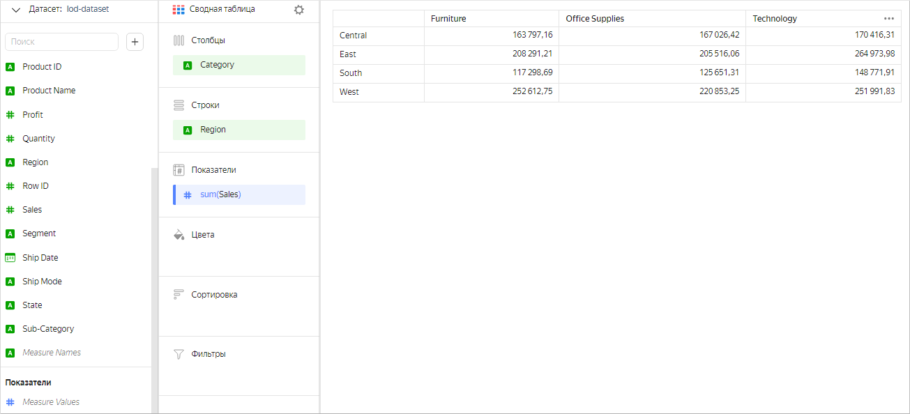
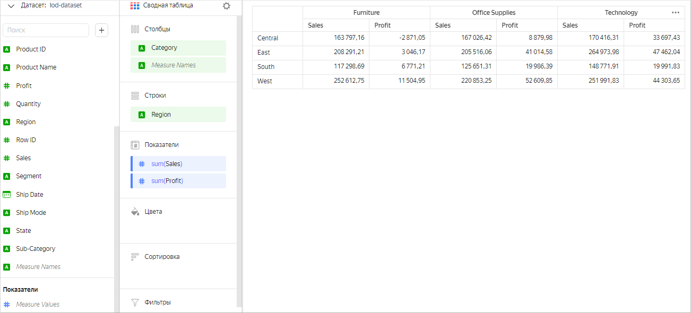
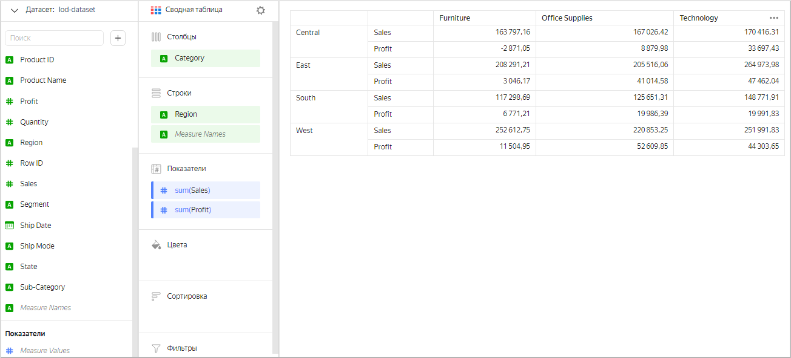
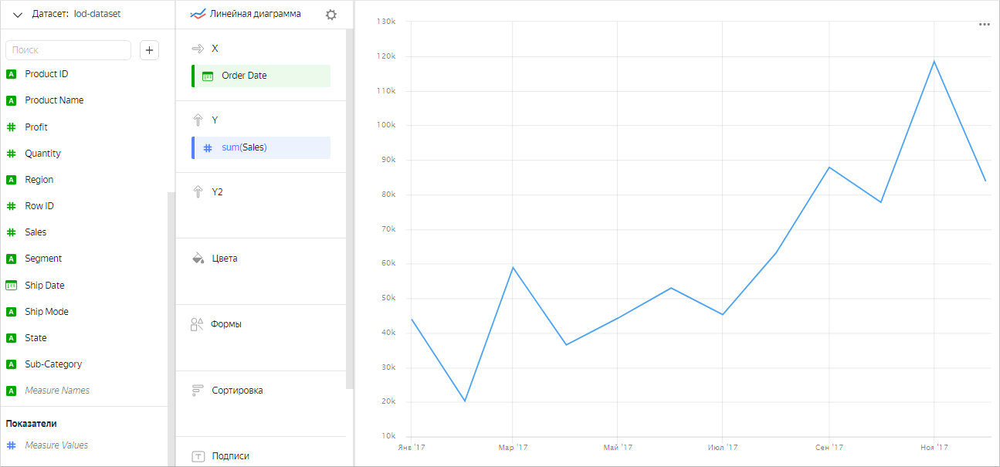
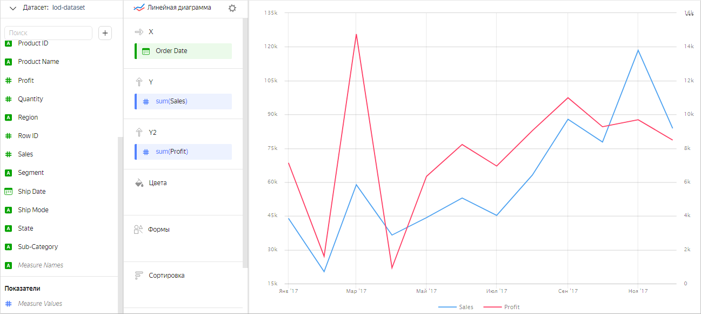
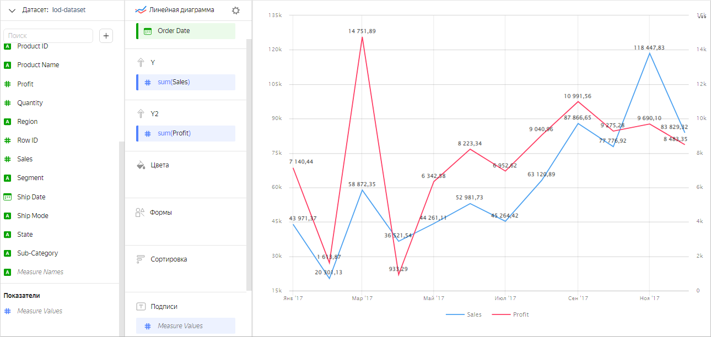
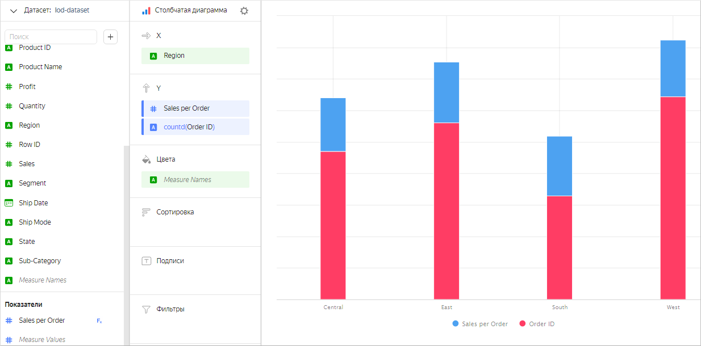
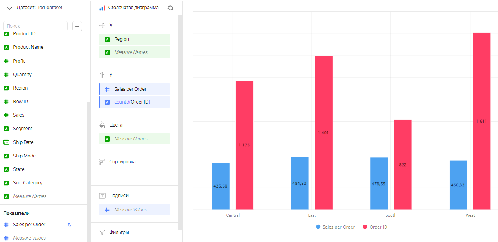

# Measure Values и Measure Names

После добавления показателя в одну из секций чарта в списке полей датасета появляется два поля — `Measure Values` и `Measure Names`. Они не входят в список исходных полей датасета — {{ datalens-short-name }} создает эти поля автоматически. Поля `Measure Values` и `Measure Names` применяются при создании чартов, в которых используется несколько показателей.

`Measure Values` — это показатель (зеленое поле), который содержит значения всех показателей, использующихся в чарте. Он применяется для отображения значений каждого показателя в виде подписей. Например, с помощью `Measure Values` можно подписать каждую линию на графике или каждый столбец в столбчатой диаграмме.

`Measure Names` — это измерение (синее поле), которое содержит названия всех показателей, использующихся в чарте. Оно применяется для задания группировки в чарте или для отображения названия каждого показателя в виде подписей. Например, с помощью `Measure Names` можно сделать столбчатую диаграмму с группировкой по нескольким показателям или подписать названия секторов на круговой диаграмме.

## Использование Measure Values и Measure Names в чартах {#usage}

Рассмотрим использование полей `Measure Values` и `Measure Names` в чартах на примерах. В качестве источника данных для примеров будет использоваться прямое [подключение](../../quickstart.md#create-connection) к демонстрационной БД (датасет построен на основе таблицы `SampleSuperstore`).

**Пример 1**

Создадим сводную таблицу, содержащую совокупную сумму продаж для каждой категории товаров по регионам.

Теперь покажем в таблице еще и прибыль для каждой категории и региона. Для этого перетащим поле `Profit` в секцию **Показатели**. При этом поле `Measure Names` автоматически добавится в секцию **Столбцы**. Таким образом задается группировка по названию показателя.

Группировку по названию показателя в таблице можно изменить. Для этого перетащим поле `Measure Names` в секцию **Строки**.

**Пример 2**

Отобразим на графике сумму продаж по месяцам в течение года.

Теперь добавим вторую ось Y, чтобы показать прибыль.

Добавим подписи со значениями показателей для каждой линии. В чарте используется два показателя, но в секцию **Подписи** можно добавить только один из них. Чтобы подписать каждую линию в таком случае, необходимо добавить в секцию **Подписи** показатель `Measure Values`. Тогда каждая линия будет подписана значениями соответствующего показателя.

**Пример 3**

Сравним количество заказов и средний чек по регионам. После добавления показателей в секцию **Y** получаем столбчатую диаграмму с накоплением. При этом поле `Measure Names` автоматически добавится в секцию **Цвета** для группировки по названию показателя.

В таком виде сравнивать показатели неудобно. Поэтому отобразим диаграмму с группировкой по оси X. Для этого перетащим измерение `Measure Names` в секцию **X**.

Чтобы подписать каждый столбец значениями соответствующего показателя, добавим в секцию **Подписи** показатель `Measure Values`.

## Ограничения {#restrictions}

Для полей `Measure Values` и `Measure Names` существуют следующие ограничения:

* `Measure Values` и `Measure Names` нельзя использовать для сортировки чарта.
* `Measure Values` и `Measure Names` нельзя использовать для фильтрации чарта.
