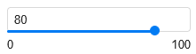

# Настройки чарта

Вы можете настраивать чарты. Например, добавить отображение легенды, настроить цветовую схему, указать собственный заголовок.

Доступность настроек зависит от типа настраиваемого чарта.

## Общие настройки {#common-settings}

Общие настройки влияют на общее отображение чартов.
Чтобы открыть общие настройки, нажмите значок  в левой части экрана над чартом.



Указанные настройки доступны не для всех видов чартов.



#|
|| **Название** | **Описание** ||
|| Заголовок | Задает заголовок для чарта.  Доступные значения:

* **Скрыть** — скрыть заголовок.
* **Показать** — отображать заголовок. В текстовом поле справа вы можете ввести текст заголовка. ||
|| Легенда | Отображает легенду под чартом. Легенда содержит цвета чарта с текстовыми описаниями, которые соответствуют значениям полей в секции **Цвета**.  Доступные значения:

* **Скрыть** — скрыть легенду.
* **Авто** — отображать легенду, если указано поле в секции **Цвета**. ||
|| Сумма в тултипах | Отображает сумму в тултипе при наведении на отображение чарта.  Доступные значения:

* **Вкл** — отображать сумму в тултипе.
* **Выкл** — скрыть сумму в тултипе. ||
|| Навигатор | Отображает дополнительный элемент под чартом — навигатор. Он позволяет уменьшить выборку данных, которая отображается в чарте.  Доступные значения:

* **Вкл** — отображать навигатор.
* **Выкл** — скрыть навигатор.

Подробнее см. [инструкцию](../../operations/chart/config-chart-navigator.md). ||
|| Пагинация | Разбивает таблицу на страницы.  Доступные значения:

* **Вкл** — отображать таблицу по частям на страницах.
* **Выкл** — отображать таблицу целиком. ||
|| Лимит | Задает количество строк для экспорта. Также это количество строк будет отображаться на одной странице. Доступно, если включена настройка **Пагинация**. ||
|| Группировка | Отображает уникальные значения полей.  Доступные значения:

* **Вкл** — отображать уникальные значения.
* **Выкл** — отображать все значения. ||
|| Итоги | Отображает строку с итоговыми значениями для столбцов в таблице. Значения в строке рассчитываются по тем же формулам, что и [агрегация](../dataset/data-model.md#aggregation) в показателе.  Доступные значения:

* **Вкл** — отображать строку **Итого**.
* **Выкл** — скрыть строку **Итого**. ||
|#

## Настройки полей {#field-settings}

Вы можете настраивать:

* измерения и показатели для [чартов на основе датасета](./dataset-based-charts.md);
* только показатели для [QL-чартов](./ql-charts.md).

Чтобы открыть настройки измерения или показателя, нажмите значок слева от его названия.



Если применяете к измерению агрегацию — он будет действовать как показатель и будут доступны настройки показателей.



### Измерения {#measure-settings}

#|
|| **Название** | **Описание** ||
|| Название | Задает имя измерения. ||
|| Тип | Задает тип данных измерения. ||
|| Группировка | Задает тип группировки или округление. Настройка доступна только для измерений типа `Дата` и `Дата и время`. ||
|| Формат | Задает формат отображения значения. ||
|| Режим даты | Задает режим отображения даты. Настройка доступна только для измерений типа `Дата` и `Дата и время`.  Доступные значения:

* **Непрерывный** — отображать все даты непрерывно.
* **Дискретный** — отображать даты, которые содержат значения. ||
|| Агрегация | Задает тип агрегации. Функции агрегации доступны в соответствии с таблицей [{#T}](../dataset/data-model.md#aggregation). ||
|#

### Показатели {#indicator-settings}

#|
|| **Название** | **Описание** ||
|| Название | Задает имя показателя. ||
|| Тип | Задает тип данных показателя. Недоступно для [QL-чартов](./ql-charts.md). ||
|| Агрегация | Задает тип агрегации. Функции агрегации доступны в соответствии с таблицей [{#T}](../dataset/data-model.md#aggregation). Недоступно для [QL-чартов](./ql-charts.md). ||
|| Формат | Задает формат отображения значения. ||
|| Знаков после запятой | Задает количество знаков, отображаемых у значения после запятой. Недоступно для [QL-чартов](./ql-charts.md). ||
|| Отображать группы разрядов | Позволяет отображать разряды числовых значений.  Доступные значения:

* **С разделителем** — отображать пробелы между разрядами.
* **Слитно** — скрыть пробелы между разрядами. ||
|| Префикс | Задает текст, который отображается перед значением. ||
|| Постфикс | Задает текст, который отображается после значения. ||
|| Размерность | Задает масштаб округления значений. ||
|#

## Настройки секций {#section-settings}

Чтобы открыть настройки секции, нажмите значок  в строке с названием секции.

### Оси {#axis-settings}

Настройки осей доступны только для тех чартов, у которых есть хотя бы одна ось X или Y:

* Линейная диаграмма.
* Диаграмма с областями (Накопительная и Нормированная).
* Столбчатая диаграмма (в том числе Нормированная).
* Линейчатая диаграмма (в том числе Нормированная).
* Точечная диаграмма.

Вы можете задавать настройки как для оси **X**, так и **Y**.



Не все указанные настройки доступны для всех осей.



#|
|| **Название** | **Описание** ||
|| Название оси | Задает подпись к оси.  Доступные значения:

* **Вкл** — использовать название поля. Если секция содержит несколько полей, то {{ datalens-short-name }} использует имя поля, которое указано первым в списке.
* **Выкл** — не отображать подписи к оси.
* **Вручную** — указать имя оси вручную в текстовом поле. ||
|| Тип оси | Определяет тип оси. Настройка доступна, если поля в секции оси имеют тип `Дробное число`.  Доступные значения:

* **Линейная** — использовать линейную ось.
* **Логарифмическая** — использовать логарифмическую ось. Подходит для чартов с большим разбросом значений. Логарифмическая ось позволяет привести быстрорастущий график к удобному для анализа виду, уменьшая значения на порядок. ||
|| Режим отображения | Позволяет настроить непрерывность отображения графика.  Доступные значения:

* **Дискретный** — отображать график только для непустых значений.
* **Непрерывный** — отображать график для всех значений непрерывно. Непрерывный режим доступен только для типов данных `Целое число`, `Дробное число`, `Дата` и `Дата и время`. ||
|| Форматирование оси | Задает форматирование подписей на оси с числовыми значениями.  Доступные значения:

* **Авто** — форматирование по умолчанию.
* **По первому полю на оси X** — отображать подписи к оси X с форматированием, указанным в настройке **Формат** для первого поля в секции **X**. Доступно в настройках оси X.
* **По первому полю на оси Y** — отображать подписи к оси Y с форматированием, указанным в настройке **Формат** для первого поля в секции **Y**. Доступно в настройках оси Y. ||
|| Сетка | Включает/отключает отображение сетки в чарте.  Доступные значения:

* **Вкл** — отображать сетку.
* **Выкл** — скрыть сетку. ||
|| Шаги сетки, px | Задает шаг сетки в пикселях. Доступно, если включена настройка **Сетка**.  Доступные значения:

* **Авто** — вычислять размер сетки автоматически.
* **Вручную** — указать размер сетки в пикселях. ||
|| Подписи | Включает/отключает отображение подписей к оси, которые соответствуют значениям поля.  Доступные значения:

* **Вкл** — отображать подписи к осям.
* **Выкл** — скрыть подписи к осям. ||
|| Вид подписей | Определяет вид отображения подписей. Доступно, если включена настройка **Подписи**.  Доступные значения:

* **Авто** — отображать значения подписи.
* **Горизонтальные** — отображать значения подписей горизонтально.
* **Вертикальные** — отображать значения подписей вертикально.
* **Под углом** — отображать значения подписей под углом 45 градусов. ||
|| Пустые значения (null) | Позволяет выбрать способ обработки пустых значений.  Доступные значения:

* **Не отображать** — не отображать пустые значения в чарте.
* **Соединять** — соединять значения полей, между которыми находятся пустые значения.
* **Отображать как 0** — отображать пустые значения в чартах, как нулевые (0) значения поля. ||
|| Масштабирование | Задает масштаб осей чарта.  Доступные значения:

* **Авто** — использовать автоматический масштаб. Вы можете указать, каким образом {{ datalens-short-name }} задает масштаб: от 0 до максимального значения поля (**Автомасштаб от 0 до max**) или от минимального до максимального значений полей (**Автомасштаб от min до max**).
* **Вручную** — указать масштаб оси вручную. Вы можете задать максимальное и минимальное значения по оси — {{ datalens-short-name }} обрежет линии чарта по этому значению. ||
|#

### Цвета {#color-settings}

В общем случае вы можете задать определенный цвет для какого-либо значения на графике.

Для древовидной диаграммы, таблицы (в том числе сводной) и карты доступны следующие настройки:

#|
|| **Название** | **Описание** ||
|| Тип градиента | Задает количество цветов, используемых в градиенте.  Доступные значения:

* **Двухцветный** — задает два цвета для градиента.
* **Трехцветный** — задает три цвета для градиента. ||
|| Цвет | Задает цвет для значения. Доступные цвета зависят от типа градиента. ||
|| Задать пороговые значения | Позволяет задать пороговые значения, которые будут соответствовать каждому цвету. ||
|| Границы | Задает границы для геополигонов.  Доступные значения:

* **Показать** — отображать границы геополигонов.
* **Скрыть** — скрыть границы геополигонов. ||
|#

Вы можете [создать палитры](../../operations/chart/create-palette.md) цветов и использовать их в своих чартах.

### Подписи {#sign}

Отображают значение показателя на чарте.

Подписи доступны для чартов типа:

* Линейная диаграмма.
* Диаграмма с областями (Накопительная и Нормированная).
* Столбчатая диаграмма (в том числе Нормированная).
* Линейчатая диаграмма (в том числе Нормированная).
* Круговая диаграмма.
* Карта.

### Сортировка {#sort}

Позволяет сортировать значения на чарте по показателю или измерению.

Сортировка доступна для чартов типа:

* Линейная диаграмма.
* Диаграмма с областями (Накопительная и Нормированная).
* Столбчатая диаграмма (в том числе Нормированная).
* Линейчатая диаграмма (в том числе Нормированная).
* Круговая диаграмма.
* Таблица (в том числе Сводная).

### Фильтры {#filter}

Позволяют делать выборку значений по измерениям или показателям.
Фильтры доступны для всех типов чартов.

## Настройки секций карт {#map-settings}

Вы можете настраивать слои, размер и цвет точек, тултипы и фильтры.
Чтобы открыть настройки секции, нажмите значок  в строке с названием секции.



В зависимости от типа визуализации доступны разные настройки.



#|
|| **Название** | **Описание** ||
|| Размер | Задает размер точки в зависимости от значения показателя. ||
|| Цвета | Задают цвет для геоточек и геополигонов в зависимости от значения показателя. ||
|| ултипы | Позволяют сделать подсказку, которая отобразится при наведении указателя на точку. Подсказка будет содержать значения измерений и показателей. ||
|| Фильтры слоя | Позволяют делать выборку значений для текущего слоя по измерениям или показателям. ||
|| Общие фильтры | Позволяют делать выборку значений для всего чарта по измерениям или показателям. ||
|#

### Слои {#map-layer}

На одну карту можно добавить не более 5 слоев с любыми типами визуализации:

* Точечная карта — тип измерения `Геоточки`.
* Фоновая карта — тип измерения `Геополигоны`.
* Тепловая карта — тип измерения `Геоточки (тепловая карта)`.

Слои можно удалять и переименовывать.

Можно изменить прозрачность текущего слоя с помощью ползунка. Также можно задать прозрачность в текстовом поле над ползунком.

Прозрачность может принимать значение от 0 до 100.

### Цвета {#map-color}

Вы можете задать цвет для геоточек и геополигонов, который будет зависеть от значения показателя.

#|
|| **Название** | **Описание** ||
|| Тип градиента | Задает количество цветов, используемых в градиенте.  Доступные значения:

* **Двухцветный** — задает два цвета для градиента.
* **Трехцветный** — задает три цвета для градиента. ||
|| Границы | Задает границы для геополигонов.  Доступные значения:

* **Показать** — отображать границы геополигонов.
* **Скрыть** — скрыть границы геополигонов. ||
|| Цвет | Задает цвет для геоточек и геополигонов. Доступные цвета зависят от типа градиента. ||
|| Задать пороговые значения | Позволяет задать пороговые значения, которые будут соответствовать каждому цвету. ||
|#

Вы можете [создать палитры](../../operations/chart/create-palette.md) цветов и использовать их в своих чартах.

