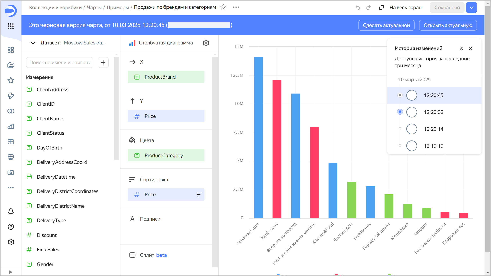
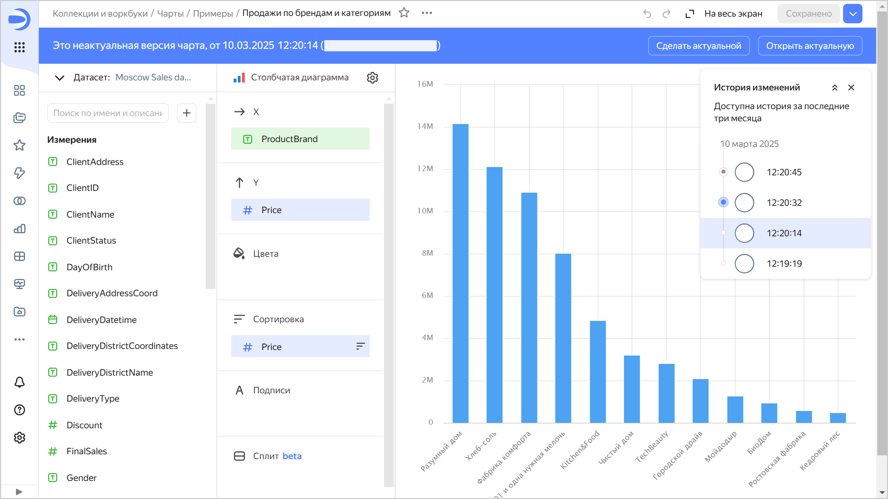
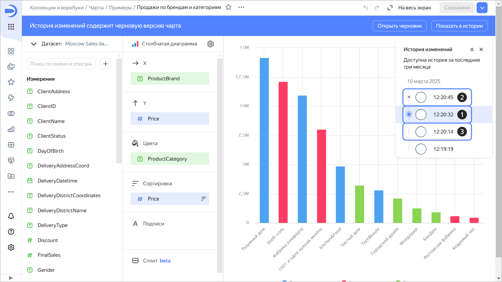
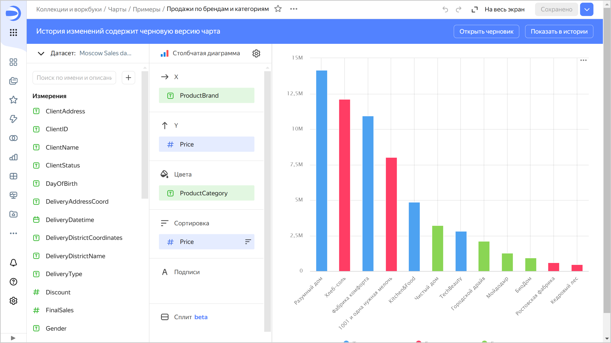

# Версионирование

Версионирование чарта — это возможность хранить историю изменений конфигурации чарта с помощью версий. Список версий доступен пользователям с минимальным правом доступа **{{ permission-read }}** на чарт.

Чтобы перейти к списку версий, в верхней части экрана нажмите на значок  и выберите **История изменений**.

Чтобы перейти к выбранной версии, нажмите на нее в списке. Номер версии отобразится в значении параметра `revId` строки адреса чарта. При переходе по ссылке, содержащей номер версии в параметре `revId`, сразу откроется эта версия чарта.

При редактировании в пределах текущей версии можно отменить или повторно выполнить внесенные изменения. Для этого нажмите:

* значок  в верхней правой части экрана или сочетание клавиш **Ctrl** (**Cmd**) + **Z** — чтобы отменить изменения;
* значок  в верхней правой части экрана или сочетание клавиш **Ctrl** (**Cmd**) + **Shift** + **Z** — чтобы повторно выполнить изменения.

Несохраненные изменения в текущей версии сбрасываются:

* при обновлении страницы;
* при сохранении чарта;
* при переключении на другую версию.

## Виды версий {#version-types}

Различают следующие версии:

1. **Актуальная**. Последняя сохраненная версия чарта.

   Актуальная отображается:
   
   * всем пользователям на дашбордах;
   * при переходе в чарт из навигации;
   * при открытии чарта в воркбуке;
   * при открытии чарта из контекстного меню на редактирование с дашборда.
   
   Актуальной может быть только одна версия чарта.

   Если у пользователя есть право доступа **{{ permission-write }}**, он может сделать актуальной любую версию чарта.
  
   
  
   При актуализации любой версии, кроме черновой, создается новая версия чарта.

   
  
1. **Черновик**. Версия, которая содержит несохраненные изменения чарта. Основные пользователи не видят изменений, которые вносятся в черновик. Это позволяет скрывать редактирование чарта до актуализации версии. Чарт может иметь только один черновик. 
   При открытии черновика вверху отображается панель, на которой указаны: тип версии, дата и время создания и логин автора версии. Справа на панели кнопки:

   * **Сделать актуальной** — делает черновик актуальной версией. Актуальная на текущий момент версия станет неактуальной.
   * **Открыть актуальную** — открывает актуальную версию.

   
   
   

   

   Чтобы создать черновую версию после редактирования чарта, в правом верхнем углу нажмите значок галочки и выберите **Сохранить как черновик**.

   Черновую версию чарта можно отобразить на дашборде. Для этого [добавьте в параметры](../../operations/chart/add-parameters.md) виджета на дашборде для этого чарта параметр `unreleased` со значением `1`.

1. **Неактуальная**. Версия, которая не является актуальной или черновиком.  
   При открытии неактуальной версии вверху отображается панель, на которой указаны: тип версии, дата и время создания и логин автора версии. Справа на панели кнопки:

   * **Сделать актуальной** — делает текущую неактуальную версию актуальной. Актуальная на текущий момент версия и черновик (если он есть) станут неактуальными.
   * **Открыть актуальную** — открывает актуальную версию.

   

   

   



Любой версией чарта можно поделиться: добавьте к ссылке на чарт параметр `revId` (например, `?revId=zac5m4edoaqqr`).



## Создание новой версии {#version-create}

Новая версия автоматически создается:

* в режиме редактирования актуальной версии чарта — после нажатия кнопки **Сохранить** (создается новая актуальная версия) или  → **Сохранить как черновик** (создается новая черновая версия);
* в режиме редактирования черновика или неактуальной версии чарта — после нажатия кнопки **Сохранить как черновик** (создается новая черновая версия) или  → **Сохранить и сделать актуальной** (создается новая актуальная версия);
* в режиме просмотра черновика или неактуальной версии чарта — после нажатия кнопки **Сделать актуальной**.

Изменения конфигурации чарта, которые приводят к созданию новой версии:

* изменение настроек чарта, доступных при нажатии на значок  вверху экрана;
* добавление, переименование, удаление полей чарта;
* добавление, удаление полей в секции чарта.

## Редактирование версий {#version-edit}

Можно редактировать любую версию чарта.

### Редактирование актуальной версии {#actual-version-edit}

Если в чарте есть черновик, при переходе к редактированию актуальной версии на верхней панели появится сообщение о наличии черновой версии в истории изменений.

Нажмите на кнопку:

* **Открыть черновик** — чтобы перейти к черновику.
* **Показать в истории** — чтобы отобразить список версий.

### Редактирование черновика {#irrelevant-version-edit}

Для редактирования черновика выберите его в списке версий. Чтобы сохранить изменения черновика, вверху справа нажмите:

* **Сохранить как черновик** — будет создан новый черновик. Текущий черновик станет неактуальной версией.
*  → **Сохранить как копию** — будет создан новый чарт.
*  → **Сохранить и сделать актуальной** — будет создана новая актуальная версия, а все остальные версии станут неактуальными.

### Редактирование неактуальной версии {#current-version-edit}

Для редактирования неактуальной версии выберите ее в списке версий. Чтобы сохранить изменения неактуальной версии, вверху справа нажмите:

* **Сохранить как черновик** — будет создан черновик из редактируемой версии. Если есть текущий черновик, он станет неактуальной версией.
*  → **Сохранить как копию** — будет создан новый чарт.
*  → **Сохранить и сделать актуальной** — будет создана новая актуальная версия, а все остальные, включая черновик, станут неактуальными.

## Ограничения {#restrictions}

* История изменений содержит только список версий чарта и включает: вид версии, дату и время сохранения и автора редактирования.
* Версии чарта не содержат изменений прав доступа (эта операция производится отдельно от редактирования самого чарта).
* В версиях не отображается список изменений. Доступен лишь просмотр сохраненного состояния конфигурации чарта.

