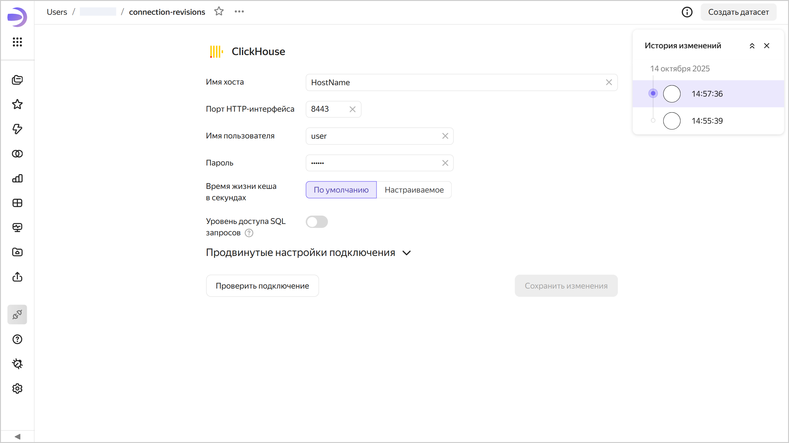
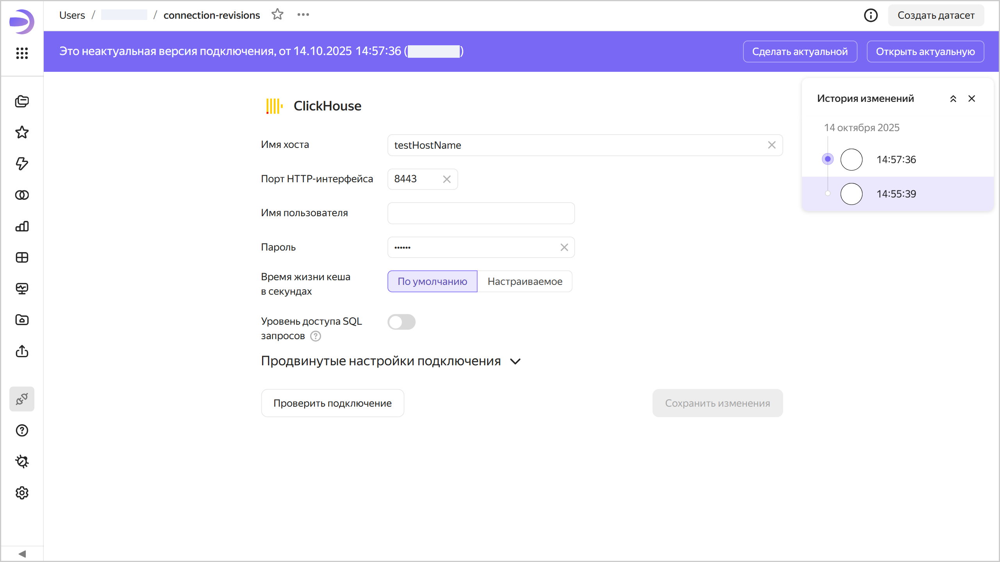
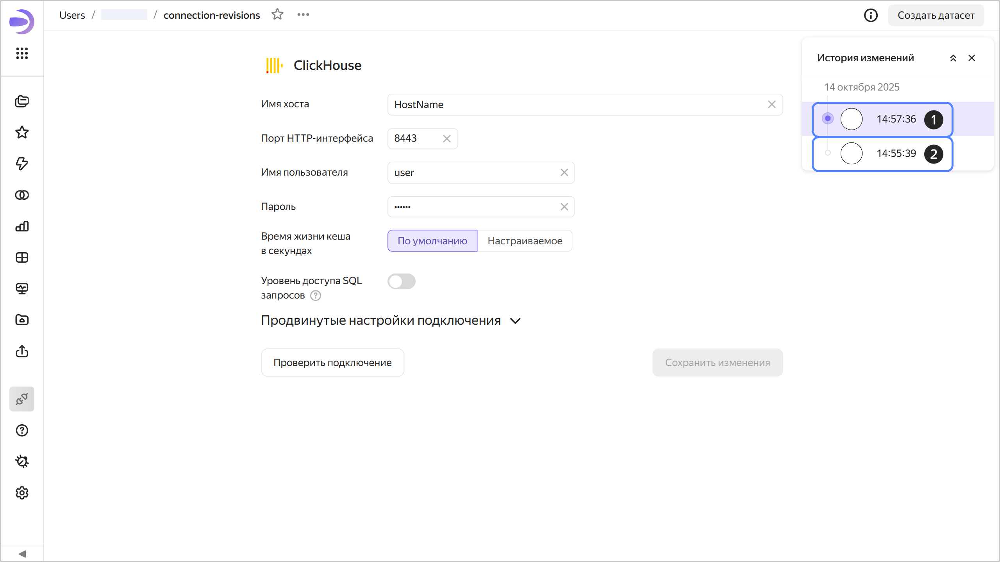

# Версионирование

Версионирование подключения — это возможность хранить историю изменений конфигурации подключения с помощью версий. Список версий доступен пользователям с минимальным правом редактирования на подключение.

Чтобы перейти к списку версий, в верхней части экрана нажмите на значок  и выберите  **История изменений**.

Чтобы перейти к выбранной версии, нажмите на нее в списке. Номер версии отобразится в значении параметра `revId` строки адреса подключения. При переходе по ссылке, содержащей номер версии в параметре `revId`, сразу откроется эта версия подключения.

## Виды версий {#version-types}

Различают следующие версии:

1. **Актуальная**. Последняя сохраненная версия подключения. Отображается всем пользователям, если открыть подключение на просмотр в воркбуке или из панели навигации. Актуальной может быть только одна версия подключения.
1. **Неактуальная**. Версия, которая не является актуальной.  
   При открытии неактуальной версии вверху отображается панель, на которой указаны: тип версии, дата и время создания и логин автора версии. Справа на панели кнопки:

   * **Сделать актуальной** — делает текущую неактуальную версию актуальной. Актуальная на текущий момент версия станет неактуальной.
   * **Открыть актуальную** — открывает актуальную версию.
   
   

   

   

## Создание новой версии {#version-create}

Новая версия автоматически создается после нажатия кнопки **Сохранить** в режиме редактирования подключения. Любые изменения конфигурации подключения, доступные в интерфейсе реадктирования, приводят к созданию новой версии.

## Редактирование версий {#version-edit}

Можно редактировать любую версию подключения.

### Редактирование неактуальной версии {#current-version-edit}

Для редактирования неактуальной версии выберите ее в списке версий. Чтобы сохранить изменения неактуальной версии, вверху справа нажмите **Сохранить** — будет создана новая актуальная версия, а все остальные станут неактуальными.

## Ограничения {#restrictions}

* Версионирование недоступно для подключений: [Файлы](../../operations/connection/create-file.md), [Яндекс Документы](../../operations/connection/create-yadocs.md) и [Google Sheets](../../operations/connection/create-google-sheets.md).
* Не версионируются чувствительные данные подключений (пароли, токены).
* Вы можете переключиться только на версии, созданные начиная с 1 декабря 2024 года. Поэтому если подключение было создано до этой даты, и в настоящее время его редактировали, после сохранения изменений предыдущая версия исчезнет, к ней нельзя будет вернуться.
* История изменений доступна только за последние три месяца.
* История изменений содержит только список версий подключений и включает: вид версии, дату и время сохранения и автора редактирования.
* Версии подключений не содержат:

  * изменений прав доступа (эта операция производится отдельно от редактирования самого подключения);
  * изменений данных в источнике (добавление, обновление или удаление строк в источнике данных).

* В версиях не отображается список изменений. Доступен лишь просмотр сохраненного состояния конфигурации подключения.