# Объединение данных {{ datalens-full-name }}

{{ datalens-full-name }} использует [подключение](connection.md), чтобы получить данные из источника (БД, CSV, Metrica и т.д.). На основе предоставленных подключением данных можно создавать датасеты, чарты и селекторы. Если в источнике доступно несколько таблиц, вы можете объединять их для получения необходимого набора данных. Связать данные из разных датасетов можно на уровне чарта или через связь селекторов.

## Способы объединения данных {#data-join}

Вы можете воспользоваться различными вариантами объединения данных:

* [{#T}](#dataset-join)

  * [{#T}](#ui-join)
  * [{#T}](#sql-join)

* [{#T}](#chart-join)

  * [{#T}](#sql-chart)
  * [{#T}](#datasets-chart)

* [{#T}](#selector-join)

### На уровне датасета {#dataset-join}

Чтобы объединить данные на уровне датасета, вы можете [добавить таблицы](#ui-join) на рабочую область или написать [SQL-запрос](#sql-join).



Нельзя объединить данные из разных источников на уровне одного датасета.



#### Добавление таблиц {#ui-join}

В интерфейсе создания датасета можно объединять данные, перетаскивая таблицы на рабочую область и настраивая связи между ними через [оператор JOIN](dataset/data-model.md#source).  Пример объединения данных с помощью добавления таблиц смотрите в [сценарии](../../tutorials/datalens/data-from-ch-visualization.md#step2).  

#### SQL-запрос {#sql-join}

В датасете можно добавить [произвольный SQL-запрос](dataset/settings.md#sql-request-in-datatset) к источнику данных. Текст запроса при обращении к источнику исполняется в виде подзапроса. Результат запроса можно использовать как итоговый набор данных датасета или объединить с другими таблицами источника через интерфейс.

### На уровне чарта {#chart-join}

{{ datalens-short-name }} позволяет объединить данные на уровне чарта. Для объединения данных на уровне чарта вы можете использовать [QL-чарт](#sql-chart) или [мультидатасетные чарты](#datasets-chart).

#### QL-чарт {#sql-chart}

[QL-чарты](chart/index.md#sql-charts) — чарты, созданные на основе подключения, если источник подключения — БД. При выполнении SQL-запроса отдельный объект Датасет не создается, он генерируется сразу и отображается на панели превью. Подробнее см. инструкцию [{#T}](../operations/chart/create-sql-chart.md).

#### Мультидатасетные чарты {#datasets-chart}

[Мультидатасетные чарты](chart/index.md#multi-dataset-charts) — чарты, которые отображают данные из разных датасетов. Запросы для каждого датасета отрабатываются независимо друг от друга. Подробнее см. инструкцию [{#T}](../operations/chart/create-multidataset-chart.md).

### На уровне связей селекторов {#selector-join}

Можно добавить на дашборд селектор, который влияет на результаты запросов в связанных с ним виджетах:
* на дашборде селекторы и чарты, построенные на основе одного датасета, связываются автоматически;
* селекторы и чарты, построенные на основе разных датасетов, можно связать вручную с помощью алиасов.

Перед созданием связи убедитесь, что поле, по которому фильтрует селектор, присутствует в датасете, по которому построен чарт. В противном случае связь работать не будет. Подробнее см. инструкцию [{#T}](../operations/dashboard/create-alias.md).

## Оптимизация данных при объединении таблиц {#join-optimization}

В некоторых чартах, построенных на основе датасета с [объединенными таблицами](#ui-join), могут использоваться поля только из одной таблицы. В этом случае {{ datalens-short-name }} оптимизирует запрос к источнику. Оператор `JOIN` не применяется, и запрос возвращает данные только из одной таблицы без фильтрации по другим. Это позволяет уменьшить объем запрашиваемых данных и сократить время выполнения запроса. Но при этом данные, которые возвращает оптимизированный запрос, могут отличаться от ожидаемых.

Оптимизация применяется при следующих условиях:

* в чарте используются поля только одной из связанных таблиц;
* поля из других таблиц не находятся ни в одной из секций чарта;
* поля из других таблиц не используются в вычисляемых полях чарта.



Оптимизация не работает, если датасет описан через [SQL-запрос к источнику](../operations/dataset/add-data.md).



Рассмотрим оптимизацию на примере разных датасетов для источника с таблицами:



| id | name     | department_id |
|----|----------|---------------|
| 1  | Иванов   | 2             |
| 2  | Петров   | 4             |
| 3  | Сидоров  | 1             |
| 4  | Степанов | 1             |
| 5  | Соколов  |               |
| 6  | Орлова   | 3             |
| 7  | Шишкина  | 3             |
| 8  | Семенов  |               |
| 9  | Антонова | 3             |
| 10 | Сергеев  | 4             |





| id | name        |
|----|-------------|
| 1  | Логистика   |
| 2  | ИТ          |
| 3  | Бухгалтерия |
| 4  | СБ          |





| employee_id | bonus  |
|-------------|--------|
| 1           | 35 000 |
| 2           | 40 000 |
| 5           | 28 000 |
| 7           | 30 000 |
| 9           | 50 000 |





| employee_id | category    |
|-------------|-------------|
| 2           | Категория 1 |
| 4           | Категория 1 |
| 5           | Категория 2 |
| 6           | Категория 3 |
| 7           | Категория 3 |
| 8           | Категория 2 |
| 10          | Категория 1 |



### Примеры {#examples}



Датасет построен из таблиц `Сотрудники` и `Отделы`, объединенных оператором [INNER JOIN](https://ru.wikipedia.org/wiki/Join_(SQL)#INNER_JOIN).

В результате объединения в датасете содержатся только общие строки из двух таблиц. Построим чарт, содержащий поля из обеих таблиц.

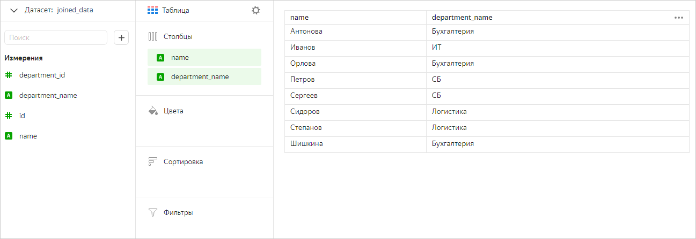

Теперь построим чарт только с полями таблицы `Сотрудники`. В этом случае {{ datalens-short-name }} не применяет оператор `JOIN` и работает только с этой таблицей. В чарте мы видим все значения из таблицы `Сотрудники`, а не только те, которые пересекаются с таблицей `Отделы`.

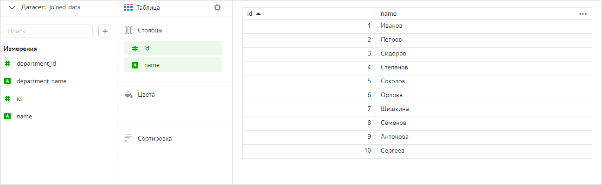

 



Датасет построен на основе таблиц `Премии` и `Сотрудники`, объединенных оператором [LEFT JOIN](https://ru.wikipedia.org/wiki/Join_(SQL)#LEFT_OUTER_JOIN). Таблица `Премии` используется целиком, а из таблицы `Сотрудники` выбираются только те значения, которые есть в `Премии`.

Построим чарт, содержащий поля из обеих таблиц.

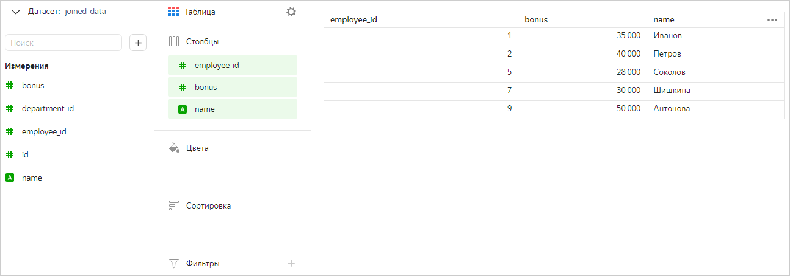

Теперь оставим в чарте только поля из таблицы `Сотрудники`. В этом случае мы увидим в чарте все значения из этой таблицы (без фильтрации по таблице `Премии`).

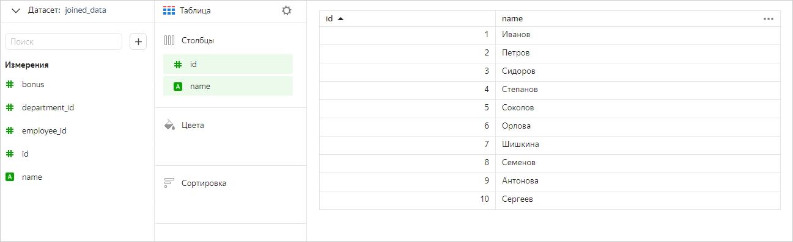

Так же работает оптимизация и для оператора [RIGHT JOIN](https://ru.wikipedia.org/wiki/Join_(SQL)#RIGHT_OUTER_JOIN).

 



Датасет построен на основе трех таблиц:

* первая таблица (`Отделы`) объединена оператором `INNER JOIN` cо второй таблицей (`Сотрудники`);
* вторая таблица (`Сотрудники`) объединена оператором `INNER JOIN` c третьей таблицей (`Премии`).

Построим чарт, содержащий поля из всех таблиц.

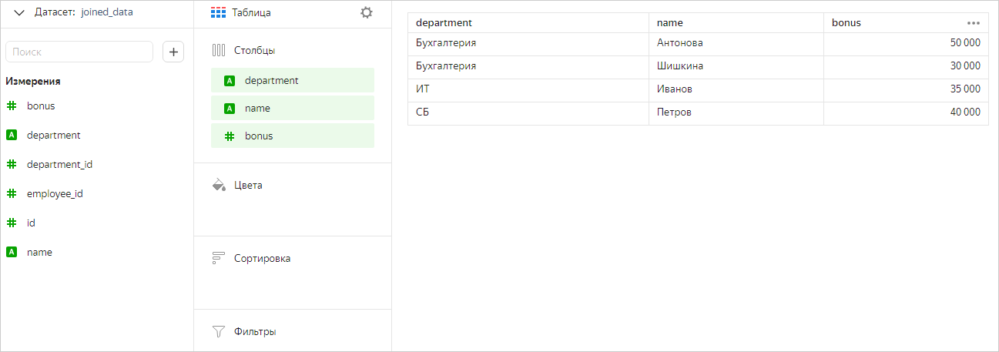

Теперь оставим в чарте только поля из таблицы `Сотрудники`. В этом случае мы увидим в чарте все значения из этой таблицы (без фильтрации по таблицам `Премии` и `Отделы`).

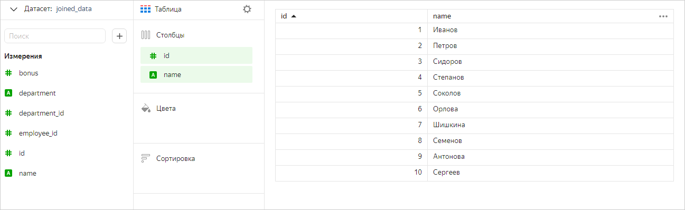

Добавим в чарт поля только из первой (`Отделы`) и третьей (`Премии`) таблицы. Явной связи между этими таблицами нет, но каждая из них связана с таблицей `Сотрудники`. Поэтому {{ datalens-short-name }} не оптимизирует запрос к источнику. В этом случае мы увидим в чарте значения из всех трех таблиц с учетом фильтрации.

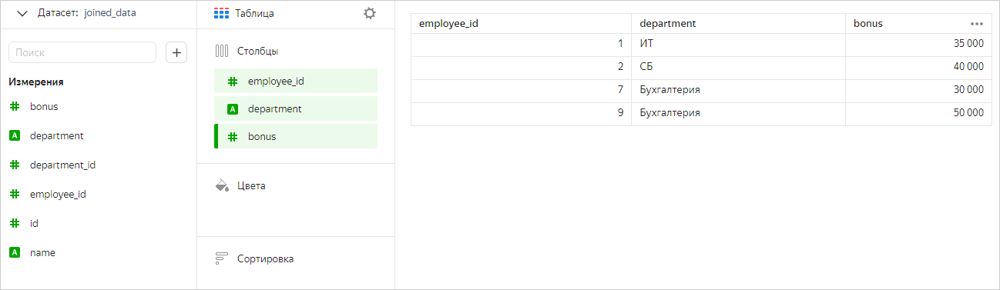

 



Датасет построен на основе трех таблиц:

* первая таблица (`Сотрудники`) объединена оператором `INNER JOIN` cо второй таблицей (`Отделы`);
* первая таблица (`Сотрудники`) объединена оператором `INNER JOIN` c третьей таблицей (`Премии`).

Построим чарт, содержащий поля из всех таблиц.

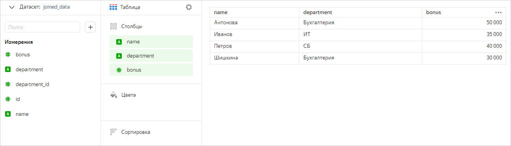

Теперь оставим в чарте только поля из таблицы `Сотрудники`. В этом случае мы увидим в чарте все значения из этой таблицы (без фильтрации по таблицам `Отделы` и `Премии`).

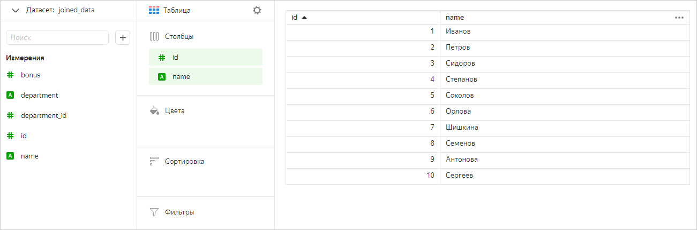

Добавим в чарт поля только из первой (`Сотрудники`) и третьей (`Премии`) таблицы. В этом случае мы увидим в чарте общие значения из этих таблиц (без фильтрации по таблице `Отделы`).

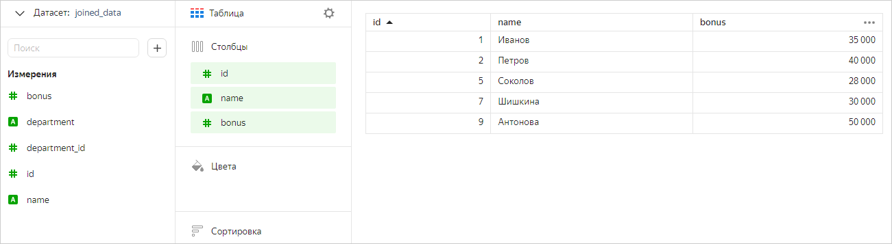

 



Датасет построен на основе четырех таблиц:

* первая таблица (`Квалификация`) объединена оператором `INNER JOIN` cо второй таблицей (`Премии`);
* первая таблица (`Квалификация`) объединена оператором `INNER JOIN` c третьей таблицей (`Сотрудники`);
* третья таблица (`Сотрудники`) объединена оператором `INNER JOIN` c четвертой таблицей (`Отделы`).

Построим чарт, содержащий поля из всех таблиц.

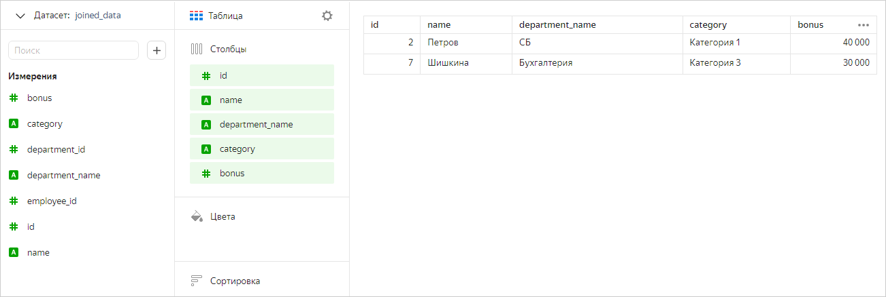

Теперь оставим в чарте только поля из таблицы `Квалификация`. В этом случае мы увидим в чарте все значения из этой таблицы (без фильтрации по остальным таблицам).

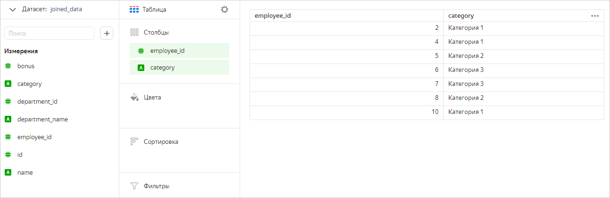

Если использовать в чарте только пару связанных между собой таблиц (первую и вторую, первую и третью, третью и четвертую), то в чарте отобразятся общие значения из этих таблиц (без фильтрации по остальным таблицам). Например, добавим в чарт поля только из первой (`Квалификация`) и второй (`Премии`) таблицы.

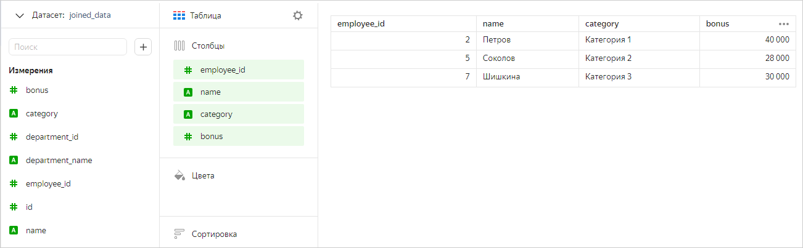

 
