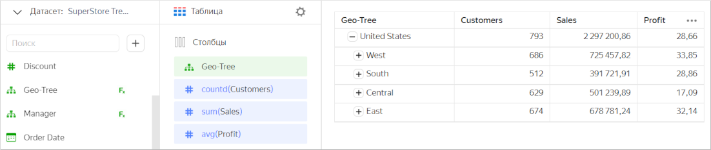

# Типы данных {{ datalens-full-name }}

{{ datalens-short-name }} работает с различными источниками данных, в которых типы данных полей могут отличаться.

Для более эффективной работы с данными, {{ datalens-short-name }} конвертирует типы данных полей источника в собственные типы.
Это оптимизирует работу с данными. Подробнее в разделе [{#T}](../dataset/types-lookup-table.md).

Вы можете изменять тип данных у полей в интерфейсе датасета и в визарде.




При загрузке CSV-файла в качестве [источника данных](../operations/connection/create-file.md), {{ datalens-short-name }} пытается автоматически определить тип данных полей.  
Если определить тип данных не удалось, DataLens задает полю тип `Строка`.

Вы можете самостоятельно изменить тип данных в интерфейсе датасета или в визарде.




## Геоточка {#geopoint}

Точка координат, которая состоит из значений широты и долготы. В {{ datalens-short-name }} задается с помощью функции [GEOPOINT](../function-ref/GEOPOINT.md).

Функция принимает на вход типы данных `Строка`, `Геоточка`, или два значения с типом `Дробное число` или `Строка`.
Если на вход подается одна строка, в ней должен содержаться список из двух чисел в JSON-синтаксисе.

Если в источнике данные записаны в формате следующей строки `[55.75222,37.61556]`, вы можете изменить тип данных поля в интерфейсе датасета и в визарде без использования формулы.







#### Примеры {#geopoint-example}

```sql
GEOPOINT("[55.7912,37.6872]")
```

```sql
GEOPOINT("55.7912","37.6872")
```

```sql
GEOPOINT(55.7912, 37.6872)
```

## Геополигон {#geopolygon}

Несколько точек координат, которые описывают полигон на карте. В {{ datalens-short-name }} задается с помощью функции [GEOPOLYGON](../function-ref/GEOPOLYGON.md).
Для заливки полигона используется алгоритм [Even-Odd](https://en.wikipedia.org/wiki/Even–odd_rule). Это позволяет создавать полигоны с вырезами.

Функция принимает на вход строку вида `[[[v1,v1], [v2,v2]], ..., [[vN-1,vN-1], [vN,vN]]]`. Если в источнике данные записаны в таком формате, вы можете изменить тип данных поля в интерфейсе датасета и в визарде без использования формулы.







#### Пример записи {#geopolygon-example}

```sql
/* Полигон без выреза */
GEOPOLYGON("[[[55.79421,37.65046],[55.79594,37.6513],[55.79642,37.65133],[55.7969, 37.65114],[55.79783, 37.65098],[55.78871,37.75101]]]")

/* Полигоны с вырезом */
GEOPOLYGON("[[[55.75,37.52],[55.75,37.68],[55.65,37.60]],[[55.79,37.60],[55.76,37.57],[55.76,37.63]]]")
GEOPOLYGON("[[[55.75,37.50],[55.80,37.60],[55.75,37.70],[55.70,37.70],[55.70,37.50]],[[55.75,37.52],[55.75,37.68],[55.65,37.60]],[[55.79,37.60],[55.76,37.57],[55.76,37.63]]]")
```

## Дата {#date}

Дата без указанного времени.

При использовании в формулах необходимо задавать дату с помощью знака решетки `#`. Например `DATETRUNC(#2018-07-12#, "year", 5)`.

Вы можете привести исходный тип данных в тип `Дата` с помощью функций [DATE](../function-ref/DATE.md) и [DATE_PARSE](../function-ref/DATE_PARSE.md).

#### Пример записи {#date-example}

```sql
#2018-01-18#
#2015-01-01#
DATETRUNC(#2018-07-12#, "year", 5)
DATEADD(#2018-01-12#, "day", 6)
```


## Дата и время (устаревший) {#datetime-old}

Дата с указанным временем (с приведением значения к [UTC](https://ru.wikipedia.org/wiki/Всемирное_координированное_время)).

При использовании в формулах необходимо задавать дату и время с помощью знака решетки `#`. Например `DATEADD(#2018-01-12 01:02:03#, "second", 6)`.

Вы можете привести исходный тип данных в тип `Дата и время (устаревший)` с помощью функций [DATETIME](../function-ref/DATETIME.md) и [DATETIME_PARSE](../function-ref/DATETIME_PARSE.md).

#### Пример записи {#datetime-old-example}

```sql
#2018-01-12 01:08:03#
#2018-05-01T#
DATEADD(#2018-01-12 01:02:03#, "second", 6)
DATETRUNC(#2018-07-12 11:07:13#, "month", 4)
```

#### Закрытие типа Дата и время (устаревший) {#datetime-deprecation}

* С 6 сентября 2022 года доступен для использования новый тип [Дата и время](#datetime), без приведения к UTC.

* 12 октября 2022 года:

  * Во всех датасетах поля с типом `Дата и время (устаревший)` будут заменены на поля с типом `Дата и время`.
  * Использование знака решетки `#` перестанет приводить константы к UTC.
  * Функции [DATETIME](../function-ref/DATETIME.md) и [DATETIME_PARSE](../function-ref/DATETIME_PARSE.md) перестанут приводить выражения к UTC.


## Дата и время {#datetime}

Дата с указанным временем (без приведения значения к [UTC](https://ru.wikipedia.org/wiki/Всемирное_координированное_время)).



Селекторы по полю с этим типом всегда применяются во временной зоне источника данных вне зависимости от временной зоны поля.



При использовании в формулах необходимо задавать дату и время с помощью удвоенного знака решетки `##`. Например `DATEADD(##2018-01-12 01:02:03##, "second", 6)`.

Вы можете привести исходный тип данных в тип `Дата и время` с помощью функций [DATETIME](../function-ref/DATETIME.md) и [DATETIME_PARSE](../function-ref/DATETIME_PARSE.md).

#### Пример записи {#datetime-example-tmp}

```sql
##2018-01-12 01:08:03##
##2018-05-01T##
DATEADD(##2018-01-12 01:02:03##, "second", 6)
DATETRUNC(##2018-07-12 11:07:13##, "month", 4)
```

## Дробное число {#float}

Вещественное число. В качестве разделителя используется символ точки.

Вы можете привести исходный тип данных в тип `Дробное число` с помощью функции [FLOAT](../function-ref/FLOAT.md).



При конвертации типа `decimal` в `Дробное число` возможна потеря точности.



#### Пример записи {#float-example}

```sql
1.47113
0.62024
FLOAT("34.567")
```

## Логический {#boolean}

Логический тип, который принимает только одно из двух значений — `TRUE` или `FALSE`.

Вы можете привести исходный тип данных в тип `Логический` с помощью функции [BOOL](../function-ref/BOOL.md).

#### Пример записи {#boolean-example}

```sql
FALSE
```

## Строка {#string}

Строка с текстом. Задается с помощью символов одиночных или двойных кавычек.
В случае использования одного вида кавычек, второй вид можно свободно использовать в этой строке без экранирования.
Например, `'Парные кавычки "пример" и одна " кавычка.'`

В строках вы можете использовать следующие символы:

* `\n` - перенос строки (LF);
* `\r` - возврат каретки (CR);
* `\t` - табуляция;
* `\"` - двойная кавычка;
* `\'` - одинарная кавычка;
* `\\` - обратная косая черта.

Вы можете привести исходный тип данных в тип `Строка` с помощью функции [STR](../function-ref/STR.md).

#### Пример записи {#string-example}

```sql
"Строка"
'Строка с "подстрокой"'
```

## Целое число {#integer}

Число, которое не содержит дробной части.

Вы можете привести исходный тип данных в тип `Целое число` с помощью функции [INT](../function-ref/INT.md).

#### Пример записи {#integer-example}

```sql
42
157
```

## Массив {#array}

Структура, которая состоит из последовательности элементов одного типа.

{{ datalens-short-name }} поддерживает работу со столбцами одномерных массивов в БД {{ CH }} и {{ PG }}. Элементы массива могут быть следующих типов:

* `Целое число`
* `Дробное число`
* `Строка`

Вы можете определить массив внутри {{ datalens-short-name }} с помощью функции [ARRAY](../../datalens/function-ref/ARRAY.md).

#### Пример записи {#array-example}

```sql
[1, 2, 3]
[1.1, 1.2, 1.3]
["Cheese", "Bread"]
```

## Дерево строк {#tree-hierarchy}

В {{ datalens-short-name }} можно создавать древовидные иерархии. Для этого используется тип поля **Дерево строк**. Данные хранятся в формате [массива](#array) с полным путем для каждого узла. Последовательность значений в массиве определяет порядок раскрытия дерева.



Дерево можно использовать только в чарте типа **Таблица**.



### Создание дерева {#how-to-create-tree}

Чтобы создать дерево, добавьте [вычисляемое поле](../operations/dataset/create-calculated-field.md) на уровне датасета или чарта через формулу `TREE(ARRAY([lev_1],[lev_2],[lev_3],[lev_n]))`, где `[lev_1]`,`[lev_2]`,`[lev_3]`, `[lev_n]` — поля датасета, определяющие иерархию дерева. 



1. Подготовьте данные в источнике:

   1. Создайте таблицу со столбцами, которые содержат значения иерархии.

      

      ```sql
      CREATE TABLE table_without_tree (
         id serial primary key,
         country text,
         region text,
         city text
      );
      ```

      

   1. Добавьте в таблицу данные с полным путем для каждого узла дерева.

      

      ```sql
      INSERT INTO table_without_tree (country, region, city)
      VALUES('Russia', 'Altay', 'Barnaul');

      INSERT INTO table_without_tree (country, region, city)
      VALUES('Russia', 'Altay', 'Biysk');

      INSERT INTO table_without_tree (country, region, city)
      VALUES('Russia', 'Altay', 'Aleisk');
      ```

      

1. В датасете создайте:

   * Вычисляемое поле с типом **Массив строк**, описывающее дерево. Например, поле `position` с формулой `ARRAY([country], [region], [city])`.
   * Вычисляемое поле с типом **Дерево строк**. Например, поле `hierarchy` с формулой `TREE([position])`, где `position` — поле с типом **Массив строк**, описывающее дерево.

     

     Создание массива и дерева строк можно объединить в одном поле с формулой `TREE(ARRAY([country], [region], [city]))`.

     





1. Подготовьте данные в источнике:

   1. Создайте таблицу, содержащую массив строк.

      

      ```sql
      CREATE TABLE table_with_tree (
        id serial primary key,
        position text[]
      );
      ```

      

   1. Добавьте в таблицу данные в виде массива с полным путем для каждого узла дерева.

      

      ```sql
      INSERT INTO table_with_tree (position)
      VALUES('{"Russia","Altay","Barnaul"}');

      INSERT INTO table_with_tree (position)
      VALUES('{"Russia","Altay","Biysk"}');

      INSERT INTO table_with_tree (position)
      VALUES('{"Russia","Altay","Aleisk"}');
      ```

      

1. В датасете создайте вычисляемое поле с типом **Дерево строк**. Например, поле `hierarchy` с формулой `TREE([position])`, где `position` — поле с типом **Массив строк**, описывающее дерево.



### Использование дерева в чарте {#how-to-use-tree}

Подготовленные в источнике данные можно использовать для создания дерева в чарте **Таблица**:

1. [Создайте](../visualization-ref/table-chart.md#create-diagram) чарт **Таблица**.
1. Перетащите в секцию **Столбцы** измерение с типом **Дерево строк**. В области визуализации отобразится древовидная иерархия. Используйте значок **+** или **-**, чтобы раскрыть или свернуть дерево.

   

   Не используйте в чарте другие измерения, кроме дерева.

   

1. Добавьте в секцию **Столбцы** необходимые показатели.

   

### Ограничения {#tree-restrictions}

В текущей версии древовидная иерархия имеет следующие ограничения:

* Одно дерево/иерархия на чарт.
* В таблице с деревьями недоступно использование опции **Пагинация** и строки **Итоги**.
* Состояние раскрытия дерева не запоминается.
* В селекторах не поддерживается использование дерева.
* В источнике необходимо хранить промежуточные узлы дерева, даже те, по которым нет данных.

