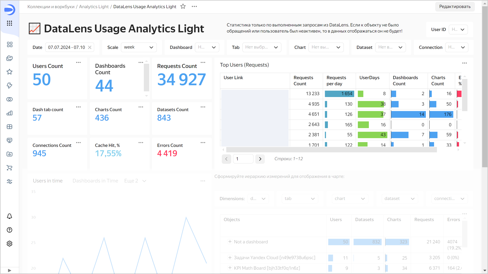
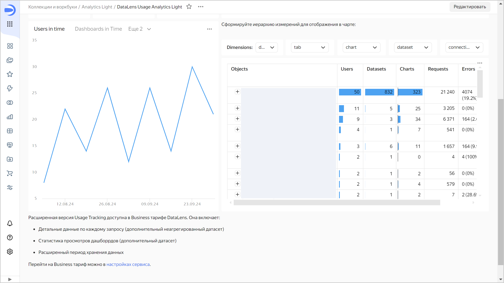
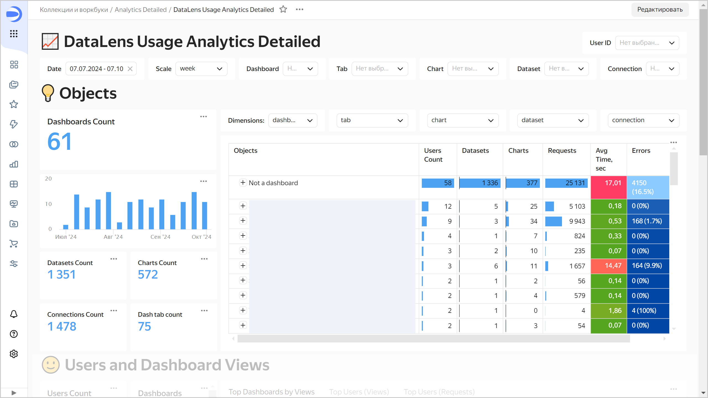
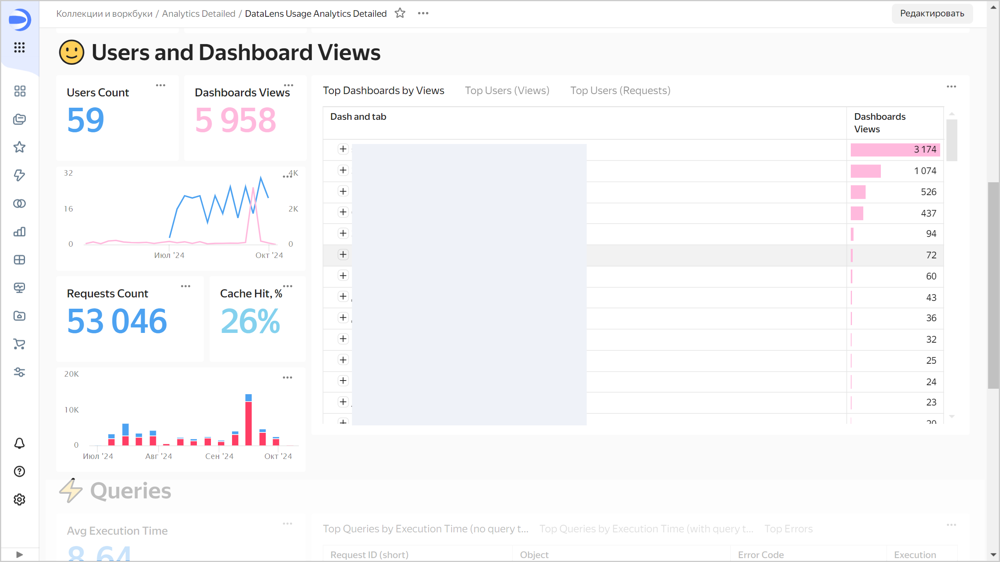

# Статистика использования сервиса {{ datalens-short-name }}

Подключение к [{{ datalens-short-name }} Usage Analytics](../operations/connection/create-usage-tracking.md) позволит вам анализировать поведение пользователей {{ datalens-short-name }}: просматривать статистику по использованию экземпляра сервиса.

В зависимости от [тарифного плана](../pricing.md#service-plans) доступны следующие подключения **Usage Analytics**:

* **Light** — предоставляет агрегированную статистику по использованию экземпляра {{ datalens-short-name }} за ограниченный период времени (60 суток). Подключение доступно в любом тарифном плане.

* **Detailed** — предоставляет как детальную, так и агрегированную статистику по использованию экземпляра {{ datalens-short-name }} за длительный период времени (180 суток). Позволяет просматривать детальную статистику по запросам в датасеты и просмотрам дашбордов. Подключение доступно в тарифном плане Business. После смены тарифного плана на Community подключение перестанет работать.

## Особенности работы с подключением {#ut-connection-dashboard}

Статистика использования сервиса формируется с учетом следующих особенностей:

* Для некоторых подключений не сохраняется текст запроса:

  * [Файлы](../operations/connection/create-file.md)
  * [Google Sheets](../operations/connection/create-google-sheets.md)
  * [Яндекс Документы](../operations/connection/create-yadocs.md)
  * [{{ yq-full-name }}](../operations/connection/create-yandex-query.md)
  * [Metrica](../operations/connection/create-metrica-api.md)
  * [AppMetrica](../operations/connection/create-appmetrica.md)
  * [{{ billing-name }}](../operations/connection/create-cloud-billing.md)
  * [{{ monitoring-full-name }}](../operations/connection/create-monitoring.md)

* При создании нового объекта (подключение, датасет, чарт, дашборд) в статистике некоторое время, но не более суток, вместо названия будет отображаться `__unknown__`. При переименовании объекта некоторое время, но не более суток, будет видно его старое название.
* Агрегированные данные обновляются один раз в день.
* Объекты, к которым не было обращений, и неактивные пользователи не отображаются в статистике.

### Дашборд DataLens Usage Analytics Light {#light-dash}

На дашборде можно посмотреть сводную информацию:

* о количестве активных пользователей — `Users Count`;
* о количестве объектов разного типа — `Dashboards Count`, `Connections Count`, `Datasets Count` и `Charts Count`;
* о количестве выполненных запросов и возникших ошибок — `Requests Count` и `Errors Count`;
* о доле запросов, которые используют данные из кеша — `Cache Hit`;
* о пользователях, которые используют объекты.





В верхней части находятся фильтры по пользователям и объектам — можно выбрать дашборд, вкладку, чарт, датасет или подключение. Используя календарь, можно задать период, за который выводится статистика. Используя селектор `Scale`, можно выбрать группировку по месяцам, неделям или дням для диаграмм ниже.

С помощью таблицы `Top Users (Requests)` можно оценить активность пользователей:

* `User Link` — логин и ссылка на страницу пользователя;
* `Requests Count` — количество запросов за указанный период;
* `Requests per day` — среднее количество запросов за день активности;
* `UserDays` — количество дней активности;
* `Dashboards Count` — количество дашбордов, к которым были запросы от пользователя;
* `Charts Count` — количество чартов, к которым были запросы от пользователя;
* `Errors, %` — количество возникших ошибок в процентах.

Ниже можно выбрать диаграмму для отображения количества пользователей, запросов, дашбордов или ошибок в заданном периоде.





С помощью настраиваемой таблицы с иерархией объектов вы можете оценить, какие дашборды используются больше всего, сколько на каждом дашборде датасетов и чартов, где чаще возникают ошибки. По умолчанию иерархия объектов в таблице выстроена от дашборда к подключению. В `Dimensions` вы можете настроить иерархию объектов по себя — например, в обратном порядке, от подключения к дашборду. Для каждого объекта в иерархии отображается:

* `Users` — количество пользователей, отправивших запрос к объекту;
* `Datasets` — количество связанных датасетов;
* `Charts` — количество связанных чартов;
* `Requests` — количество запросов;
* `Errors` — количество и процент ошибок;
* `Lvl 1` — ссылка на объект верхнего уровня в иерархии.

### Дашборд DataLens Usage Analytics Detailed {#detailed-dash}

Дашборд разбит на три блока:

* **Objects** — объекты. В этом блоке можно посмотреть сводную информацию по количеству объектов разного типа. В верхней части находятся фильтры по объектам. С помощью настраиваемой таблицы с иерархией объектов вы можете оценить: какие дашборды используются больше всего, какие чарты грузятся в среднем дольше других, где чаще возникают ошибки и другую информацию.

  

  

  

  По умолчанию иерархия объектов в таблице выстроена от дашборда к подключению. В `Dimensions` вы можете настроить иерархию объектов по себя — например, в обратном порядке, от подключения к дашборду. Для каждого объекта в иерархии отображается:

  * `Users Count` — количество пользователей, отправивших запрос к объекту;
  * `Datasets` — количество связанных датасетов;
  * `Charts` — количество связанных чартов;
  * `Requests` — количество запросов;
  * `Avg Time, sec` — среднее время выполнения запроса к объекту;
  * `Errors` — количество и процент ошибок;
  * `Lvl 1` — ссылка на объект верхнего уровня в иерархии.

* **Users and Dashboard Views** — пользователи и просмотры дашбордов. В этом блоке можно посмотреть:

  * количество активных пользователей — `Users Count`;
  * количество просмотров дашбордов — `Dashboards Views`;
  * количество запросов — `Requests Count`;
  * доля запросов, которые используют данные из кеша — `Cache Hit`;
  * какие дашборды просматривают;
  * кто пользуется вашими объектами.

  На вкладках можно смотреть информацию как по просмотрам, так и по запросам.

  

  

  

* **Queries** — запросы. В этом блоке можно посмотреть среднее время выполнения запросов и количество ошибок, а также детальную информацию о конкретных запросах:
  
  * идентификатор запроса;
  * время выполнения;
  * дату и время отправки запроса;
  * текст запроса, который отправлен в источник;
  * код ошибки.
   
  
  

  

  

