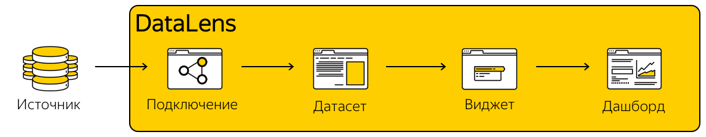

# Взаимосвязь ресурсов сервиса

Компоненты сервиса Yandex DataLens — это инструменты, с помощью которых осуществляется полный цикл работы с данными: поставка, обработка, хранение и визуализация.

DataLens состоит из следующих компонентов:
- **Подключение** — параметры доступа к источнику данных.
- **Датасет** — набор данных и/или их метаописание.
- **Виджет** — визуализация данных в виде графика, таблицы, тепловой карты...
- **Дашборд** — страница с набором виджетов и управляторов.
