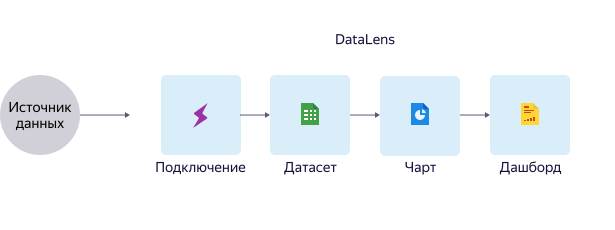

# Обзор сервиса

Yandex DataLens это сервис для бизнес-аналитики. Сервис позволяет загружать и обрабатывать данные,
визуализировать их для анализа и проверки гипотез. С его помощью вы можете принимать важные маркетинговые и другие решения
для вашего продукта.

## Взаимосвязь компонентов

DataLens состоит из нескольких компонентов, которые позволяют осуществлять полный цикл работы с данными.

DataLens состоит из следующих компонентов:
- **Подключение** — содержит параметры доступа к источнику данных. Для создания подключения к разным источникам,
 используются коннектор. Они содержат предустановленные настройки для загрузки данных.
- **Датасет** — набор данных и их описание. DataLens позволяет визуализировать загруженные данные
с помощью специального конструктора — визарда.
- **Чарт** — визуализация данных из датасета в виде диаграмм и таблиц. Чарты можно использовать для быстрой проверки
гипотез или сохранять их в виде виджетов для дальнейшего использовния.
- **Дашборд** — страница с набором виджетов. На дашборде размещаются различные объекты визуализации а также инструменты
 управления.
