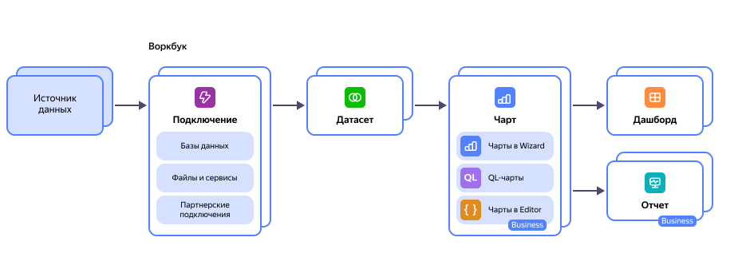

# О {{ datalens-full-name }}

{{ datalens-full-name }} — сервис для бизнес-аналитики. Сервис позволяет подключаться к различным источникам данных, строить визуализации, собирать дашборды, отчеты и презентации, а также делиться полученными результатами. С помощью {{ datalens-short-name }} вы можете отслеживать продуктовые и бизнес-метрики напрямую из источников, чтобы принимать основанные на данных решения.

Примеры использования сервиса вы найдете на [{{ datalens-gallery }}]({{ link-datalens-main }}/gallery).

## Как устроен {{ datalens-short-name }} {#how-dl-works}

{{ datalens-short-name }} состоит из нескольких сущностей:

* **Подключение** — набор параметров для доступа к источнику данных.
* **Датасет** — описание набора данных из источника.
* **Чарт** — визуализация данных из источника данных или датасета в виде таблиц, диаграмм и карт.
* **Дашборд** — набор чартов и селекторов для фильтрации данных и текстовых блоков с автоматической адаптацией на мобильных устройствах.
* **Отчет** — документ, который можно использовать как интерактивную презентацию: добавить графики, текстовые блоки, заголовки и изображения и в дальнейшем экспортировать в PDF. Отчеты доступны в [тарифном плане](../../datalens/pricing.md#service-plans) Business.

Организация объектов в {{ datalens-short-name }} осуществляется с помощью воркбуков и коллекций. Воркбуки содержат подключения, датасеты, чарты и дашборды. Коллекция служит контейнером для группировки воркбуков и других коллекций и упрощает управление и навигацию по данным.

В {{ datalens-short-name }} есть три инструмента для создания чартов (графиков, таблиц, карт):

* [**Wizard**](./chart/dataset-based-charts.md) — инструмент, привычный пользователям Tableau, PowerBI и подобных систем, позволяющий создавать датасеты и визуализировать данные из них в графическом интерфейсе с помощью формул и перемещения полей в нужные секции.

* [**QL-чарты**](chart/ql-charts.md) — возможность создания чарта на базе написанного запроса к источнику данных.

* [**Editor**](../charts/editor/index.md) — редактор, позволяющий создавать различные виджеты для визуализации данных с помощью кода на JavaScript. Editor позволяет использовать данные из различных [источников](../charts/editor/sources.md) и обрабатывать их произвольным образом, что делает его очень гибким инструментом. Доступен только в тарифе Business.

Создаваемые чарты затем можно вынести на [дашборды](./dashboard.md) или в [отчеты](../reports/index.md), добавить к ним элементы управления в виде селекторов, заголовки, изображения, текстовые пояснения и поделиться результатом с коллегами и командой.

