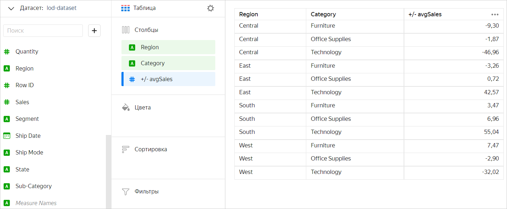
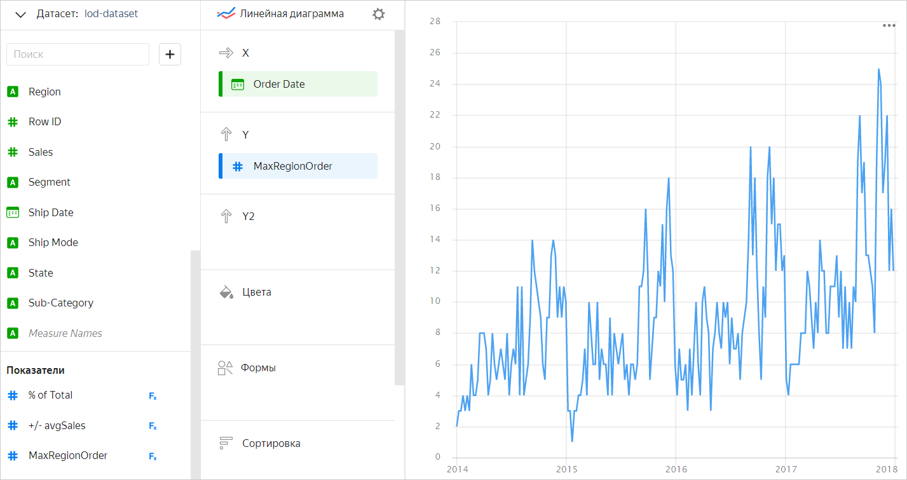
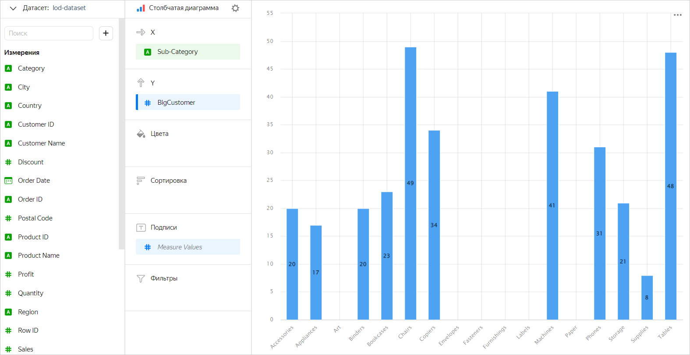
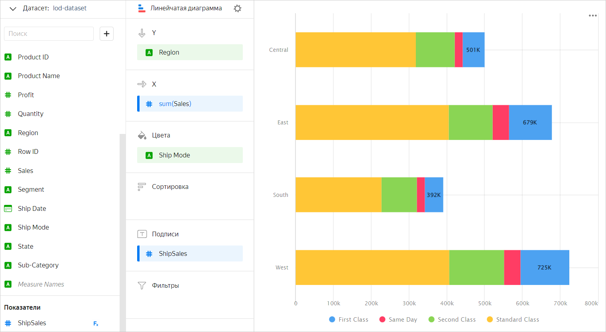
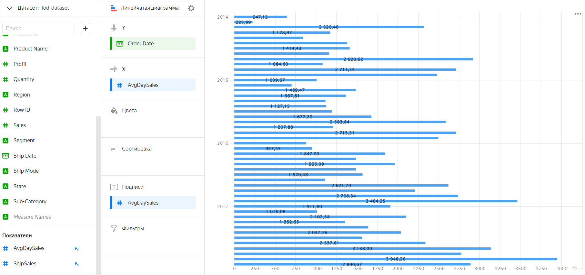
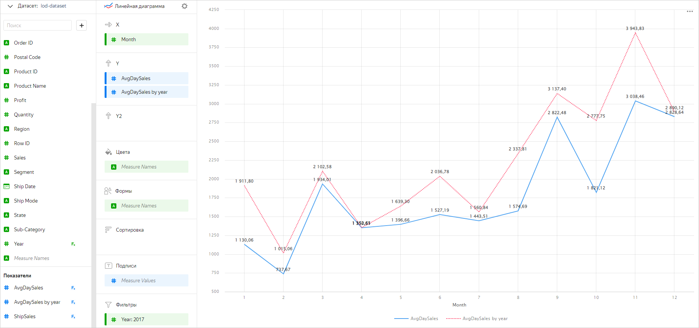

# LOD-выражения и управление фильтрацией в агрегатных функциях

По умолчанию в {{ datalens-short-name }} [агрегатные функции](../function-ref/aggregation-functions.md) вычисляются с группировкой по измерениям, которые участвуют в построении чарта (находятся в одной из его секций). Группировку для агрегатной функции можно изменить, если указать для нее [уровень детализации](../function-ref/aggregation-functions.md#syntax-lod). Управление уровнем детализации позволяет добавлять или исключать измерения из группировки, а также использовать вложенные агрегации. Подробнее о том, как работают агрегация и группировка данных в {{ datalens-short-name }}, читайте в разделе [{#T}](aggregation-tutorial.md).

В качестве источника данных для примеров будет использоваться прямое [подключение](../tutorials/data-from-ch-to-sql-chart.md#create-connection) к демонстрационной БД (датасет построен на основе таблицы `SampleSuperstore`).

## Группировка в LOD-выражениях {#lod-grouping}

Уровень детализации в LOD-выражениях задается с помощью указания ключевых слов (см. раздел [{#T}](../function-ref/aggregation-functions.md#syntax)):

* [FIXED](#fixed)
* [INCLUDE](#include)
* [EXCLUDE](#exclude)

Ключевые слова переопределяют группировку, заданную в чарте, при вычислении конкретной агрегатной функции.



В LOD-выражениях можно указывать как используемые, так и не используемые в чарте измерения. При этом агрегация верхнего уровня должна содержать только измерения, которые используются в чарте (находятся в одной из его секций).



### FIXED {#fixed}

Ключевое слово `FIXED` позволяет выполнить группировку по явно перечисленным измерениям. `FIXED` с пустым списком измерений эквивалентно той же группировке, что и в чарте.

**Пример 1**

В чарте с группировкой по измерениям `Region` и `Category` необходимо посчитать долю каждой категории в регионе от общей суммы продаж (`% of Total`). 

Создадим показатель `SUM([Sales]) / SUM([Sales] FIXED)`, где:

* `SUM([Sales])` — сумма продаж по каждой категории в городе (вычисляется с группировкой по умолчанию в чарте); 
* `SUM([Sales] FIXED)` — общая сумма продаж (вычисляется с группировкой без измерений).

На примере чарта **Таблица** результат будет выглядеть так:


**Пример 2**

В том же чарте посчитаем для каждой категории товаров отклонение средней суммы продаж в регионе от средней суммы продаж во всех регионах (`+/- avgSales`).

Создадим показатель `AVG([Sales]) - AVG([Sales] FIXED [Category])`, где:

* `AVG([Sales])` — средняя сумма продаж по категории в регионе (вычисляется с группировкой по умолчанию в чарте — по измерениям `[Region]` и `[Category]`); 
* `AVG([Sales] FIXED [Category])` — средняя сумма продаж по категории во всех регионах (вычисляется с группировкой по измерению `[Category]`).

На примере чарта **Таблица** результат будет выглядеть так:



### INCLUDE {#include}

Ключевое слово `INCLUDE` позволяет добавить указанные измерения в группировку чарта. Таким образом, повышается уровень детализации при вычислении агрегатной функции.
Выражения с `INCLUDE` могут быть полезны, если нужно вычислить показатель с высоким уровнем детализации, а в чарте отобразить его на более грубом уровне. Например, можно вычислить сумму продаж за каждый день, а затем усреднить ее.

`INCLUDE` с пустым списком измерений эквивалентно той же группировке, что и в чарте.

**Пример 1**

Вычислим максимальное количество заказов по регионам за каждую дату. Здесь используем вложенную агрегацию: сначала посчитаем количество заказов за каждую дату, а потом выберем максимальное значение. Формула для показателя: `MAX(COUNTD([Order ID] INCLUDE [Region]))`.



В этом примере измерение `[Region]`, отсутствующее в чарте, добавляется на вложенном уровне. Таким образом, на верхнем уровне агрегация будет вычисляться с группировкой по измерению `[Order Date]`, которое используется в чарте, а вложенная агрегация — по измерениям `[Order Date]` и `[Region]`.



На примере чарта **Линейная диаграмма** результат будет выглядеть так:



В чарте используется только одно измерение — `[Order Date]`. При этом вычисление количества заказов выполняется с группировкой по дате и региону, потому что для функции [COUNTD](../function-ref/COUNTD.md) в группировку добавлено измерение `[Region]`.

**Пример 2**

Посчитаем, сколько покупателей со средней суммой покупки больше 1000 приходится на каждую подкатегорию товаров. Для вычисления создадим показатель с помощью функции [COUNTD_IF](../function-ref/COUNTD_IF.md). Формула показателя — `COUNTD_IF(ANY([Customer ID] INCLUDE [Customer ID]), AVG([Sales] INCLUDE [Customer ID]) > 1000)`, где:

* `ANY([Customer ID] INCLUDE [Customer ID])` — измерение `[Customer ID]` преобразуется в показатель с помощью функции [ANY](../function-ref/ANY.md);
* `AVG([Sales] INCLUDE [Customer ID]) > 1000` — средняя сумма покупки сравнивается с заданным значением.

На примере чарта **Столбчатая диаграмма** результат будет выглядеть так:



Любую агрегацию с `INCLUDE` можно заменить на агрегацию с `FIXED`. Например, в чарте с группировкой по измерениям `Region` и `Category` показатель `SUM(SUM([Sales] INCLUDE [City]))` будет аналогичен показателю `SUM(SUM([Sales] FIXED [Region],[Category],[City]))`.

### EXCLUDE {#exclude}

Ключевое слово `EXCLUDE` позволяет исключить указанные измерения из группировки чарта. Таким образом, вычисление значения агрегатной функции выполняется с группировкой по всем измерениям чарта, кроме перечисленных.

Выражения с `EXCLUDE` могут использоваться, например, для вычисления процент от общего числа или разницы от общего среднего.

`EXCLUDE` с пустым списком эквивалентно той же группировке, что и в чарте.

**Пример 1**

Посчитаем сумму продаж в регионах с разбивкой по типу доставки. Для этого в чарте зададим группировку по измерениям `[Region]` и `[Ship Mode]`. Чтобы показать общую сумму по всем типам доставки, добавим в секцию **Подписи** такой показатель: `IF([Ship Mode]="First Class", SUM([Sales] EXCLUDE [Ship Mode]), NULL)`. С помощью `EXCLUDE` измерение `[Ship Mode]` исключается из группировки при расчете этого показателя, поэтому считается общая сумма для всех типов доставки.

На примере чарта **Линейчатая диаграмма** результат будет выглядеть так:



**Пример 2**

Вычислим среднюю дневную сумму продаж в разбивке по месяцам. Для этого добавим в чарт группировку по месяцам: для поля `[Order Date]` в настройке **Группировка** выберем **Округление** ⟶ **Месяц** (подробнее в разделе [{#T}](chart/settings.md#field-settings)). Создадим показатель с формулой `AVG(SUM([Sales] FIXED [Order Date]) EXCLUDE [Order Date])`, где:

* `SUM([Sales] FIXED [Order Date])` — сумма продаж всех заказов за день;
* `AVG(SUM([Sales] FIXED [Order Date]) EXCLUDE [Order Date])` — измерение `[Order Date]` исключается из группировки, чтобы средняя дневная сумма продаж считалась с группировкой по месяцам (которая задана в чарте).

На примере чарта **Линейчатая диаграмма** результат будет выглядеть так:



Любую агрегацию с `EXCLUDE` можно заменить на агрегацию с `FIXED`. Например, в чарте с группировкой по измерениям `Region` и `Category` показатель `SUM([Sales] EXCLUDE [Category])` будет аналогичен показателю `SUM([Sales] FIXED [Region])`.

## Фильтрация {#before-filter-by}

Секция [BEFORE FILTER BY](window-function-tutorial.md#before-filter-by) в LOD-выражениях имеет тот же смысл, что и в оконных функциях: агрегатная функция будет вычисляться до фильтрации по указанным полям.

**Пример**

Сравним показатели средних дневных продаж в месяц за определенный год с аналогичными показатели всего периода. Добавим в чарт два новых измерения — месяц и год заказа:

* Month — `MONTH([Order Date])`
* Year — `YEAR([Order Date])`

Для вычисления суммы продаж создадим два показателя:

* AvgDaySales — `AVG(SUM([Sales] FIXED [Order Date]) EXCLUDE [Order Date] BEFORE FILTER BY [Year])`
* AvgDaySales by year — `AVG(SUM([Sales] FIXED [Order Date]) EXCLUDE [Order Date])`

В чарте добавим измерение `Year` в секцию **Фильтры** и укажем, например, значение `2017`. Таким образом, показатель `AvgDaySales` будет вычислен до применения фильтрации в чарте по году, и мы получим среднюю дневную сумму продаж в месяц за весь период. А показатель `AvgDaySales by year` будет вычислен после применения фильтрации в чарте по году, и мы получим среднюю дневную сумму продаж в месяц за выбранный год (`2017`).

На примере чарта **Линейная диаграмма** результат будет выглядеть так:



## Сходство с оконными функциями {#lod-and-window}

В некоторых случаях LOD-выражения можно использовать как альтернативу [оконным функциям](../function-ref/window-functions.md). 

Например, выражение с `FIXED` со списком измерений может применяться аналогично оконной функции с группировкой [WITHIN](window-function-tutorial.md#within), а выражение с `EXCLUDE` — оконной функции с группировкой [AMONG](window-function-tutorial.md#among).

**Пример 1**

Рассмотрим чарт с вычислением доли каждой категории товаров от общей суммы продаж по городу. Показатели `% Total by city window` и `% Total by city lod` дают одинаковый результат:

* % Total by city lod — `SUM([Sales]) / SUM([Sales] FIXED [City])`
* % Total by city window — `SUM([Sales]) / SUM(SUM([Sales]) WITHIN [City])`

`FIXED` с пустым списком измерений в некоторых случаях аналогично использованию оконной функции с группировкой [TOTAL](window-function-tutorial.md#one-window-grouping) (которая, в свою очередь, является синонимом `WITHIN` с пустым списком).

**Пример 2**

Рассмотрим чарт с вычислением доли каждой категории товаров от общей суммы продаж во всех городах. Показатели `% Total window` и `% Total lod` дают одинаковый результат:

* % Total lod — `SUM([Sales]) / SUM([Sales] FIXED)`
* % Total window — `SUM([Sales]) / SUM(SUM([Sales]) TOTAL)`

Для `INCLUDE` аналога в оконных функциях нет — в них нельзя добавить новые измерения.

## Ограничения {#restrictions}

Есть ряд ограничений на использование уровня детализации в LOD-выражениях:

1. Агрегации верхнего уровня не могут содержать измерения, которые не используются в чарте. Таким образом, на верхнем уровне нельзя использовать агрегацию с непустым `INCLUDE` или с `FIXED`, содержащим измерения, которые не используются в чарте.

   **Пример**

   В чарте с группировкой по измерениям `[Region]` и `[Category]` создадим показатель для вычисления средней суммы продаж по городу:

   

   - Как можно
  
     ```
     AVG(AVG([Sales] INCLUDE [City]))
     ```

     В этом случае группировка вложенной агрегации будет выполнена по измерениям, [унаследованным](../function-ref/aggregation-functions.md#syntax-lod-inheritance) от агрегации верхнего уровня (`[Region]` и `[Category]`), и измерению `[City]`, добавленному в группировку с помощью `INCLUDE`. Таким образом, на верхнем уровне агрегация будет вычисляться с группировкой по измерениям чарта `[Region]` и `[Category]`, а вложенная агрегация — по измерениям `[Region]`,`[Category]` и `[City]`.

   - Как нельзя
  
     ```
     AVG([Sales] INCLUDE [City])
     ```

     При вычислении этого показателя группировка на верхнем уровне выполняется по измерениям `[Region]`,`[Category]` и `[City]`. Ошибка в этом случае возникает из-за того, что измерение `[City]` (добавленное в группировку с помощью `INCLUDE`) не используется в чарте.

   

1. Агрегации, находящиеся на одном уровне вложенности, не могут иметь разные наборы измерений. Хотя бы одна из вложенных агрегаций должна содержать все измерения, которые есть в других вложенных агрегациях.

   **Пример**

   В чарте с группировкой по измерениям `[Region]` и `[Category]` создадим показатель для вычисления города с максимальной средней дневной суммой продаж:

   

   - Как можно

     ```
     ARG_MAX(
          ANY([City] INCLUDE [City]),
          AVG([Sales] INCLUDE [City],[Order Date])
     )
     ```

     Агрегации `ANY([City] INCLUDE [City])` и `AVG([Sales] INCLUDE [City],[Order Date])` находятся на одном уровне вложенности (внутри `ARG_MAX`). При этом вторая агрегация содержит все измерения, по которым выполняется группировка в первой агрегации.

   - Как нельзя

     ```
     ARG_MAX(
          ANY([City] INCLUDE [City]),
          AVG([Sales] INCLUDE [Order Date])
     )
     ```

     Агрегации `ANY([City] INCLUDE [City])` и `AVG([Sales] INCLUDE [Order Date])` находятся на одном уровне вложенности (внутри `ARG_MAX`). У первой агрегации измерение `[City]`, у второй — `[Order Date]`. При этом нет другой агрегации, которая содержит оба этих измерения.

   

1. Нельзя использовать агрегации с заданным уровнем детализации и функции [AGO](../function-ref/AGO.md), [AT_DATE](../function-ref/AT_DATE.md) в одном и том же запросе (в одном чарте или в предпросмотре датасета), даже если они содержатся в разных полях.
