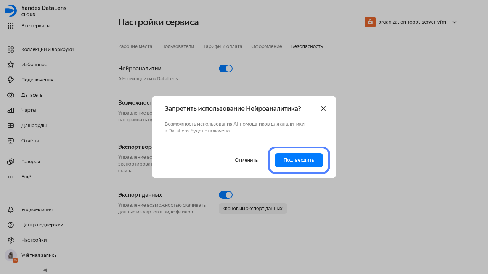
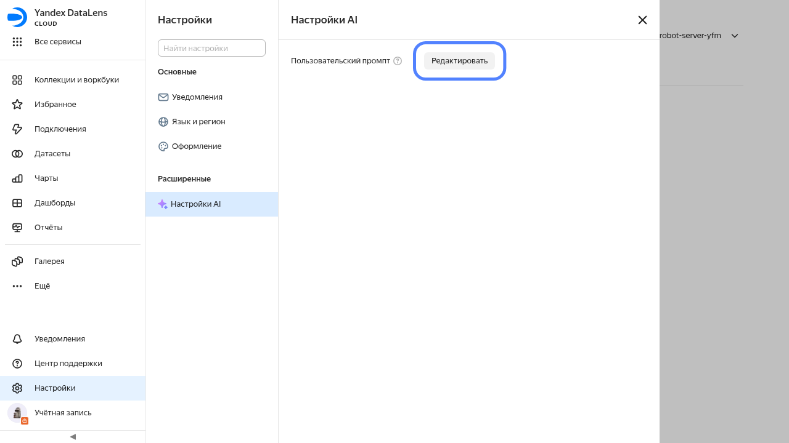

# Нейроаналитик в {{ datalens-full-name }}

Нейроаналитик в {{ datalens-full-name }} — это несколько AI-помощников, которые помогают анализировать проекты, предлагают улучшения и правки, ускоряют и упрощают создание и редактирование визуализаций.

* [Нейроаналитик для создания вычисляемых полей](../concepts/calculations/formulas-helper.md) — помощь при создании вычисляемых полей.
* [Нейроаналитик на дашборде](../dashboard/insights.md) — нейроаналитика по всему дашборду и для отдельных чартов. Доступен [Нейроаналитик 2.0](../dashboard/insights.md#neuroanalyst-2) — полноценный AI-агент в {{ datalens-name }}, который для ответа на вопрос может подобрать похожий чарт и построить новый прямо по датасету.
* [Нейроаналитик в Editor](../charts/editor/code-helper.md) — помощь в написании кода и поиске ответов на вопросы.
* [Нейроаналитик в отчете](../reports/insights.md) — нейроаналитика в отчете.

## Безопасность и обработка данных {#security}

* Нейроаналитик основан на базе облачного сервиса [{{ ai-studio-full-name }}]({{ link-docs-ai }}).

* Ваши данные и запросы не покидают контура {{ yandex-cloud }}.
* Ваши данные и запросы не логируются и не используются для дообучения.
* На уровне дашборда или отчета администратор может [отключить возможность генерации инсайтов для ваших пользователей](#prohibit).

Смотрите также [лимиты для Нейроаналитика](./limits.md#datalens-ai-limits).

## Запрет на использование Нейроаналитика {#prohibit}

По умолчанию пользователи {{ datalens-name }} могут использовать Нейроаналитика. Пользователь с ролью `{{ roles-datalens-admin }}` может отключить эту возможность на уровне экземпляра {{ datalens-short-name }} или точечно на уровне настроек дашборда или отчета:



- Экземпляр {{ datalens-short-name }}

  1. На панели слева выберите  **Настройки сервиса**.
  1. Выберите вкладку **Безопасность**.
  1. Отключите опцию **Нейроаналитик** (по умолчанию она включена). После этого AI-помощники пропадут из интерфейса {{ datalens-name }} у всех пользователей экземпляра.

  
  

  

  

- Дашборд

  

- Отчет

  



## Настройка пользовательского промпта {#user-promt}

В {{ datalens-short-name }} есть возможность настройки пользовательского промпта для AI. Чтобы его настроить:

1. Откройте настройки, для этого на панели навигации слева нажмите  **Настройки**.
1. Перейдите на вкладку **Настройки AI**.

      
   

   

   

1. Нажмите кнопку **Редактировать**
1. Введите промпт в текстовое поле и нажмите кнопку **Сохранить**.

При выполнении каждого запроса к AI пользовательский промпт добавляется к системному промпту, определенному в {{ datalens-short-name }}.

