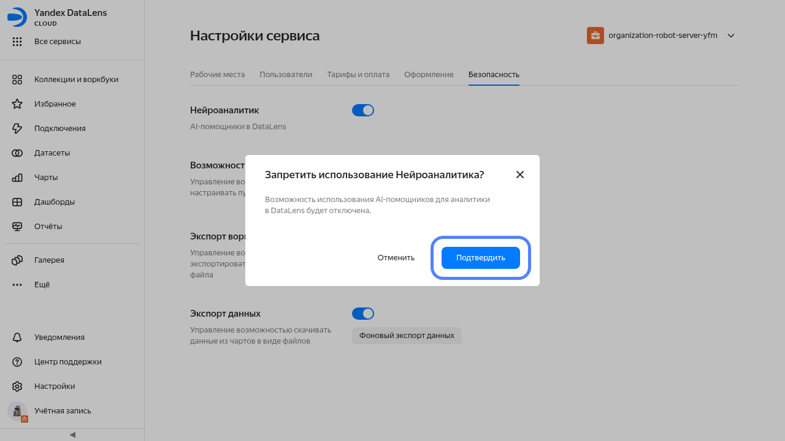
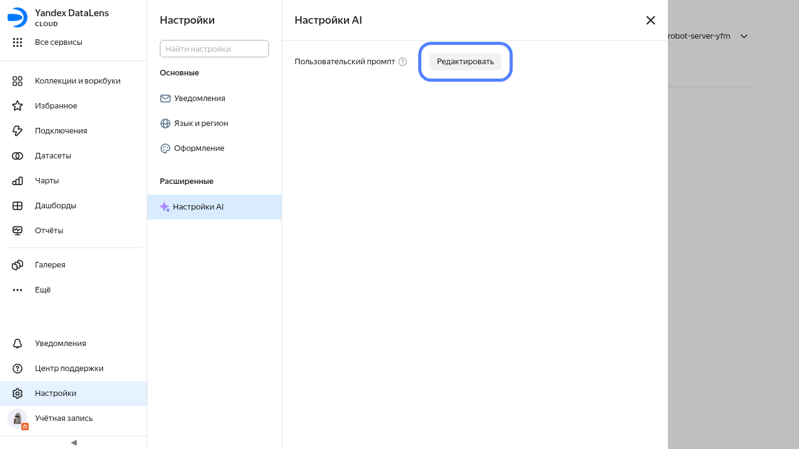

# Нейроаналитик в {{ datalens-full-name }}

Нейроаналитик в {{ datalens-full-name }} — это AI-помощники, которые помогают анализировать проекты, предлагают улучшения и правки, ускоряют и упрощают создание и редактирование визуализаций.

* [Нейроаналитик для создания вычисляемых полей](../concepts/calculations/formulas-helper.md) — помогает составлять формулы и отвечает на вопросы по ним.
* [Нейроаналитик на дашборде](../dashboard/insights.md) — анализирует как дашборд в целом, так и его отдельные чарты. Нейроаналитик на дашборде работает в агентском режиме: при ответе на вопрос он может подобрать похожий чарт и построить новый прямо по датасету. На дашборд можно [добавлять виджеты с инсайтами](../operations/dashboard/add-ai.md) от Нейроаналитика.
* [Нейроаналитик в Editor](../charts/editor/code-helper.md) — помогает писать и отлаживать код для построения визуализаций, а также отвечает на вопросы по коду.
* [Нейроаналитик в отчете](../reports/insights.md) — анализирует чарты в отчете. В отчет можно [добавлять виджеты с инсайтами](../reports/report-operations.md#report-widget-settings) от Нейроаналитика.
* [Нейроаналитик в рассылках](./maillists.md) — анализирует и суммаризирует содержимое рассылки.

## Безопасность и обработка данных {#security}

* Нейроаналитик основан на базе облачного сервиса [{{ ai-studio-full-name }}]({{ link-docs-ai }}).

* Ваши данные и запросы не покидают контура {{ yandex-cloud }}.
* Ваши данные и запросы не используются для дообучения.
* Можно запретить использование Нейроаналитика и виджетов-инсайтов [на разных уровнях](#prohibit): экземпляр {{ datalens-name }}, отдельно взятые дашборды и отчеты.
* Действуют лимиты на количество запросов к Нейроаналитику, подробности в [разделе](./limits.md#datalens-ai-limits).

## Запрет на использование Нейроаналитика {#prohibit}

По умолчанию все пользователи {{ datalens-name }} могут использовать Нейроаналитика. Пользователь с ролью `{{ roles-datalens-admin }}` может отключить эту возможность на уровне экземпляра {{ datalens-short-name }} или точечно на уровне настроек дашборда или отчета:



- Экземпляр {{ datalens-short-name }}

  1. На панели слева выберите  **Настройки сервиса**.
  1. Выберите вкладку **Безопасность**.
  1. Отключите опцию **Нейроаналитик** (по умолчанию она включена). После этого AI-помощники пропадут из интерфейса {{ datalens-name }} у всех пользователей экземпляра. На дашбордах и в отчетах перестанут работать виджеты с инсайтами.

  
  

  

  

- Дашборд

  

- Отчет

  



## Настройка пользовательского промпта {#user-promt}

В {{ datalens-short-name }} есть возможность настройки пользовательского промпта для AI. Чтобы его настроить:

1. Откройте настройки, для этого на панели навигации слева нажмите  **Настройки**.
1. Перейдите на вкладку **Настройки AI**.

      
   

   

   

1. Нажмите кнопку **Редактировать**
1. Введите промпт в текстовое поле и нажмите кнопку **Сохранить**.

При выполнении каждого запроса к AI пользовательский промпт добавляется к системному промпту, определенному в {{ datalens-short-name }}.

