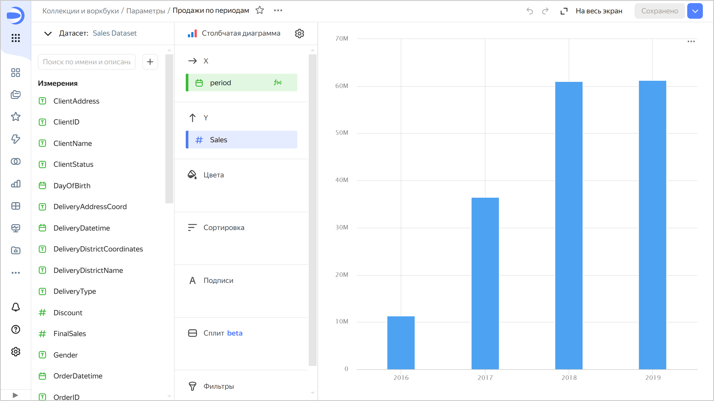
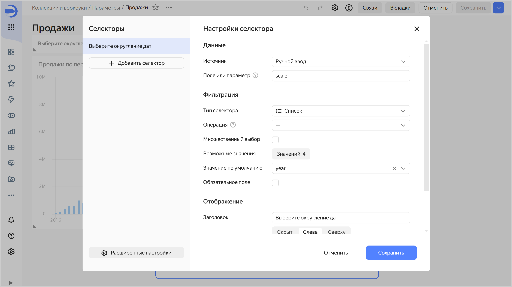
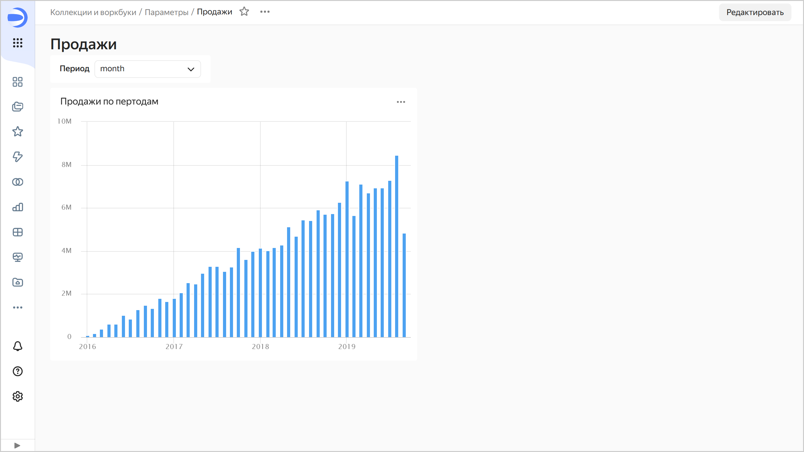
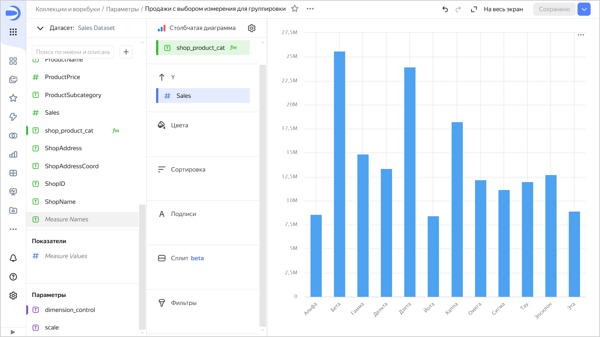
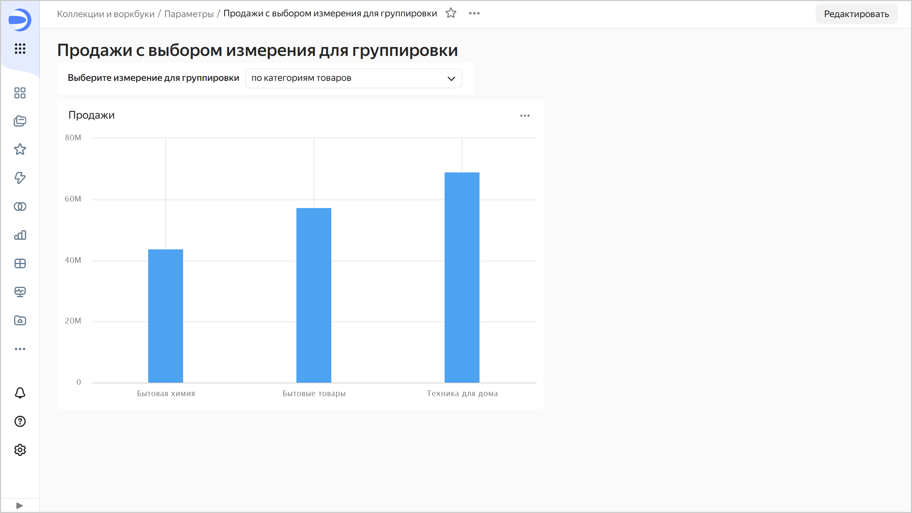
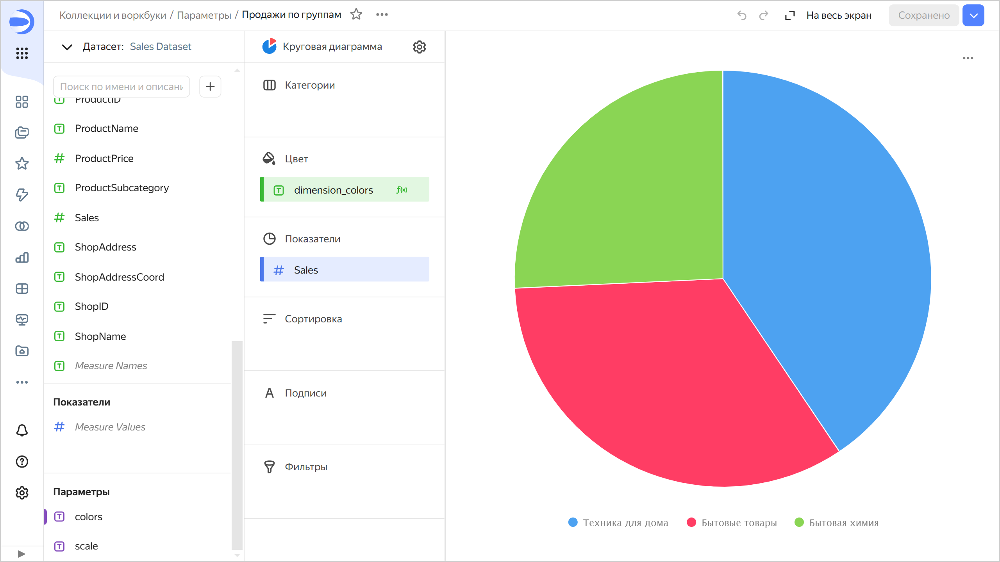
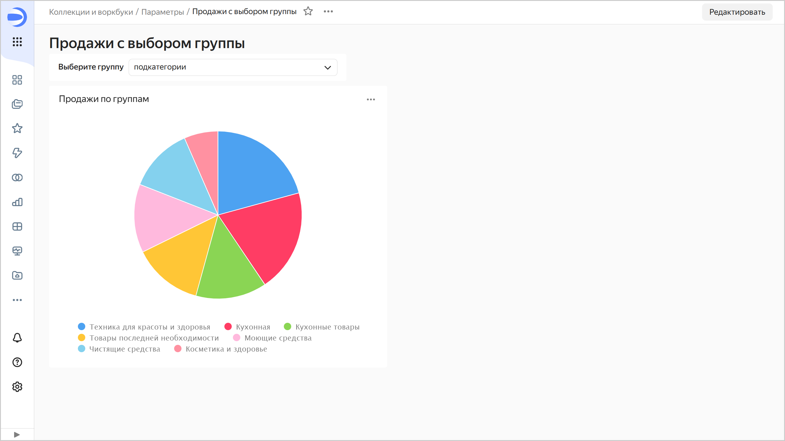

# Параметры в {{ datalens-full-name }}

Параметр — это переменная, которая может заменять константные значения в вычисляемых полях. Параметры можно создавать [на уровне датасета](../dataset/create-dataset.md#add-parameters) и [на уровне чарта](../operations/chart/add-parameter-chart.md).

Параметры датасета доступны во всех чартах, созданных на основе этого датасета, а параметры чарта — только в том чарте, где они созданы. Значение по умолчанию для параметра датасета может быть [переопределено](../operations/chart/add-parameter-chart.md#change-value) на уровне чарта.

## Использование параметров {#using-params}

С помощью параметров датасета или чарта вы можете управлять формулами и менять визуализацию в чарте.
Сохраненные параметры датасета подставляются во все чарты, которые созданы на его основе в момент их загрузки.

Вы можете изменять значение параметра на дашбордах с помощью селекторов с ручным вводом. При этом существуют следующие ограничения:

* Нельзя использовать опцию **Множественный выбор**.
* Нельзя выбирать операцию в селекторе (оставьте прочерк в поле выбора из выпадающего списка **Операция**).
* При использовании селектора по параметру из датасета необходимо разорвать связь этого селектора с другими селекторами на вкладке дашборда (установить тип [связи](../dashboard/link.md) **Не связаны**).

Вы также можете указать значения параметров в ссылке на чарт. Для этого нужно добавить знак `?` в конце URL, после него без пробела написать имя параметра, указать знак `=` и без пробела указать значение параметра. Можно перечислять несколько параметров в URL с помощью разделителя `&`. 

Чтобы использовать чарт с параметром:

1. Добавьте параметр [в датасет](../dataset/create-dataset.md#add-parameters) или [в чарт](../operations/chart/add-parameter-chart.md).
1. [Разместите чарт](../operations/dashboard/add-chart.md) на дашборде.
1. [Добавьте селектор](../operations/dashboard/add-selector.md) на дашборд для управления параметром чарта:

   * выберите **Ручной ввод**;
   * в поле **Поле или параметр** укажите имя параметра из чарта;
   * в поле выбора из выпадающего списка **Операция** оставьте прочерк;
   * в поле **Значение по умолчанию** укажите значение, которое будет подставлено в параметр чарта;
   * укажите **Заголовок** селектора для отображения на дашборде.

   Меняя значения селектора, вы можете настраивать с помощью параметра визуализацию в чарте.

## Примеры {#examples}

Рассмотрим использование параметра для управления визуализацией в чарте на примерах. В качестве источника построим датасет на основе [подключения](../tutorials/data-from-ch-to-sql-chart.md#create-connection) к демонстрационной БД (таблица `samples.MS_SalesFullTable`).

**Пример 1**

Настройте визуализацию графика продаж на дашборде, меняя уровень детализации с помощью селектора:

1. В датасет [добавьте параметр](../dataset/create-dataset.md#add-parameters) `scale`с типом `Строка` и значением по умолчанию `year`. Параметр будет доступен во всех чартах, созданных на основе этого датасета.
1. Создайте на основе созданного датасета чарт с типом [Столбчатая диаграмма](../visualization-ref/column-chart.md#create-diagram):

   * В чарт [добавьте поле](../concepts/calculations/index.md#how-to-create-calculated-field) `period` с формулой `DATETRUNC([OrderDatetime], [scale])` и перетащите его в секцию **X**.
   * Перетащите измерение `Sales` в секцию **Y**. Автоматически измерение `Sales` будет преобразовано в показатель `SUM[Sales]`.

   

   

   

1. [Разместите чарт](../operations/dashboard/add-chart.md) на дашборде.
1. [Добавьте селектор](../operations/dashboard/add-selector.md) для управления параметром чарта:

   * выберите **Ручной ввод**;
   * в поле **Поле или параметр** укажите `scale`;
   * в поле выбора из выпадающего списка **Тип селектора** оставьте `Список`;
   * в поле выбора из выпадающего списка **Операция** оставьте прочерк;
   * в окне **Возможные значения** добавьте: `year`, `month`, `week`, `day`;
   * в поле **Значение по умолчанию** укажите `year`, чтобы по умолчанию округлять даты до года в чарте;
   * в поле **Заголовок** укажите название селектора для отображения на дашборде.

   

   

   

1. Проверьте, что связь между селектором и чартом на дашборде установлена правильно:

   1. В режиме редактирования дашборда нажмите кнопку **Связи**.
   1. Выберите из списка добавленный селектор. Убедитесь, что для него установлена исходящая связь с требуемым чартом по полю `scale`.
   1. При необходимости [добавьте связь](../operations/dashboard/create-alias.md) между виджетами.

      

      

      

   Теперь, выбирая значения селектора, вы можете менять округление дат в чарте, например, по годам или по месяцам.

   

   

   

**Пример 2**

Добавьте возможность выбора измерения с помощью селектора для отображения в диаграмме на дашборде:

1. Создайте чарт с типом [Столбчатая диаграмма](../visualization-ref/column-chart.md#create-diagram):

   * В чарт [добавьте параметр](../operations/chart/add-parameter-chart.md) `dimension_control`с типом `Строка` и значением по умолчанию `по магазинам`. Параметр будет доступен только в этом чарте.
   * В чарт [добавьте поле](../concepts/calculations/index.md#how-to-create-calculated-field) `shop_product_cat` с формулой `CASE([dimension_control], "по магазинам", [ShopName], "по категориям товаров",[ProductCategory], "по подкатегориям товаров", [ProductSubcategory], '')` и перетащите его в секцию **X**
   * Перетащите измерение `Sales` в секцию **Y**. Автоматически измерение `Sales` будет преобразовано в показатель `SUM[Sales]`.

   

   

   

1. [Разместите чарт](../operations/dashboard/add-chart.md) на дашборде.
1. [Добавьте селектор](../operations/dashboard/add-selector.md) для управления параметром чарта:

   * выберите **Ручной ввод**;
   * в поле **Поле или параметр** укажите `dimension_control`;
   * в поле выбора из выпадающего списка **Тип селектора** оставьте `Список`;
   * в поле выбора из выпадающего списка **Операция** оставьте прочерк;
   * в окне **Возможные значения** добавьте: `по магазинам`, `по категориям товаров`, `по подкатегориям товаров`;
   * в поле **Значение по умолчанию** укажите `по магазинам`, чтобы по умолчанию отображать суммы продаж по магазинам;
   * в поле **Заголовок** укажите название селектора для отображения на дашборде.

   Теперь, выбирая значения селектора, вы можете менять измерение, которое отображается на диаграмме.

   

   

   

**Пример 3**

Добавьте возможность выбора измерения для раскрашивания в чарте с помощью селектора:

1. Создайте чарт с типом [Круговая диаграмма](../visualization-ref/pie-chart.md#create-diagram):

   * В чарт [добавьте параметр](../operations/chart/add-parameter-chart.md) `colors`с типом `Строка` и значением по умолчанию `категории`. Параметр будет доступен только в этом чарте.
   * В чарт [добавьте поле](../concepts/calculations/index.md#how-to-create-calculated-field) `dimension_colors` с формулой `IF([colors]="категории", [ProductCategory], [ProductSubcategory])`и перетащите его в секцию **Цвет**.
   * Перетащите измерение `Sales` в секцию **Показатели**. Автоматически измерение `Sales` будет преобразовано в показатель `SUM[Sales]`.

   

   

   

1. [Разместите чарт](../operations/dashboard/add-chart.md) на дашборде.
1. [Добавьте селектор](../operations/dashboard/add-selector.md) для управления параметром чарта:

   * выберите **Ручной ввод**;
   * в поле **Поле или параметр** укажите `colors`;
   * в поле выбора из выпадающего списка **Тип селектора** оставьте `Список`;
   * в поле выбора из выпадающего списка **Операция** оставьте прочерк;
   * в окне **Возможные значения** добавьте: `категории`, `подкатегории`;
   * в поле **Значение по умолчанию** укажите `категории`, чтобы по умолчанию окрашивать суммы продаж по категориям товаров;
   * в поле **Заголовок** укажите название селектора для отображения на дашборде.

   Теперь, выбирая значения селектора, вы можете менять измерение для раскрашивания в чарте.

   

   

   

## Ограничения {#restrictions-params}

При использовании параметров существуют следующие ограничения на имя параметра:

* Допускаются только буквы латинского алфавита (строчные и заглавные), цифры, знак тире `-` и подчеркивание `_`.
* Длина имени не должна превышать 36 символов.
* Не допускается наименование параметра, начинающегося с символа подчеркивания: `_name`.
* Зарезервированные имена параметров, которые нельзя использовать: `tab`, `state`, `mode`, `focus`, `grid`, `tz`, `from`, `to`.
* Имя параметра регистрозависимое: `Test` и `test` — различные параметры.
* Имя параметра не должно совпадать с именем поля в датасете.
* После добавления параметра в датасет, нужно пересохранить чарты в визарде.
* Если в датасете и в чарте есть параметры с одинаковым именем, параметр из чарта игнорируется.

## Примеры использования {#examples}

* [{#T}](../tutorials/data-from-ch-with-parameters.md)

