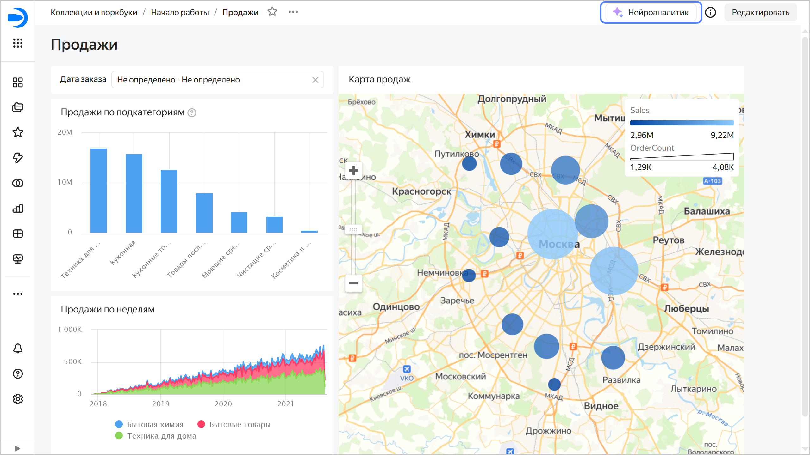
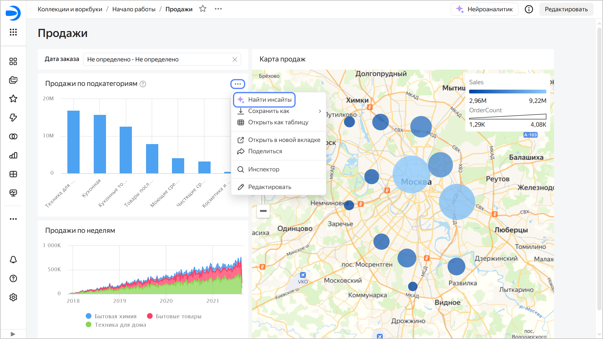
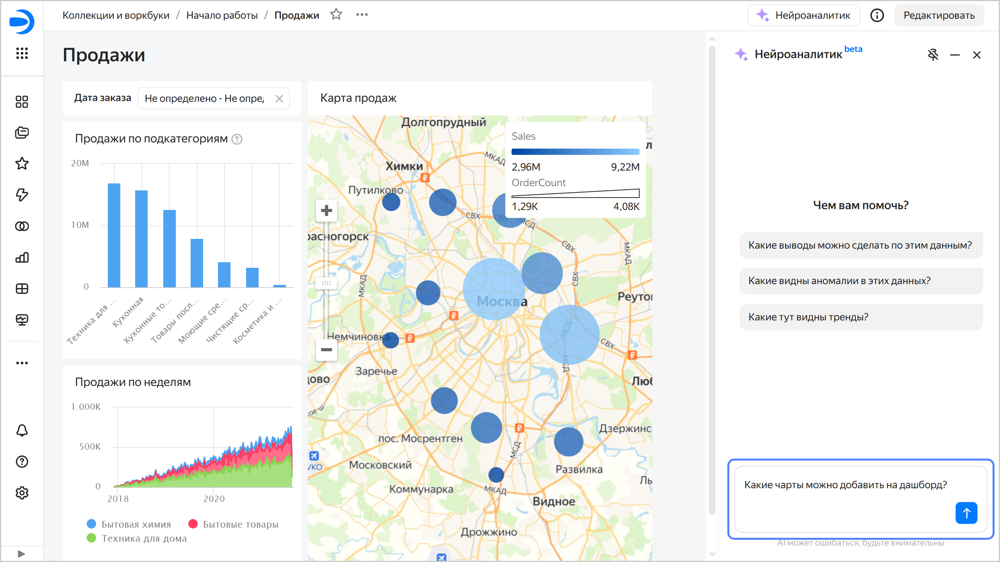
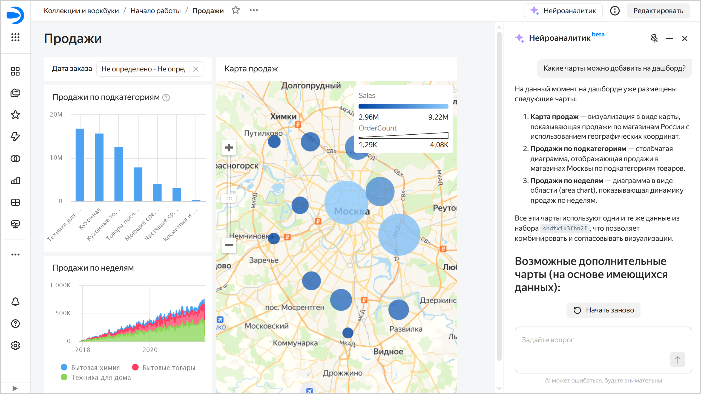

# Нейроаналитик на дашборде в {{ datalens-full-name }}



Функциональность находится на стадии бета-тестирования.



[Нейроаналитик](../concepts/neuroanalyst.md) на дашборде — инструмент, который анализирует чарты на дашборде, формирует выводы на основе данных и позволяет задавать уточняющие вопросы. В качестве контекста также учитываются:
* [информация о дашборде](../operations/dashboard/add-description.md);
* заголовок чарта на дашборде;
* [информация о чарте](../operations/chart/add-description.md);
* [описание и подсказка](../operations/dashboard/add-chart.md) для чарта на дашборде (кроме таблиц).

Нейроаналитик на дашборде можно использовать для всего дашборда или для отдельных чартов на дашборде. Чтобы использовать Нейроаналитик на дашборде:

1. Откройте вкладку Нейроаналитика.

   

   - Для всего дашборда

     Нажмите вверху дашборда кнопку **Нейроаналитик** — справа откроется вкладка **Нейроаналитик**.

     

     

     

   - Для отдельного чарта на дашборде

     В правом верхнем углу чарта на дашборде нажмите  → **Найти инсайты** — справа откроется вкладка **Нейроаналитик**.

     

     

     

   

1. Выберите вопрос или задайте свой, например: «Какие чарты можно добавить на дашборд?».

   

   

   

   Нейроаналитик даст развернутый ответ, предложит возможные решения и рекомендации.

   

   

   

Чат с Нейроаналитиком можно закрепить поверх дашборда или сбоку от него (по умолчанию). Чтобы изменить положение чата, нажмите:
  
  *  — чат будет отображаться поверх дашборда;
  *  — чат будет отображаться сбоку от дашборда.

Все запросы к Нейроаналитику приватны — логи нигде не хранятся и не используются для дальнейшего дообучения или исследований.

Вы можете [запретить](../operations/dashboard/dashboard-neuroanalyst-off.md) использование Нейроаналитика для дашборда.

## Ограничения {#restrictions}

* Выполнение анализа может занять длительное время.
* Для таблиц не добавляются описание и подсказка чарта.
* Нейроаналитик может работать только с данными, которые загружены на страницу. Если объем данных слишком большой, он может превысить доступный для обработки контекст.
