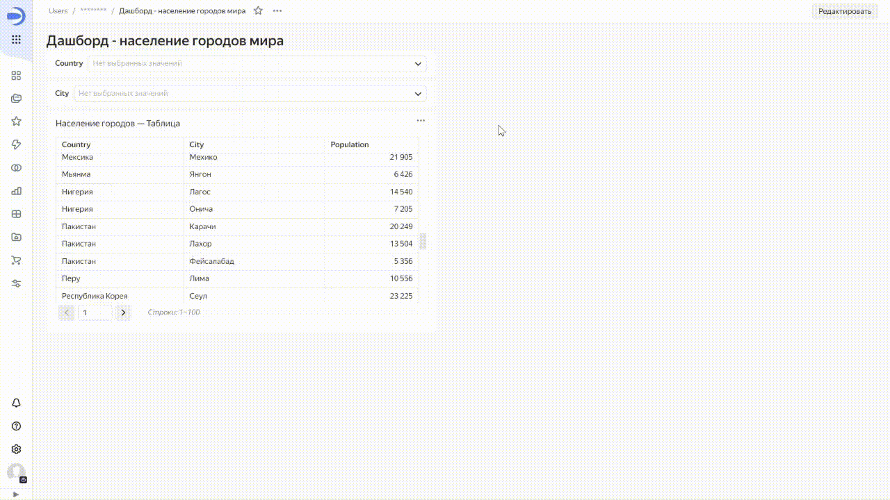

# Связь

Связь определяет влияние селектора на один или несколько чартов, а также на другие селекторы. По умолчанию связаны селекторы и чарты, которые созданы на основе одного датасета. Селекторы и чарты, которые созданы на базе разных датасетов, могут быть связаны вручную с помощью [алиасов](#alias).

В качестве связи можно выбрать существующее поле датасета или создать собственное поле, а в нем вручную задать значения селектора. Поля, по которым будет установлена связь, указываются в окне настройки алиаса.

Связь позволяет фильтровать значения селекторов и чартов. Например, если вы выберете на дашборде страну в первом селекторе, во втором селекторе ограничится список городов (и наоборот).





Поле, по которому фильтрует селектор, должно присутствовать в датасете, по которому построен чарт. В противном случае связь работать не будет. Подробнее см. раздел [{#T}](../concepts/data-join.md).

Тип связи определяет, как будут отфильтрованы значения в селекторах и чартах. Тип задается в окне связей в режиме редактирования дашборда.
Существуют следующие типы связей для пары виджетов:

* **Связь** — двухстороннее влияние виджетов друг на друга.
* **Вх.связь** — входящее влияние.
* **Исх.связь** — исходящее влияние.
* **Игнор** — двухстороннее игнорирование виджетами друг друга.
* **Нет связи** — отсутствие связи между виджетами из разных датасетов или виджетами, между которыми связь невозможна.



Нельзя создать связь с виджетами [{#T}](./widget.md#text) и [{#T}](./widget.md#title).



Некоторые виджеты не могут влиять на другие. Возможные типы связей в отношении пар виджетов приведены в таблице:

Что / на что | Селектор | Чарт
----- | ----- | -----
**Селектор** | Связь Вх.связь Исх.связь Игнор | Исх.связь Игнор
**Чарт**| Вх.связь Игнор | —

## Алиас {#alias}

Алиас — это связь полей разных датасетов, которая определяет влияние виджетов друг на друга при установлении между ними связи.

Алиасы позволяют связать виджеты, созданные на базе разных датасетов. Например, если вы создадите алиас с полями `[Region]` и `[Country]` из разных датасетов, то селектор по полю `[Region]` из одного датасета будет фильтровать данные чарта с полем `[Country]` другого датасета. Для виджетов, построенных на основе одного датасета, алиасы создаются автоматически.

Создание алиасов требуется в тех случаях, когда необходимо:

* Установить связи между селекторами, построенными на основе разных датасетов, чтобы значения одного селектора фильтровали список доступных значений второго селектора.

* Установить связи между селектором с типом **На основе датасета** из одного датасета и чартами из другого датасета, чтобы значения селектора фильтровали значения в чартах.

* Установить связи между селектором с типом **Ручной ввод** и другими селекторами, чтобы значения одного селектора фильтровали список доступных значений второго селектора.

Вы можете указать алиас для пары связанных виджетов, при этом:

* Для одной пары виджетов может быть указано несколько алиасов.
* Алиас, указанный для одной пары виджетов, применяется для всех связанных виджетов на основе тех же датасетов (в которых используются указанные в алиасе поля).
* Алиас работает в пределах одной вкладки дашборда.
* Чтобы ограничить применение алиаса, задайте между виджетами тип связи **Игнор** по выбранному полю. В этом случае не будет влияния виджетов по выбранному полю в пределах вкладки дашборда.



Если в окне связей уже отображается связь между виджетами, то необязательно добавлять для них алиас.



Подробнее о том, как создать алиас, читайте в разделе [{#T}](../operations/dashboard/create-alias.md).

Из алиаса, в котором связано более двух полей, можно удалять связи. Удалите поле из алиаса, если связь по нему между датасетами или между виджетами в пределах вкладки дашборда не нужна. Подробнее в разделе [{#T}](../operations/dashboard/edit-alias.md).

