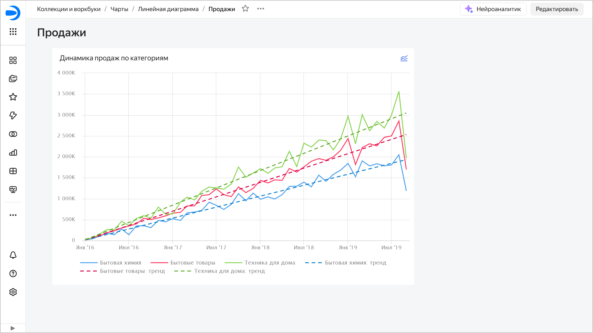
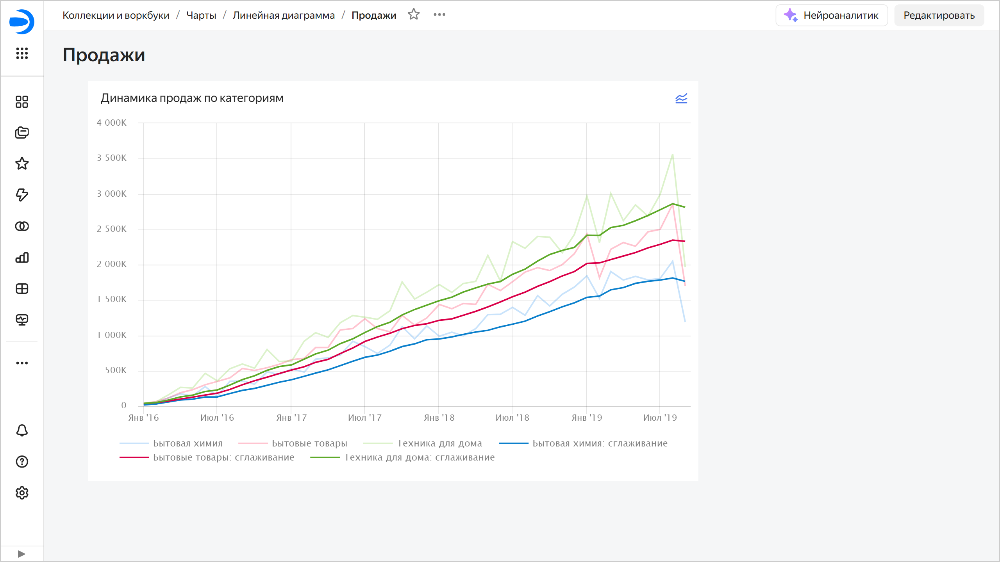

# Тренды и сглаживания в чартах {{ datalens-full-name }}

В {{ datalens-short-name }} вы можете применить сглаживание или добавить линию тренда для чартов на дашборде:

* **Сглаживание** — добавляет линию с простым скользящим средним для лучшей визуализации данных с колебаниями.
* **Линия тренда** — добавляет линию тренда для отображения общей тенденции изменения данных.

Возможность позволяет выполнить временное изменение визуализации без сохранения изменений в исходном чарте.

Для каждого чарта на дашборде вы можете:

* [Добавить или убрать тренд](#trend)
* [Добавить или убрать сглаживание](#smoothing)
* [Настроить линии тренда и сглаживания](#settings)

Функциональность находится на стадии Preview. Перед использованием ознакомьтесь с [ограничениями](#restrictions).



Настройки трендов и сглаживаний применяются только к текущему просмотру дашборда и не сохраняются при перезагрузке страницы.



При включенном сглаживании или линии тренда в правом верхнем углу чарта на дашборде отображается значок . При нажатии на него открывается окно [настроек](#settings).

## Добавить или убрать тренд {#trend}

Чтобы добавить линию тренда, в правом верхнем углу чарта на дашборде нажмите  →  **Моделирование** → **Добавить тренд** или включите опцию **Тренд** в окне [настроек](#settings). Для каждой линии графика добавится линия тренда, отображающая общую тенденцию изменения данных.

Чтобы убрать линию тренда, в правом верхнем углу чарта на дашборде нажмите  →  **Моделирование** → **Убрать тренд** или выключите опцию **Тренд** в окне [настроек](#settings).

## Добавить или убрать сглаживание {#smoothing}

Чтобы добавить линию тренда, в правом верхнем углу чарта на дашборде нажмите  →  **Моделирование** → **Добавить сглаживание** или включите опцию **Сглаживание** в окне [настроек](#settings). Для каждой линии графика добавится линия со сглаживанием.

Чтобы убрать линию тренда, в правом верхнем углу чарта на дашборде нажмите  →  **Моделирование** → **Убрать сглаживание** или выключите опцию **Сглаживание** в окне [настроек](#settings).

## Настроить линии тренда и сглаживания {#settings}

Чтобы настроить линии тренда и сглаживания, в правом верхнем углу чарта на дашборде нажмите  →  **Моделирование** → **Настроить**. Справа в окне **Моделирование**:

* Включите опцию **Сглаживание** и выберите:
  
  * **Функция** — доступно значение `Простое скользящее среднее` — среднее арифметическое в точке `t` за интервал, указанный в поле **Окно**. Окно включает точки, предшествующие `t`, и саму точку `t`.
  * **Окно (количество точек)** — интервал или количество точек для расчета среднего арифметического, включая саму точку `t`. Возможные значения: от `1` до `15`.
  * **Форма и толщина линий** — параметры линии сглаживания.

* Включите опцию **Тренд** и выберите:

  * **Функция** — функция для сглаживания линий графика:

    * **Линейная** — линейная регрессия, представляет собой прямую линию, помогает в целом оценить рост или падение на выбранном интервале. Регрессионная модель: $y = a * x + b$, где параметры $a$ и $b$ подбираются таким образом, чтобы получилась прямая, наиболее точно отражающая связь между данными исходной линии.
    * **Квадратичная** — используйте, если в исходных данных явно видна нелинейная зависимость. Регрессионная модель: $y = a * x^{2} + b * x + c$, где параметры $a$, $b$ и $c$ подбираются таким образом, чтобы линия параболы наиболее точно отражала связь между данными исходной линии.
    * **Кубическая** — используйте, если на исходных данных явно видно больше одного перегиба. Регрессионная модель: $y = a * x^{3} + b * x^{2} + c * x + d$, где параметры $a$, $b$, $c$ и $d$ подбираются таким образом, чтобы линия кубической параболы наиболее точно отражала связь между данными исходной линии.

    С осторожностью используйте квадратичную и кубическую функции.

  * **Форма и толщина линий** — параметры линии тренда.

* Дополнительные настройки:

  * Включите опцию **Группировать линии**, чтобы не отображать в легенде чарта сглаживание и линии тренда.

Внесенные изменения настроек линии тренда и сглаживания сразу отображаются на графике.

## Ограничения {#restrictions}

* Доступно только для линейных чартов (Wizard, QL-чарты или чарты в Editor).
* Доступно только с дашбордов.
* Недоступно для линейных чартов с дискретным режимом отображения оси `X`.
* Состояние настроек не сохраняется.
* Пока недоступно в публичных и встроенных дашбордах.
