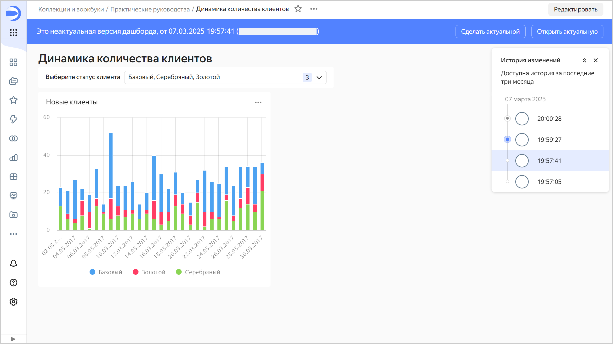
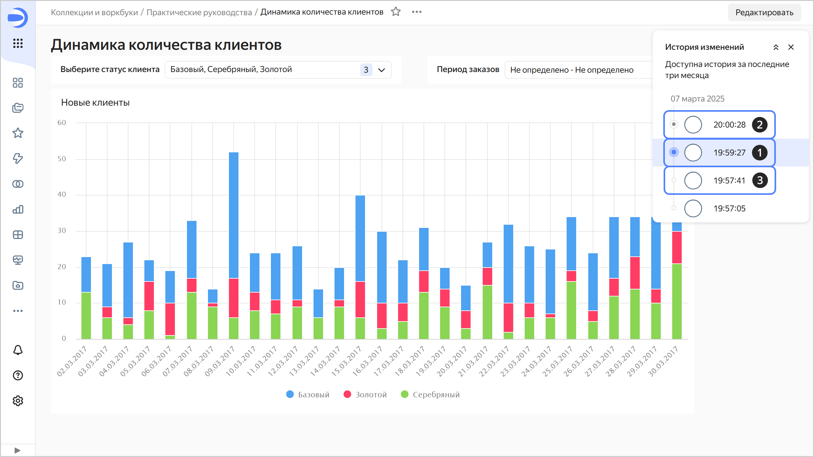
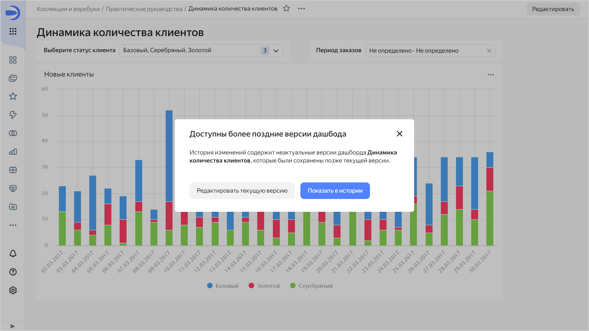

# Версионирование

Версионирование дашборда — это возможность хранить историю изменений конфигурации дашборда с помощью версий. Список версий доступен пользователям с минимальным правом доступа **Просмотр** на дашборд.

Чтобы перейти к списку версий, в верхней части экрана нажмите на значок  и выберите  **История изменений**.

Чтобы перейти к выбранной версии, нажмите на нее в списке. Номер версии отобразится в значении параметра `revId` строки адреса дашборда. При переходе по ссылке, содержащей номер версии в параметре `revId`, сразу откроется эта версия дашборда.

## Виды версий {#version-types}

Различают следующие версии:

1. **Актуальная**. Последняя сохраненная версия дашборда. Отображается всем пользователям, если открыть дашборд на просмотр в воркбуке или из панели навигации. Актуальной может быть только одна версия дашборда.
1. **Черновик**. Версия, которая содержит несохраненные изменения дашборда. Основные пользователи не видят изменений, которые вносятся в черновик. Это позволяет скрывать редактирование дашборда до актуализации версии. Дашборд может иметь только один черновик.   
   При открытии черновика вверху отображается панель, на которой указаны: тип версии, дата и время создания и логин автора версии. Справа на панели кнопки:

   * **Сделать актуальной** — делает черновик актуальной версией. Актуальная на текущий момент версия станет неактуальной.
   * **Открыть актуальную** — открывает актуальную версию.

   
   
   

   

1. **Неактуальная**. Версия, которая не является актуальной или черновиком.  
   При открытии неактуальной версии вверху отображается панель, на которой указаны: тип версии, дата и время создания и логин автора версии. Справа на панели кнопки:

   * **Сделать актуальной** — делает текущую неактуальную версию актуальной. Актуальная на текущий момент версия и черновик (если он есть) станут неактуальными.
   * **Открыть актуальную** — открывает актуальную версию.
   
   

   

   

## Создание новой версии {#version-create}

Новая версия автоматически создается после нажатия кнопки **Сохранить** в режиме редактирования дашборда. Изменения конфигурации дашборда, которые приводят к созданию новой версии:

* изменение настроек дашборда, доступных при нажатии на значок  вверху экрана;
* добавление, переименование, удаление вкладок дашборда;
* редактирование связей;
* добавление и удаление виджетов;
* редактирование виджетов типа [Заголовок](#title) и [Текст](#text);
* редактирование табов виджетов;
* редактирование настроек селекторов.

## Редактирование версий {#version-edit}

Можно редактировать любую версию дашборда.

### Редактирование актуальной версии {#actual-version-edit}

Если в дашборде есть черновик, при переходе к редактированию актуальной версии появится сообщение о наличии неактуальных версий в истории изменений, сохраненных после текущей.

Нажмите на кнопку:

* **Редактировать текущую версию** — чтобы продолжить редактирование. После сохранения будет создана новая актуальная версия, а все остальные, включая черновик, станут неактуальными.
* **Показать в истории** — чтобы отобразить список версий.

### Редактирование черновика {#irrelevant-version-edit}

Для редактирования черновика выберите его в списке версий. Чтобы сохранить изменения черновика, вверху справа нажмите:

* **Сохранить как черновик** — будет создан новый черновик. Текущий черновик станет неактуальной версией.
*  → **Сохранить и сделать актуальным** — будет создана новая актуальная версия, а все остальные версии станут неактуальными.
*  → **Сохранить как новый дашборд** — будет создан новый дашборд.

### Редактирование неактуальной версии {#current-version-edit}

Для редактирования неактуальной версии выберите ее в списке версий. Чтобы сохранить изменения неактуальной версии, вверху справа нажмите:

* **Сохранить как черновик** — будет создан черновик из редактируемой версии. Если есть текущий черновик, он станет неактуальной версией.
*  → **Сохранить и сделать актуальным** — будет создана новая актуальная версия, а все остальные, включая черновик, станут неактуальными.
*  → **Сохранить как новый дашборд** — будет создан новый дашборд.

## Ограничения {#restrictions}

* История изменений содержит только список версий дашбордов и включает: вид версии, дату и время сохранения и автора редактирования.
* Версии дашбордов не содержат:

  * изменений прав доступа (эта операция производится отдельно от редактирования самого дашборда);
  * изменений настроек графиков — те настройки графика, которые производятся в Визарде, QL-чарте или в Editor;
  * изменений настроек датасетов, которые производятся в интерфейсе датасета;
  * изменений настроек подключения, производимых в интерфейсе редактирования параметров подключения;
  * изменений данных в источнике (добавление, обновление или удаление строк в источнике данных).

* В версиях не отображается список изменений. Доступен лишь просмотр сохраненного состояния конфигурации дашборда.
