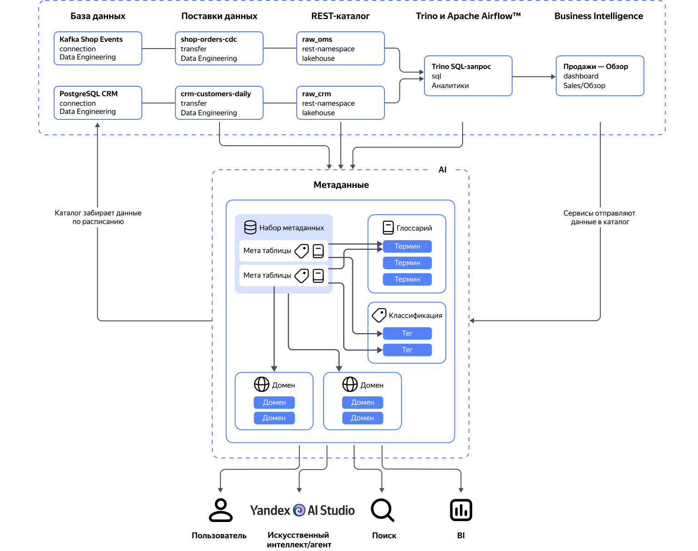

# Метаданные в {{ datalens-platform-full-name }}

_Метаданные_ — это информация о данных платформы {{ datalens-platform-full-name }}: какие есть таблицы и дашборды, что в них лежит, откуда поставляется, кто за это отвечает и насколько этому можно доверять. Если данные отвечают на вопрос «сколько было продаж в марте», то метаданные — на вопрос «в какой таблице это искать», «актуальна ли она» и «что на самом деле значит поле `revenue_net`».

## Каталог метаданных {#metadata-catalog}

Отсутствие метаданных приводит к тому, что контекст данных сохраняется лишь в памяти сотрудников и их переписках. _Каталог метаданных_ собирает их в одном месте, чтобы:

* находить данные — единый поиск по таблицам, датасетам, чартам и дашбордам;
* понимать данные — описания таблиц и полей, бизнес-термины, домены по отделам и направлениям;
* доверять данным — прозрачность источника, цепочки преобразований и статистики по содержимому;
* отвечать за данные — определение владельца, подписка на изменения, выполнение регуляторных требований по происхождению данных.

Метаданные загружаются из источников автоматически. Сами данные каталог не копирует за исключением семплов при включенном профилирования. Доступ к семплам имеют только пользователи с правами доступа к данным.



В зависимости от типа источника данных, загружаемые данные могут отличаться.





















В каталог загружаются метаданные о датасетах, чартах, дашбордах, отчетах, воркбуках и коллекциях. Метаданные загружаются для выбранных подключений. Если подключения не выбраны, метаданные загружаются для всех доступных подключений.





В каталог загружаются метаданные об SQL-запросах и объектах базы данных, которые используются в запросах. Результаты выполнения запросов не загружаются. При этом запросы загружаются только для баз данных, для которых в каталоге создан источник.
В каталоге пользователю отображаются только его запросы или запросы, на просмотр которых у него есть права.



Что дальше:

* [Проверьте собранные метаданные](../../operations/data-catalog/work-with-data-catalog.md).
* [Добавьте разметку](../../operations/data-catalog/metadata-markup.md).
* [Определите связи между объектами](../../operations/data-catalog/metadata-linage.md).
