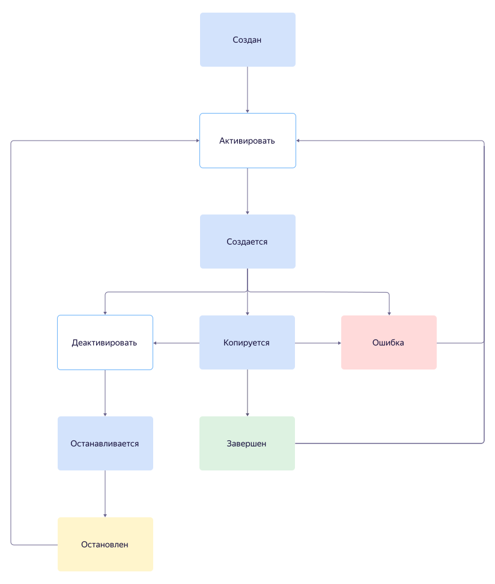

# Поставки данных в {{ datalens-platform-full-name }}

Поставка данных переносит данные из внешнего [подключения-источника](../../../concepts/connection/index.md) (например, базы {{ PG }}) в хранилище на основе [REST-каталога](../rest-catalog/index.md). В {{ datalens-platform-full-name }} вы можете создавать поставки разных типов:

* [регулярное копирование](#regular-copy) — используйте, когда есть постоянная потребность в поставке данных и необходимость поддерживать приемник данных в актуальном состоянии;
* [разовое копирование](#one-time-copy) — используйте, когда нет постоянной потребности в поставке данных, например, для развертывания тестовых сред или для загрузки первичной порции данных;
* [захват изменений данных (CDC)](#cdc) `Скоро` — используйте для сценариев, когда важно отслеживать изменения данных в реальном времени.



После создания поставки вы можете [просматривать статистику, изменять настройки, приостанавливать или удалять поставку](../../operations/data-transfer/manage-transfer.md).

## Жизненный цикл поставки {#lifecycle}

Когда поставка будет подготовлена к работе, она автоматически перейдет в статус {{ dt-status-copy }}. В этом статусе она будет находиться до тех пор, пока все данные, находящиеся в источнике, не будут перенесены на приемник. Затем поставка автоматически деактивируется и перейдет в статус {{ dt-status-finished }}. Переход между статусами показан на схеме:

## Регулярное копирование {#regular-copy}



Подробнее о том, [как создать регулярное копирование](../../operations/data-transfer/regular-copy.md).

## Разовое копирование {#one-time-copy}



Подробнее о том, [как создать разовое копирование](../../operations/data-transfer/one-time-copy.md).

## Захват изменений данных {#cdc} `Скоро`


