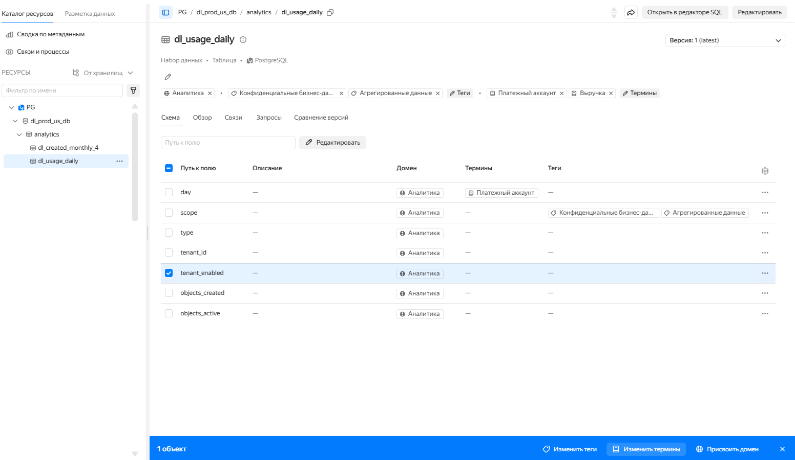

# Разметка метаданных

Для первичного распределения метаданных, например по отделам компании, применяются [домены и поддомены](#domains). Для более детальной разметки метаданных вы можете использовать:

* [классификации и теги](#classifications-and-tags),
* [глоссарии и термины](#glossaries-and-terms).

Вы можете разметить весь набор данных (например, таблицу {{ PG }}) и отдельные его части (например, отдельное поле).

Для разметки данных и создания новых элементов разметки вам потребуется [роль](../../security/index.md) `Администрирование метаданных`.

## Домены и поддомены {#domains}



## Классификации и теги {#classifications-and-tags}



## Глоссарии и термины {#glossaries-and-terms}



Сначала [создайте элементы разметки](#create-markup-elements), затем перейдите к [массовой](#mass-markup) или [точечной разметке](#specific-markup).

## Создание элементов разметки {#create-markup-elements}

Создайте элементы разметки, которые будут описывать характер и структуру ваших метаданных:

* [Создание домена](#create-domain)
* [Создание поддомена](#create-subdomain)
* [Создание глоссария](#create-glossary)
* [Создание термина](#create-term)
* [Создание классификации](#create-classification)
* [Создание тега](#create-tag)

### Создание домена {#create-domain}

Чтобы создать домен:

1. Перейдите в раздел  **Метаданные** на вкладку **Разметка данных**.
1. В панели навигации откройте раздел  **Домены**.
1. Нажмите **Создать домен** или  рядом с разделом **Домены** в панели навигации.
1. В форме **Создание домена** заполните поля:
   * **Имя** — введите название домена.
   * (Опционально) **Описание** — укажите, для чего нужен домен.
   * (Опционально) **Правила разметки** — укажите контекст и правила разметки для этого объекта. AI-агент будет учитывать ваши рекомендации.
   * (Опционально) **Добавить тег** — нажмите **Добавить**, чтобы присвоить теги.
1. Нажмите **Создать**.

### Создание поддомена {#create-subdomain}

Домены могут быть многоуровневыми — поддомен можно создать и внутри другого поддомена. Чтобы создать поддомен:

1. Перейдите в раздел  **Метаданные** на вкладку **Разметка данных**.
1. В панели навигации перейдите в раздел  **Домены** и откройте домен, внутри которого нужно создать поддомен.
1. Нажмите **Добавить поддомен** или  рядом со строкой домена в панели навигации.
1. В форме создания поддомена проверьте путь родительского домена (например, `Продажи > Продажи РФ`) и заполните поля:
   * **Имя** — введите название поддомена.
   * (Опционально) **Описание** — укажите, для чего нужен поддомен.
   * (Опционально) **Правила разметки** — укажите контекст и правила разметки для этого объекта. AI-агент будет учитывать ваши рекомендации.
   * (Опционально) **Добавить тег** — нажмите **Добавить**, чтобы присвоить теги.
1. Нажмите **Создать**.

### Создание глоссария {#create-glossary}

Глоссарий — это набор терминов, объединенных по теме. Чтобы создать глоссарий:

1. Перейдите в раздел  **Метаданные** на вкладку **Разметка данных**.
1. В панели навигации откройте раздел  **Глоссарии и термины**.
1. Нажмите **Создать глоссарий** или  рядом со строкой глоссария в панели навигации. Заполните поля:
   * **Имя** — введите название глоссария.
   * (Опционально) **Описание** — укажите, для чего нужен глоссарий.
   * (Опционально) **Правила разметки** — укажите контекст и правила разметки для этого объекта. AI-агент будет учитывать ваши рекомендации.
   * (Опционально) **Добавить тег** — нажмите **Добавить**, чтобы присвоить теги.
1. Нажмите **Создать**.

### Создание термина {#create-term}

Термин создается внутри глоссария и описывает отдельное понятие вашей предметной области. Чтобы создать термин:

1. Перейдите в раздел  **Метаданные** на вкладку **Разметка данных**.
1. В панели навигации откройте раздел  **Глоссарии и термины** (или конкретный глоссарий, в котором нужен термин).
1. Нажмите **Создать термин**. Альтернативно нажмите  рядом со строкой глоссария и выберите **Создать термин**. Затем заполните поля:
   * **Имя** — введите название термина.
   * (Опционально) **Описание** — укажите, для чего нужен термин.
   * (Опционально) **Правила разметки** — укажите контекст и правила разметки для этого объекта. AI-агент будет учитывать ваши рекомендации.
   * (Опционально) **Синонимы** — нажмите **Добавить** и укажите синонимы термина.
   * (Опционально) **Добавить тег** — нажмите **Добавить**, чтобы присвоить теги.
   * (Опционально) **Связанные термины** — нажмите **Добавить** и укажите термины, связь с которыми надо будет отслеживать.
1. Нажмите **Создать**.

### Создание классификации {#create-classification}

Классификация — это группа тегов, объединенных по смыслу. Чтобы создать классификацию:

1. Перейдите в раздел  **Метаданные** на вкладку **Разметка данных**.
1. В панели навигации откройте раздел  **Классификации и теги**.
1. Нажмите **Создать классификацию** или  рядом со строкой классификации в панели навигации. Заполните поля:
   * **Имя** — введите название классификации.
   * (Опционально) **Описание** — укажите, для чего нужна классификация.
   * (Опционально) **Правила разметки** — укажите контекст и правила разметки для этого объекта. AI-агент будет учитывать ваши рекомендации.
   * **Взаимоисключающие** — с помощью переключателя укажите, можно ли применять к одному объекту несколько тегов из этой классификации. Если переключатель включен, к объекту можно применить только один тег из классификации.
1. Нажмите **Создать**.

### Создание тега {#create-tag}

Тег создается внутри классификации. Одну и ту же классификацию можно наполнить несколькими тегами.

Чтобы создать тег:

1. Перейдите в раздел  **Метаданные** на вкладку **Разметка данных**.
1. В панели навигации откройте раздел  **Классификации и теги** и откройте нужную классификацию.
1. Создайте тег одним из способов:
   * На вкладке **Теги** нажмите кнопку **Создать** в правом верхнем углу.
   * В панели навигации наведите курсор на классификацию, откройте меню действий и выберите **Создать тег**.
1. Заполните поля тега:
   * **Имя** — введите название тега.
   * (Опционально) **Описание** — укажите, что означает тег.
   * (Опционально) **Правила разметки** — укажите контекст и правила разметки для этого объекта. AI-агент будет учитывать ваши рекомендации.
1. Нажмите **Создать**.

## Массовая разметка {#mass-markup}

Вы можете присвоить элемент разметки сразу нескольким наборам или сегментам метаданных. Для массовой разметки метаданных:

<iframe width="640" height="360" src="https://runtime.strm.yandex.ru/player/video/vplvjq4fbhxdafouoisr?autoplay=0&mute=0" allow="autoplay; fullscreen; accelerometer; gyroscope; picture-in-picture; encrypted-media" frameborder="0" scrolling="no"></iframe>

1. Перейдите в раздел  **Метаданные** на вкладку **Разметка данных**.
1. Перейдите в раздел **Массовая разметка**.
1. Переключитесь на вкладку **Метаданные** и выберите наборы метаданных для присвоения или изменения элементов разметки.
1. В правом нижнем углу выберите требуемое действие:  **Изменить теги**,  **Изменить термины** или  **Присвоить домен**. В открывшемся окне отметьте, какие теги, термины или домен необходимо присвоить.
1. Проверьте изменения на вкладках **Классификации и теги**, **Глоссарии и термины** и **Домены**.

Для удобства просмотра иерархии глоссариев и классификаций нажмите .

Для коррекции массовой разметки нажмите **Редактировать таблицу**, внесите правки для конкретного набора метаданных и нажмите **Сохранить изменения**.

## Точечная разметка {#specific-markup}

Чтобы разметить конкретный набор метаданных:

1. Перейдите в раздел  **Метаданные** на вкладку **Каталог ресурсов**.
1. В списке **РЕСУРСЫ** выберите нужный набор данных для разметки.
1. В панели просмотра набора данных отметьте один или несколько элементов в списке (например, поля базы данных).
1. В правом нижнем углу выберите требуемое действие:  **Изменить теги**,  **Изменить термины** или  **Присвоить домен**. В открывшемся окне отметьте, какие теги, термины или домен необходимо присвоить.
1. Для изменения элементов разметки для всего набора (например, для всей базы данных {{ PG }}) используйте кнопки  для тегов, терминов и описания над таблицей с данными.

## Настройка AI-разметки {#ai-markup}

AI-разметка помогает автоматически размечать метаданные: генерировать термины, теги и домены и составлять описания. В настройках AI-разметки задаются контекст вашего сервиса и правила, по которым работает ассистент. Чтобы настроить AI-разметку:

1. Перейдите в раздел  **Метаданные** на вкладку **Разметка данных**.
1. Перейдите в раздел  **Настройки AI-разметки**.
1. В блоке **Документация** добавьте документацию по вашему сервису — это поможет ассистенту лучше понять его контекст. Перетащите файл в область загрузки. Загруженные файлы отображаются под областью загрузки.
1. В блоке **Правила AI-разметки** задайте общие правила — контекст, который ассистент должен учитывать при разметке и генерации терминов, тегов и доменов. Выберите вкладку с нужным типом правил и введите правило в поле (например: «не создавай новые глоссарии, предлагай термины по типу клиентов»).
1. Сохраните настройки одним из двух способов:
   * **Сохранить и переразметить** — применить настройки и сразу переразметить данные.
   * **Сохранить для будущих загрузок** — применить настройки только к будущим загрузкам.
