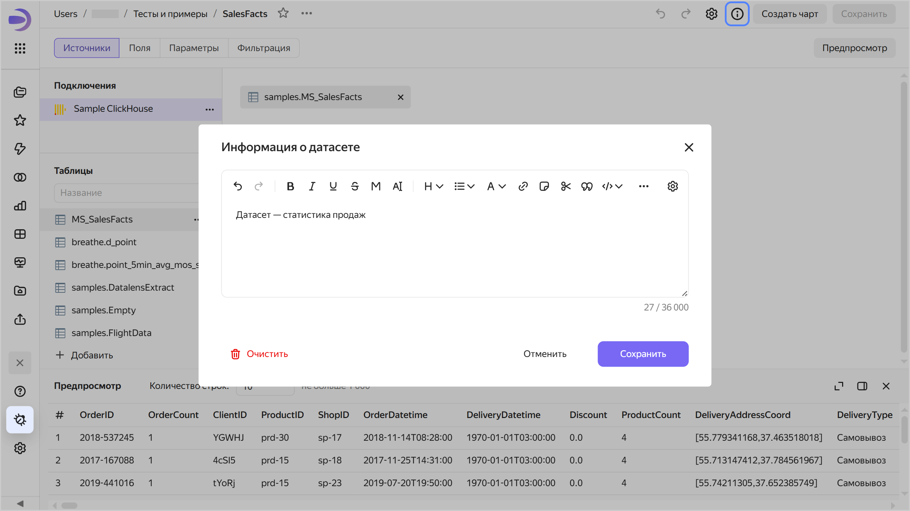
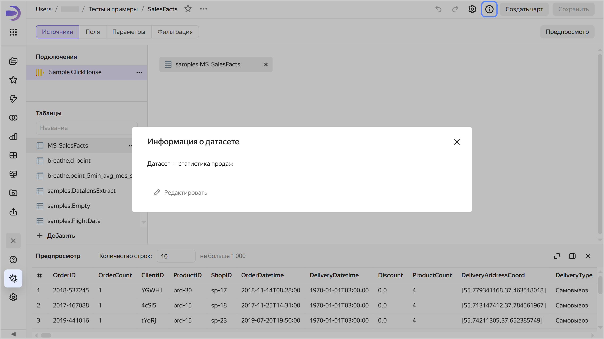

# Добавление информации о датасете в {{ datalens-full-name }}

Чтобы добавить информацию о датасете:

1. Откройте датасет, для которого необходимо добавить информацию.
1. В верхней части экрана нажмите значок .
1. Введите информацию и нажмите **Сохранить**.

   

   

   

1. В правом верхнем углу экрана нажмите **Сохранить**.

Теперь в правом верхнем углу датасета для всех пользователей появится значок . При нажатии на него откроется окно **Информация о датасете** с информацией.





Чтобы удалить информацию о датасете, сохраните пустое поле в окне **Информация о датасете**. После этого у всех пользователей значок  отображаться не будет.
