# Работа с датасетом

В этом разделе вы узнаете, как работать с датасетом:

* [Создать датасет](#create)
* [Добавить данные](#add-data)
* [Настроить связи](#links)
* [Создать поля](#create-fields)
* [Настроить поля](#setup-fields)
* [Выполнить операции с полями](#field-operations)
* [Добавить параметры](#add-parameters)
* [Добавить фильтры](#add-filters)
* [Отключить возможность экспорта данных](#data-export-disable)
* [Настроить доступ](#access)
* [Удалить датасет](#delete)

## Создать датасет {#create}


Новый датасет можно создать одним из способов:



- Главная страница

  1. Перейдите на [главную страницу]({{ link-datalens-main }}) {{ datalens-short-name }}.

  
  1. Нажмите кнопку **Создать датасет**.


- Воркбук

  1. Перейдите на [страницу коллекций и воркбуков]({{ link-datalens-main }}/collections).
  1. Откройте [воркбук](../workbooks-collections/index.md), в котором хотите создать датасет.
  1. В правом верхнем углу нажмите кнопку **Создать** и выберите **Датасет**.


- Панель навигации

  На панели слева выберите  **Датасеты** и нажмите кнопку **Создать датасет**.




## Добавить данные {#add-data}

В датасет можно добавлять данные из таблиц, которые доступны в источнике, или использовать произвольный SQL-запрос в источник.



Использование SQL-запросов доступно только для источников-БД.



1. В датасете перейдите на вкладку **Источники**.
1. На панели подключений нажмите  **Добавить**.

   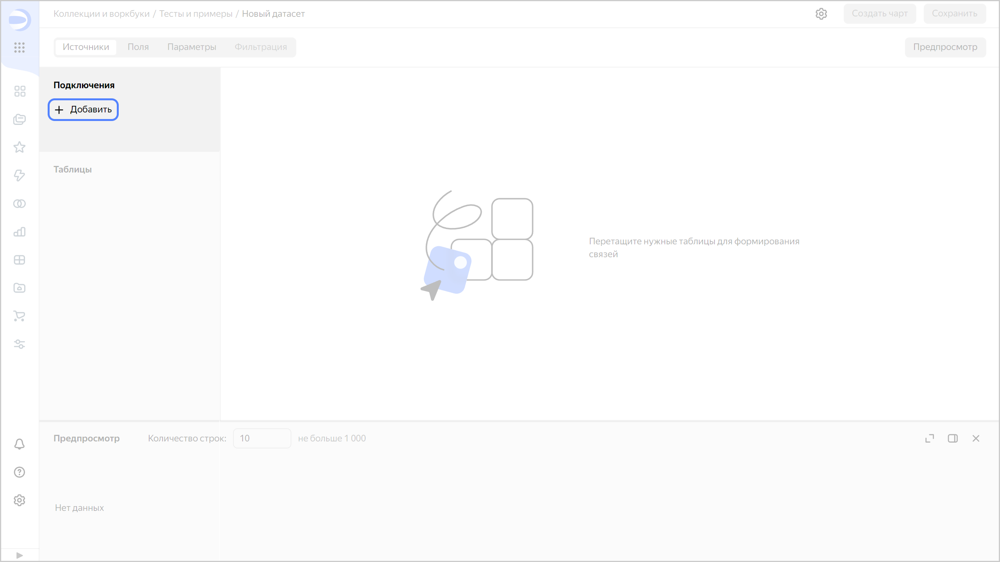

1. Выберите [подключение](../concepts/connection.md) к источнику данных.
1. Добавьте данные из источника:

   

   - Таблица

     Перетащите нужные таблицы с панели таблиц на рабочую область. Между таблицами автоматически установится связь по первому совпадению имени и типа данных полей.

     

     * Максимальное количество таблиц в одном датасете — 32.
     * Максимальное количество полей в одном датасете — 1200.

     

   - SQL-запрос

     

     * Чтобы использовать подзапросы в качестве источника, включите опцию **Уровень доступа SQL запросов** → **Разрешить подзапросы в датасетах** при создании или редактировании [подключения](../concepts/connection.md).
     * При описании датасета через SQL-запрос не поддерживаются параметры. Но вы можете использовать [параметризованные запросы](../operations/chart/create-sql-chart.md#selector-parameters) в [QL-чартах](../concepts/chart/ql-charts.md).

     

     1. На панели таблиц нажмите  **Добавить**.

        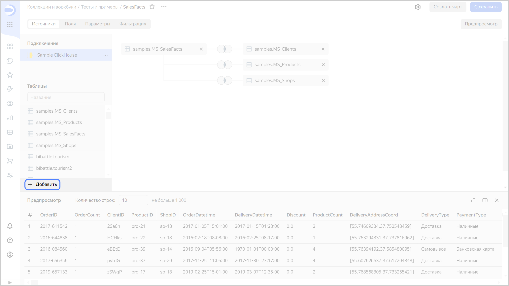

     1. Введите **Название источника** и текст SQL-запроса в поле **Подзапрос**.
     1. Нажмите кнопку **Создать**.

        

        

        

   

### Заменить подключение {#replace-connection}

Чтобы заменить подключение в датасете:

1. В датасете перейдите на вкладку **Источники**.
1. Удалите все таблицы из рабочей области.
1. На панели подключений нажмите значок  у подключения и выберите **Заменить подключение**.

   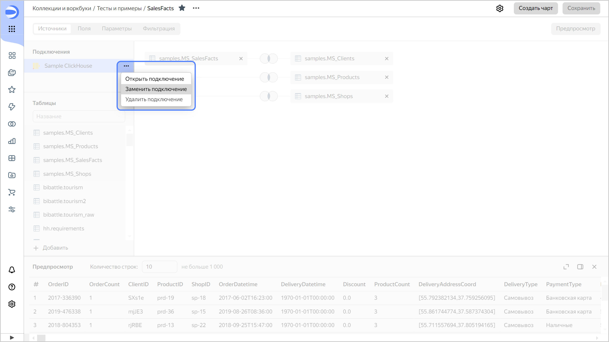

1. Выберите другое подключение.
1. Перетащите на рабочую область таблицы, которые будут источником данных для датасета.
1. Отредактируйте или удалите [вычисляемые поля](../concepts/calculations/index.md), в которых используются поля, отсутствующие в новой таблице.
1. В правом верхнем углу нажмите кнопку **Сохранить**.



Если схема данных в источнике поменялась, [обновите поля](#update-fields) датасета.



## Настроить связи {#links}

Данные из таблиц источника можно объединять.



1. В датасете перейдите на вкладку **Источники**.
1. Нажмите на изображение связи между таблицами.

   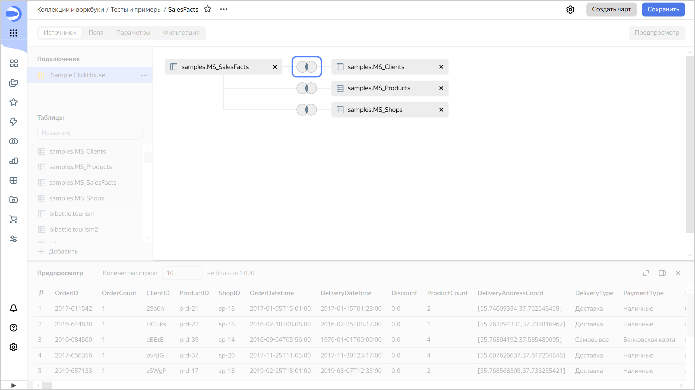

1. Выберите тип связи: `inner`, `left`, `right` или `full`.

   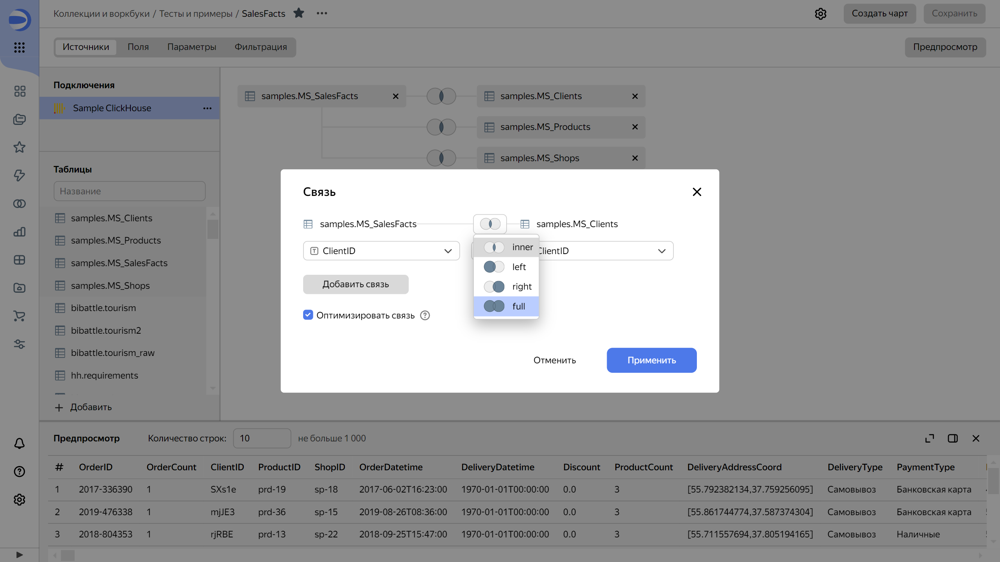

1. Выберите поля для связи между таблицами. Установить связь можно только по полям с одним и тем же [типом данных](./data-types.md). Информацию о типе данных поля {{ datalens-short-name }} получает непосредственно из подключения. Если вам нужно объединить таблицы по полям с разным типом данных, воспользуйтесь одним из вариантов:
   
   * Приведите поля к одному типу данных на уровне источника.
   * [Опишите датасет через SQL-запрос](#add-data). Для преобразования типа данных используйте функции [CAST или CONVERT](https://dev.mysql.com/doc/refman/8.0/en/cast-functions.html). Например:
   
     ```sql
     SELECT * FROM lead INNER JOIN user ON lead.assigned_by_id = CONVERT(user.external_id, CHAR)
     ```

1. При необходимости добавьте связь между таблицами по другим полям. Для этого нажмите кнопку **Добавить связь**.
1. (опционально) Отключите опцию **Оптимизировать связь**, чтобы сделать связь обязательной. В этом случае операция объединения (оператор `JOIN`) будет выполняться, даже если выбираются поля только из одной таблицы.
1. Нажмите кнопку **Применить**.

Новые таблицы из источника данных при добавлении на рабочую область по умолчанию автоматически связываются с первой таблицей, которая там расположена. При необходимости можно явно указать таблицу, с которой нужно установить связь. Для этого наведите новую таблицу на добавленную ранее так, чтобы вокруг последней появилась серая рамка, затем отпустите таблицу. Новая связь образуется с указанной таблицей.

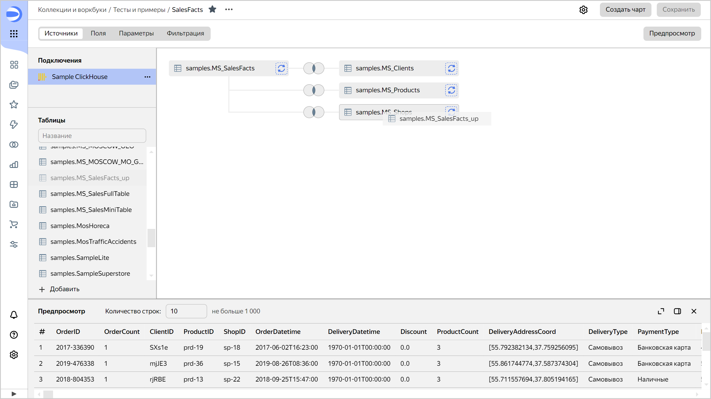

Ранее добавленную таблицу можно заменить. При перетаскивании новой таблицы наведите ее на иконку с круговыми стрелками справа от заменяемой таблицы так, чтобы фон иконки стал синим, затем отпустите таблицу.

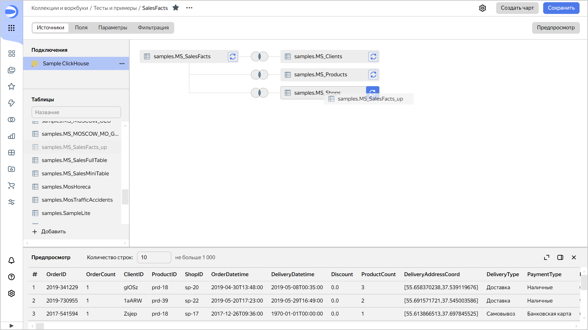



Если у обновленной таблицы останется тот же набор полей с такими же названиями, ID полей в датасете не поменяются. В этом случае все чарты, которые созданы на основе этого датасета, не нарушатся. Если у обновленной таблицы поменялась схема, [обновите поля](#update-fields) датасета.



## Создать поля {#create-fields}

В датасет можно добавлять поля из таблиц источника данных или создавать [вычисляемые поля](../concepts/calculations/index.md) с помощью формул.

1. В датасете перейдите на вкладку **Поля**.
1. В верхней части экрана нажмите кнопку  **Добавить поле**.

   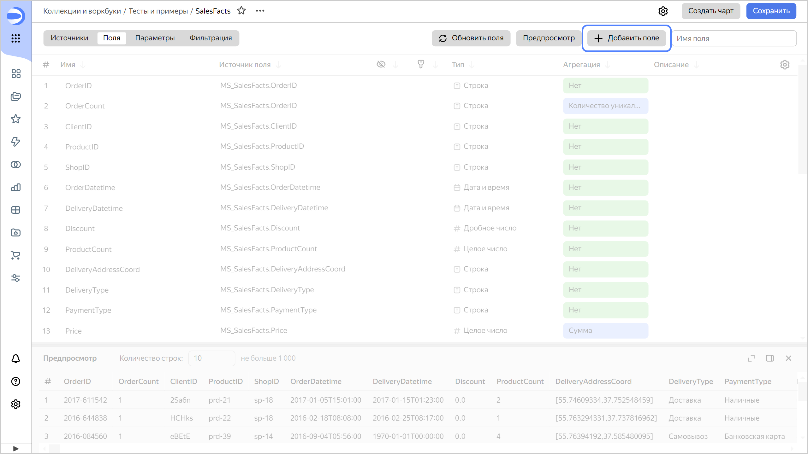

1. Создайте поле:

   

   - Вычисляемое поле

     1. Введите название поля.
     1. Введите формулу для вычисления значения поля, используя [функции источника данных](../function-ref/all.md).
     1. (опционально) Включите опцию **Не показывать в визарде**, чтобы скрыть поле в визарде при создании чарта.
     1. Нажмите кнопку **Создать**. Поле отобразится в датасете.

        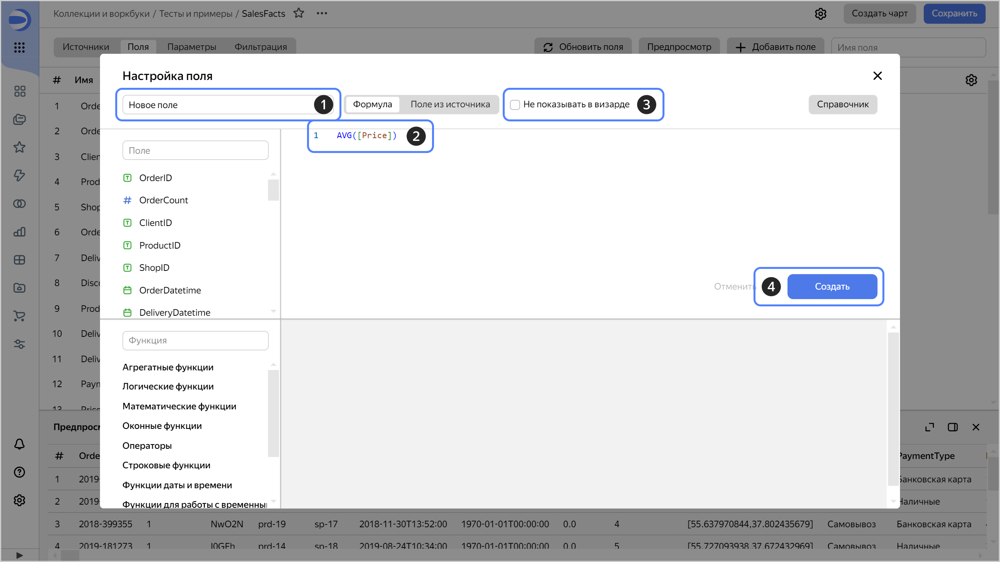

   - Поле данных

     1. Введите название поля.
     1. Перейдите на вкладку **Поле из источника**.
     1. Укажите параметры поля:

        * **ID поля**. Идентификатор создаваемого поля, который используется для передачи параметров фильтрации по этому полю на дашборде или URL чарта. Допускается использовать латинские буквы в нижнем регистре, а также символы `_` и `-`.
        * **Источник**. Таблица в источнике данных, которая содержит нужное поле.
        * **Поле источника**. Поле из выбранной таблицы в источнике данных.
        * **Тип поля**. [Тип данных](./data-types.md) поля.
        * **Агрегация**. [Функция агрегации](./data-model.md#aggregation), которая применяется к полю.

     1. (опционально) Включите опцию **Не показывать в визарде**, чтобы скрыть поле в визарде при создании чарта.
     1. Нажмите кнопку **Создать**. Поле отобразится в датасете.

        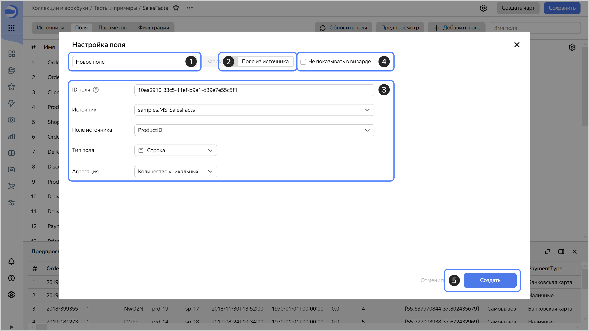

   

### Дублировать поля {#dublicate-fields}

Вы можете продублировать любое поле датасета, в том числе вычисляемое поле, которое вы создали ранее. Для этого:

1. В правой части строки с полем нажмите  (появляется при наведении указателя на строку) и выберите **Дублировать**. В список слева добавится новое поле с типом и настройками исходного.
1. (опционально) Переименуйте дубликат поля, измените его тип и формулу.

## Настроить поля {#setup-fields}

С полями датасета можно выполнять следующие действия:

1. Изменить имя. Чтобы изменить имя поля, нажмите на текущее имя и введите новое.
1. Изменить источник. Если схема таблиц в источнике изменилась, вы можете выбрать новое поле в источнике, которое будет соответствовать полю датасета.
1. Изменить тип данных поля. [Тип данных](./data-types.md) определяет, как данные будут обрабатываться и какие [функции](../function-ref/all.md) можно применять к полю. Чтобы изменить тип данных, нажмите на текущий тип и выберите новый из списка доступных типов.
1. Выбрать тип агрегации. Тип агрегации определяет [функцию агрегации](./data-model.md#aggregation), которая будет применена к полю. Чтобы изменить тип агрегации, нажмите на текущий тип и выберите новый из списка доступных типов агрегации.
1. Настроить права доступа. Вы можете ограничить доступ к значениям поля для разных пользователей или групп пользователей. Для этого нажмите значок  и задайте конфигурацию доступа в формате `'значение_поля': e-mail_пользователя`. Подробнее читайте в разделе [{#T}](../security/row-level-security.md).
1. Сортировать. Вы можете сортировать поля по имени, типу данных, типу агрегации и другим параметрам. Для этого используйте кнопки сортировки в верхней части таблицы полей.
1. Добавить описание. Пояснение к полю можно добавить в столбце **Описание**. Это может помочь другим пользователям понять назначение поля или логику его расчета.
1. Скрыть. Вы можете скрыть поля, которые не нужны в данный момент. Другие пользователи не увидят их в визарде при создании чарта. Для этого нажмите значок .

   
   


### Обновить поля {#update-fields}

Обновление полей необходимо, если вы изменили схему таблицы (или таблиц) в источнике данных или удалили поля из датасета вручную.

Чтобы обновить поля в датасете:

1. В датасете перейдите на вкладку **Поля**.
1. В верхней части экрана нажмите кнопку **Обновить поля**.

   * Если поле отсутствует в датасете, но присутствует в источнике данных, оно появится в списке.
   * Если поле есть и в датасете, и в источнике данных, оно обновится (например, изменится тип).
   * Если поле присутствует в датасете, но отсутствует в источнике данных, оно будет помечено красным. Удалите его из датасета или [замените](#replace-field) другим полем из источника.

   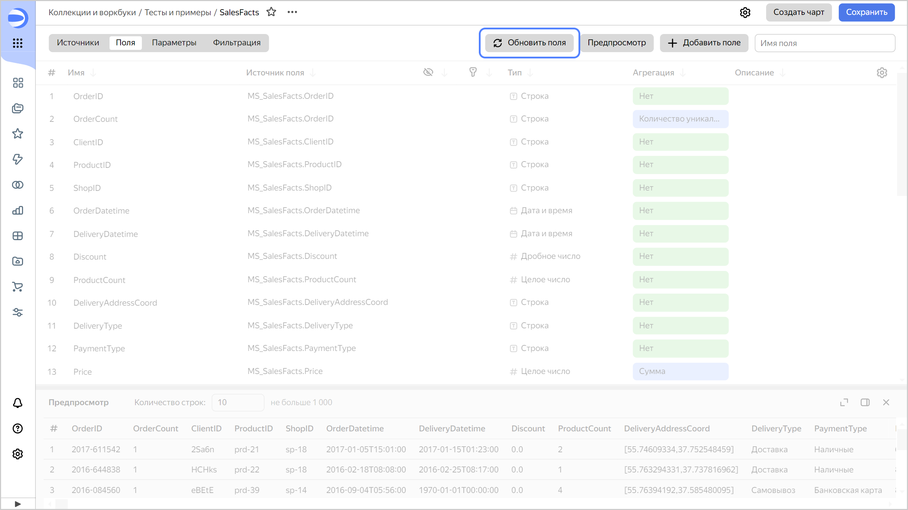

1. В правом верхнем углу нажмите кнопку **Сохранить**.

### Заменить поля {#replace-field}

Если поле было удалено из источника данных, то при обновлении датасета такое поле не обновится. Чарты с таким полем будут отображаться с ошибкой [`ERR.DS_API.FORMULA.UNKNOWN_SOURCE_COLUMN`](../troubleshooting/errors/ERR-DS_API-FORMULA-UNKNOWN_SOURCE_COLUMN.md). Вы можете удалить это поле из чарта или заменить источник для него в датасете.

Чтобы заменить источник поля в датасете:

1. На панели слева нажмите  **Датасеты** и выберите нужный датасет.
1. В левом верхнем углу переключитесь на вкладку **Поля**.
1. В датасете выберите поле, которое хотите заменить.
1. Перейдите к столбцу **Источник поля**.
1. В настройках поля из списка **Поле из источника** выберите поле, которым вы хотите заменить удаленное.

   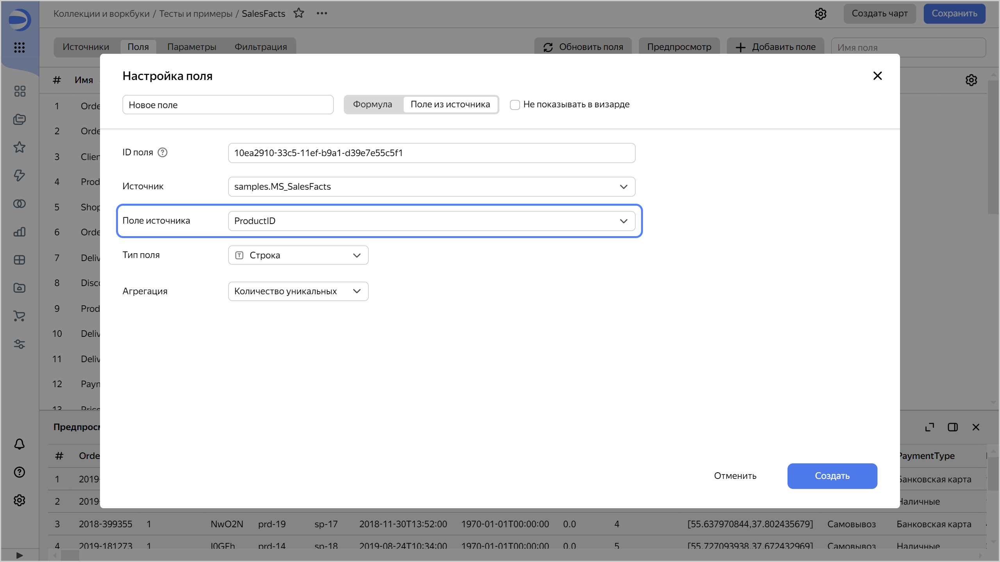

1. Нажмите кнопку **Сохранить**.

## Выполнить операции с полями {#field-operations}

Чтобы выполнить операции с полями, в правой части строки с полем нажмите  (появляется при наведении указателя на строку) и выберите:

* **Дублировать** — создать копию поля с такими же свойствами;
* **Редактировать** — изменить настройки поля, его формулу или источник;
* **Права доступа** — настроить доступ к значениям поля для разных пользователей или групп пользователей;
* **Скопировать ID** — скопировать идентификатор поля для передачи параметров фильтрации по этому полю на дашборде или URL чарта;
* **Удалить** — удалить поле.

### Выполнить массовые операции с полями {#bulk-changes}

В датасете можно отметить сразу несколько полей, чтобы их удалить, скрыть или показать, изменить тип или агрегацию.

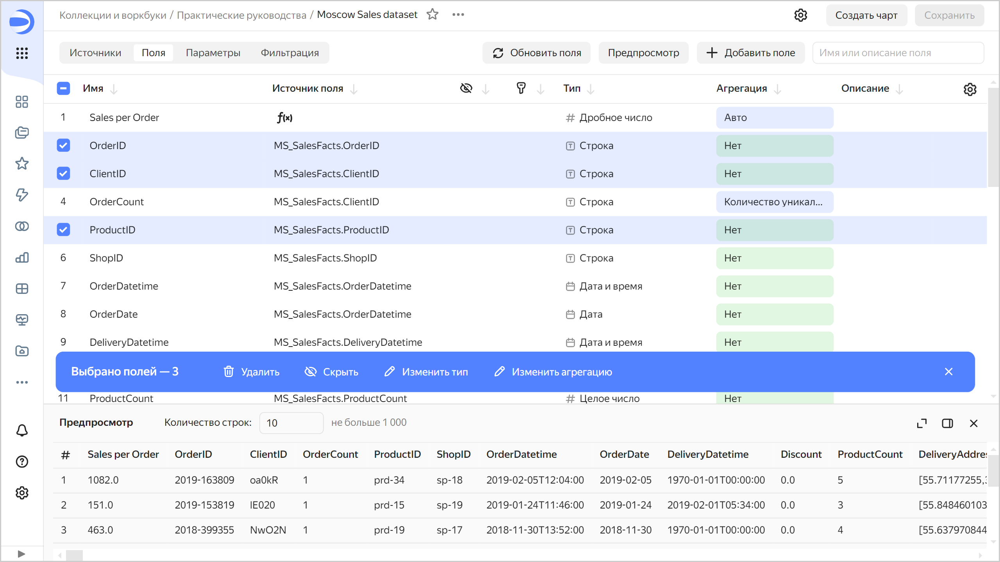

Чтобы выделить диапазон полей, зажмите клавишу **Shift** и отметьте начало и конец диапазона мышью. Вы можете выделить несколько диапазонов. Чтобы выделить каждый диапазон полей, зажмите клавишу **Ctrl** и отметьте начало диапазона мышью, зажмите клавишу **Shift** и отметьте конец диапазона мышью.

## Добавить параметры {#add-parameters}


В датасетах можно использовать параметры:

* в [вычисляемых полях](../concepts/parameters.md);
* в [источниках датасетов](./parametrization.md).




Параметры, добавленные на уровне датасета, доступны во всех чартах, созданных над этим датасетом.



1. В датасете перейдите на вкладку **Параметры**.
1. Нажмите кнопку **Добавить**.
1. В окне **Добавление параметра** введите:

   * **Название**. Задает название параметра.
   * **Тип**. [Тип данных](./data-types.md) параметра.
   * **Значение по умолчанию**. Заполняется обязательно. Используется в случаях, когда значение параметра не определено на дашборде, в URL чарта или в настройках самого чарта.

   
   * **Разрешить использовать в настройке источника**. Активируйте, если планируете использовать параметр при обращении к [источнику датасета](./parametrization.md).
   * **Валидация значений**. Настройка будет доступна, если активировать опцию **Разрешить использовать в настройке источника**. Валидация значений по умолчанию: `^[a-zA-Z0-9а-яА-ЯёЁ_\s\(\)\.\'\=\-\+\*\/\,\<\>\!]+$`. Вы можете настроить свою валидацию с помощью регулярного выражения Python.


1. Нажмите кнопку **Добавить**.

Также вы можете создать параметры [на уровне чарта](../operations/chart/add-parameter-chart.md).


Пример использования параметров в источнике см. в практическом руководстве [{#T}](../tutorials/data-from-ch-dataset-parametrization.md).


## Добавить фильтры {#add-filters}

На уровне датасета можно добавить [фильтры по умолчанию](./settings.md#default-filters), которые применятся к любому новому чарту, созданному на основе данных из текущего датасета.

1. В датасете перейдите на вкладку **Фильтрация**.
1. Нажмите кнопку **Добавить**.
1. Выберите поле, к которому будет применен фильтр.
1. Задайте условие для фильтрации.
1. В правом нижнем углу нажмите кнопку **Применить фильтр**.



Фильтры по умолчанию не применяются к данным в области предпросмотра датасета.




## Отключить возможность экспорта данных {#data-export-disable}

Чтобы отключить возможность экспорта данных из чартов на базе определенного датасета, в правом верхнем углу датасета нажмите значок  и снимите отметку с пункта **Разрешить экспорт данных**.

Теперь в интерфейсе чартов на базе этого датасета в меню  пункт экспорта данных будет недоступен, и пользователи не смогут экспортировать данные из этих чартов. При этом останется возможность копировать данные из чартов и снимать скриншоты.

Чтобы вернуть возможность экспорта данных, в правом верхнем углу датасета нажмите значок  и поставьте отметку на пункт **Разрешить экспорт данных**.

## Настроить доступ {#access}


Настройка доступа к датасету отличается в зависимости от того, где расположен датасет — в [воркбуке](../workbooks-collections/index.md) или папке.

Перед назначением прав доступа для пользователя [добавьте](../security/add-new-user.md) его в {{ datalens-short-name }}.



- Воркбук

  Датасет наследует права доступа, назначенные на воркбук. [Назначьте пользователю права](../workbooks-collections/security.md#wb-coll-grant) на воркбук, чтобы они распространились на датасет.

- Папка

  1. На странице датасета в верхнем меню нажмите значок  и выберите **Права доступа**.
  1. В появившемся окне нажмите кнопку **Права на датасет**.
  1. Введите имя пользователя или группу **Все**.

     
     


  1. (опционально) Напишите комментарий для пользователя, которому выдаете доступ.
  1. Укажите права доступа и нажмите кнопку **Добавить**.

     




Подробнее о доступе к объектам читайте в разделе [{#T}](../security/index.md).


## Удалить датасет {#delete}

Перед удалением датасета проверьте, какими объектами он используется. Для этого вверху датасета нажмите  →  **Связанные объекты**.

Чтобы удалить датасет:

1. Вверху датасета нажмите  →  **Удалить**.
1. Нажмите кнопку **Удалить**.

#### См. также {#see-also}

* [{#T}](./settings.md)
