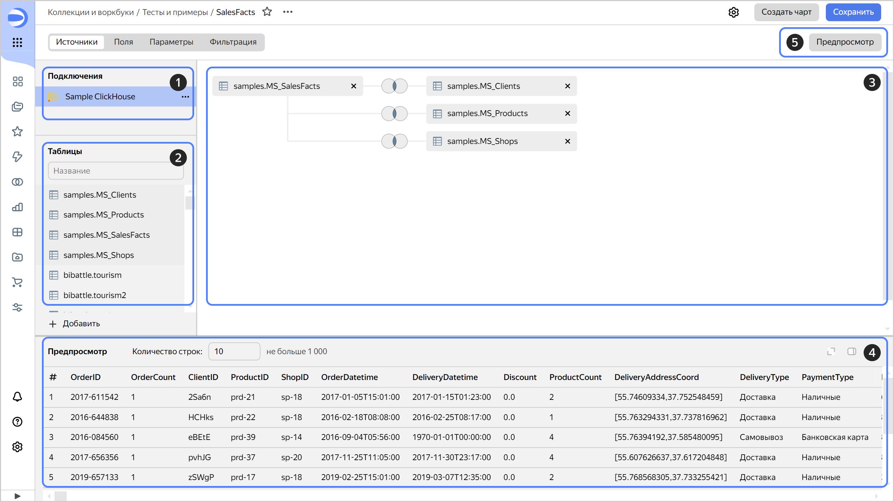
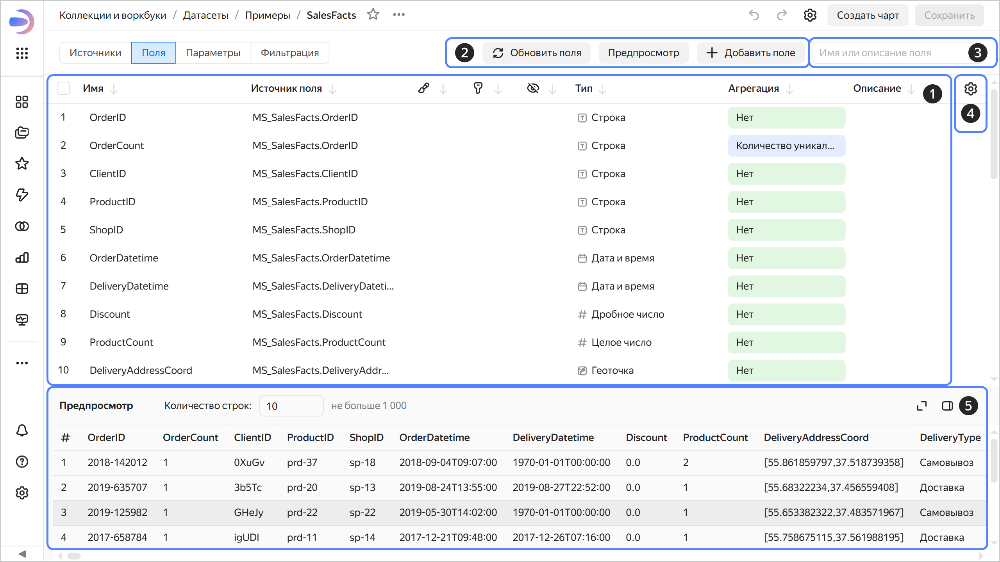
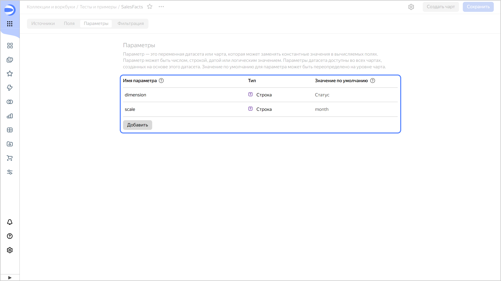
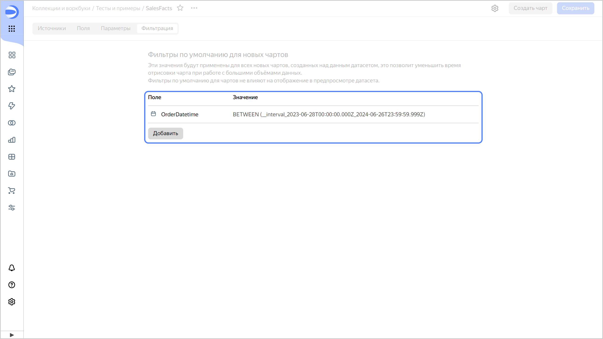

# Датасет в {{ datalens-name }}

_Датасет_ описывает набор данных и его структуру. Набор данных датасета представлен в виде полей.

{{ datalens-short-name }} создает датасет на основе источника данных, для которого существует [подключение](../concepts/connection.md).

Датасет работает с источниками в режиме прямого доступа: все запросы к данным выполняются на стороне источника. При этом изменять данные в самом источнике с помощью {{ datalens-short-name }} нельзя.



## Страница датасета {#dataset-page}

Страница датасета состоит из нескольких вкладок:



- Вкладка Источники

  1. Панель подключений. Здесь отображается подключение к источнику данных, на основе которого построен датасет.
  1. Панель таблиц. Содержит список таблиц, которые доступны в источнике данных.
  1. Рабочая область. Сюда можно перетащить нужные таблицы и настроить между ними связи.
  1. Область предпросмотра. Здесь можно увидеть, как выглядит набор данных датасета. Отображение предпросмотра по умолчанию можно [отключить](./settings.md#preview-default).
  1. Кнопка **Предпросмотр**. Позволяет скрыть или показать область предпросмотра.

     

- Вкладка Поля

  1. Список полей. [Поля](./data-model.md#field), которые определяют структуру и формат датасета.
  1. Кнопки. С их помощью можно [создать](./create-dataset.md#create-fields) новое поле, [обновить](./create-dataset.md#update-fields) существующие и скрыть область предпросмотра.
  1. Строка поиска. Позволяет найти поле по его имени.
  1. Дополнительные настройки. Позволяют настроить отображение полей в списке.
  1. Область предпросмотра. Здесь можно увидеть, как выглядит набор данных датасета. Отображение предпросмотра по умолчанию можно [отключить](./settings.md#preview-default).

     

- Вкладка Параметры

  На вкладке отображаются [параметры](../concepts/parameters.md), созданные на уровне датасета. Здесь можно [добавить новый параметр](../dataset/create-dataset.md#add-parameters) или редактировать существующий.

  

- Вкладка Фильтрация

  На вкладке отображаются [фильтры](./settings.md#default-filters), которые применяются ко всем новым чартам, построенным на основе текущего датасета. Здесь можно [создать новый фильтр](../dataset/create-dataset.md#add-filters) или редактировать существующий.

  



#### См. также {#see-also}

* [{#T}](./create-dataset.md)
* [{#T}](./data-model.md)
* [{#T}](./data-types.md)
* [{#T}](./settings.md)
* [{#T}](../tutorials/data-from-ch-dataset-parametrization.md)
