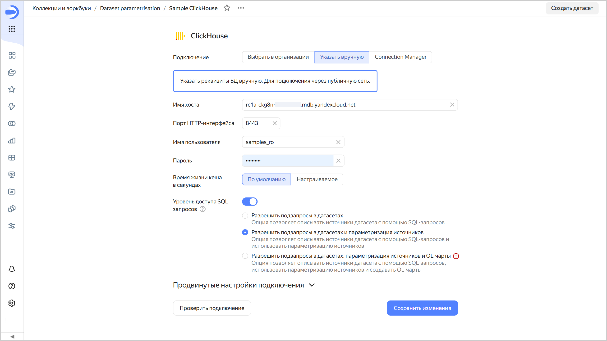
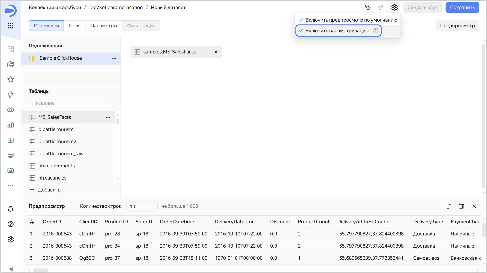

# Параметризация источников датасета

Параметризация источников датасета позволяет динамически подставлять параметры из чарта в SQL-запрос или название таблицы или схемы.

Чтобы включить параметризацию источников:

1. На уровне подключения настройте **Уровень доступа SQL запросов**. Активируйте настройку и выберите уровень **Разрешить подзапросы в датасетах и параметризацию источников**.

   

   

   

1. Создайте датасет и в его настройках  нажмите **Включить параметризацию**.

   

   

   

1. По [инструкции](./create-dataset.md#add-parameters) добавьте параметр и активируйте в нем опцию **Разрешить использовать в настройке источника**. Доступные типы значений: [Целое число](./data-types.md#integer), [Дробное число](./data-types.md#float), [Строка](./data-types.md#string), [Дата](./data-types.md#date), [Дата и время](./data-types.md#datetime).
1. При определении датасета используйте кнопку **Вставить параметр**.

Пример использования параметров в источнике см. в практическом руководстве [{#T}](../tutorials/data-from-ch-dataset-parametrization.md).
   
