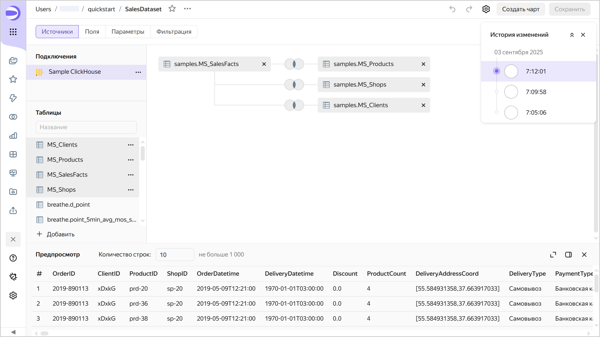
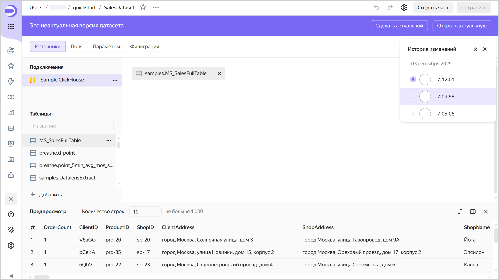
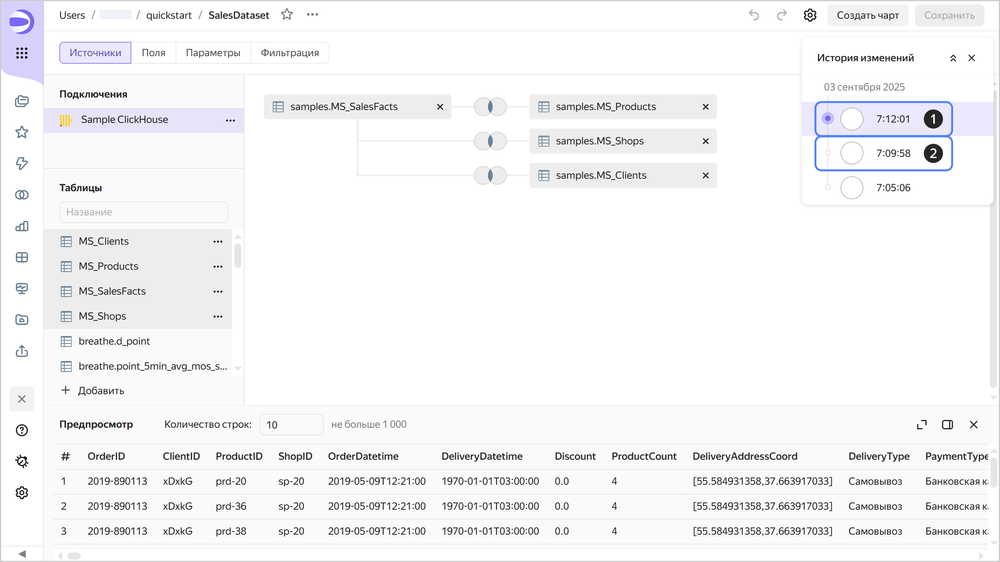

# Версионирование

Версионирование датасета — это возможность хранить историю изменений конфигурации датасета с помощью версий. Список версий доступен пользователям с минимальным правом редактирования на датасет.

Чтобы перейти к списку версий, в верхней части экрана нажмите на значок  и выберите  **История изменений**.

Чтобы перейти к выбранной версии, нажмите на нее в списке. Номер версии отобразится в значении параметра `revId` строки адреса датасета. При переходе по ссылке, содержащей номер версии в параметре `revId`, сразу откроется эта версия датасета.

## Виды версий {#version-types}

Различают следующие версии:

1. **Актуальная**. Последняя сохраненная версия датасета. Отображается всем пользователям, если открыть датасет на просмотр в воркбуке или из панели навигации. Актуальной может быть только одна версия датасета.
1. **Неактуальная**. Версия, которая не является актуальной.  
   При открытии неактуальной версии вверху отображается панель, на которой указаны: тип версии, дата и время создания и логин автора версии. Справа на панели кнопки:

   * **Сделать актуальной** — делает текущую неактуальную версию актуальной. Актуальная на текущий момент версия станет неактуальной.
   * **Открыть актуальную** — открывает актуальную версию.
   
   

   

   

## Создание новой версии {#version-create}

Новая версия автоматически создается после нажатия кнопки **Сохранить** в режиме редактирования датасета. Изменения конфигурации датасета, которые после сохранения приводят к созданию новой версии:

* изменения на вкладке **Источники**:

  * замена [подключения](../concepts/connection.md);
  * [добавление данных](../dataset/create-dataset.md#add-data) на рабочую область из таблиц источника или через SQL-запрос;
  * [настройка связей](../dataset/create-dataset.md#links);
  * изменение настроек таблицы данных. Чтобы открыть окно настроек, справа от таблицы нажмите  → **Изменить настройки**.

* добавление, редактирование, удаление [полей](../dataset/create-dataset.md#field-operations) на вкладке **Поля**;
* добавление, редактирование, удаление [параметра](../dataset/create-dataset.md#add-parameters) на вкладке **Параметры**;
* добавление, редактирование, удаление [фильтра](../dataset/create-dataset.md#add-filters) на вкладке **Фильтрация**.

## Редактирование версий {#version-edit}

Можно редактировать любую версию датасета.

### Редактирование неактуальной версии {#current-version-edit}

Для редактирования неактуальной версии выберите ее в списке версий. Чтобы сохранить изменения неактуальной версии, вверху справа нажмите **Сохранить** — будет создана новая актуальная версия, а все остальные станут неактуальными.

## Ограничения {#restrictions}

* Вы можете переключиться только на версии, созданные начиная с 1 декабря 2024 года. Поэтому если датасет был создан до этой даты, и в настоящее время его редактировали, после сохранения изменений предыдущая версия исчезнет, к ней нельзя будет вернуться.
* История изменений доступна только за последние три месяца.
* История изменений содержит только список версий датасетов и включает: вид версии, дату и время сохранения и автора редактирования.
* Версии датасетов не содержат:

  * изменений прав доступа (эта операция производится отдельно от редактирования самого датасета);
  * изменений настроек подключения, производимых в интерфейсе редактирования параметров подключения;
  * изменений данных в источнике (добавление, обновление или удаление строк в источнике данных).

* В версиях не отображается список изменений. Доступен лишь просмотр сохраненного состояния конфигурации датасета.