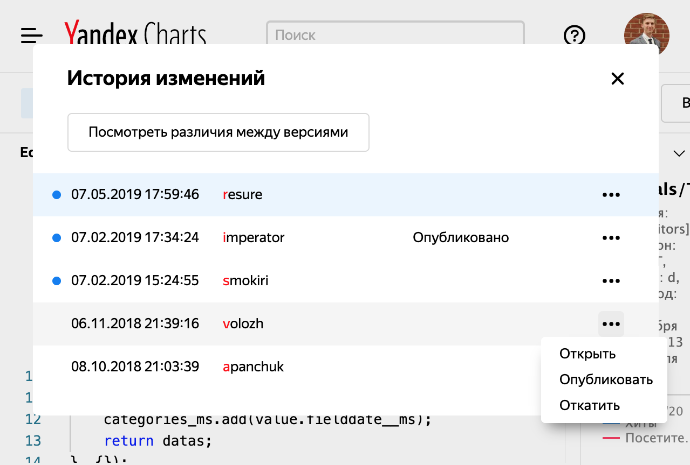

# Версионирование

Все изменения в [Editor](https://charts.yandex-team.ru/editor) версионируются.
Внесенные изменения можно **сохранить** или **опубликовать**.

По умолчанию в Editor работа происходит с последней сохраненной версией.
За пределами Editor, например на [дашбордах](https://dash.yandex-team.ru), по умолчанию используется опубликованная версия.
Такой подход позволяет сохранять изменения в процессе разработки чарта и публиковать стабильную версию.
При необходимости можно явно использовать сохраненную версию, добавив в url чарта параметр `unreleased=1`.

Через диалог "История изменений" можно откатиться на предыдущую версию (тогда она станет сохраненной), либо переопубликовать её.

Аналогичным образом в чартах происходит работа с [модулями](widgets/module/index.md): по умолчанию используется опубликованная версия.
Подробнее про версионирование модуля можно узнать в [соответствующем разделе](widgets/module/index.md#versioning).

Если у чарта нет ни одной опубликованной версии, то его использование приведет к ошибке *«Чарт не найден»*.

Чарты, построенные в [Wizard](https://charts.yandex-team.ru/wizard), всегда публикуются при сохранении, таким образом для них всегда используется последняя версия.
На данный момент в Wizard нет возможности откатиться на предыдущую версию.
