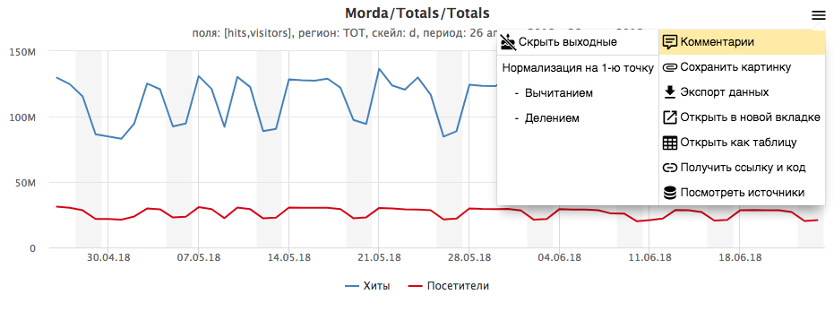
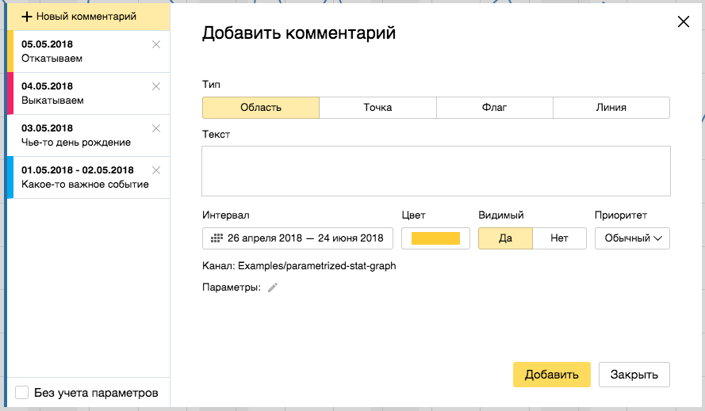
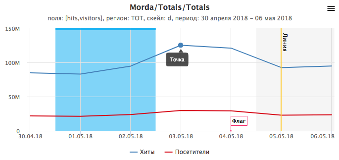
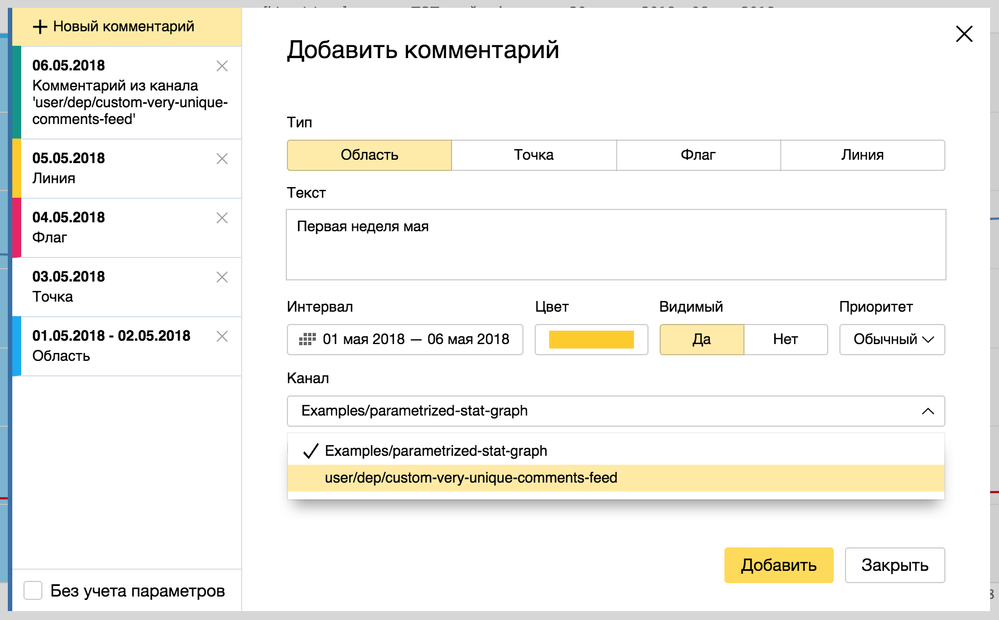
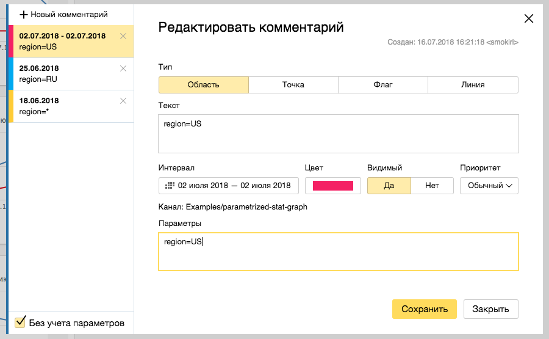
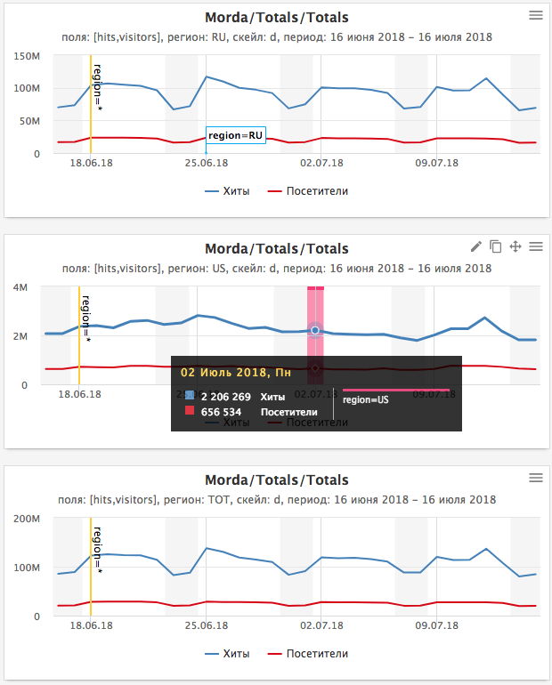

# Комментарии

* [Общая информация](#common)
* [Каналы](#channels)
* [Параметры](#params)

## Общая информация {#common}

Комментарии доступны для **графиков** с **временным рядом**.
Чтобы перейти в форму работы с комментариями достаточно кликнуть на соответствующий пункт в меню:



**Примечание**: Пункт меню "Комментарии" доступен на **скейлах** от **недели** и **меньше**.
*Однако, если комментарий попадает, например, на первый день месяца, то он отобразится на графике с месячным скейлом.*



С помощью формы можно создавать, редактировать и удалять комментарии.
Доступны 4 вида комментариев со своими наборами свойств: область, точка, флаг и линия.



## Каналы {#channels}

Каждый комментарий относится к какому-либо каналу.
Канал по умолчанию - имя скрипта.

Указать список каналов для графика, можно прописав соответствующие настройки в секции `comments.feeds` [на вкладке Config](index.md#config).
Например:

```js
module.exports = {
    comments: {
        feeds: [
            {
                feed: 'user/dep/custom-very-unique-comments-feed'
            }
        ]
    }
};
```

В списке каналов могут быть перечислены, как уже существующие каналы с комментариями, так и новые.

После этого в списке комментариев будут доступны комментарии из других каналов,
и при создании можно будет указать соответствующий канал.



## Параметры {#params}

Каждый комментарий может иметь набор параметров, формирующих срез.

Значения параметров комментария соотносятся со значениями [параметров графика](../../params.md).
Перечислить имена параметров, которые будут проверяться на соответствие, можно
[на вкладке Config](index.md#config) в секции `comments.matchedParams` и отдельно для каждого из каналов.
Например:

```js
module.exports = {
    comments: {
        matchedParams: ['region']
    }
};
```

Теперь можно создать комментарии с разными значениями параметра `region`:



Чтобы указать, что параметр может иметь любое значение можно использовать `*`.
По умолчанию в списке отображаются комментарии с совпавшими параметрами, но включив опцию "Без учета параметров" можно
получить список всех комментариев по указанным каналам.

В зависимости от параметров графика будут отображены соответствующие по параметрам комментарии:


