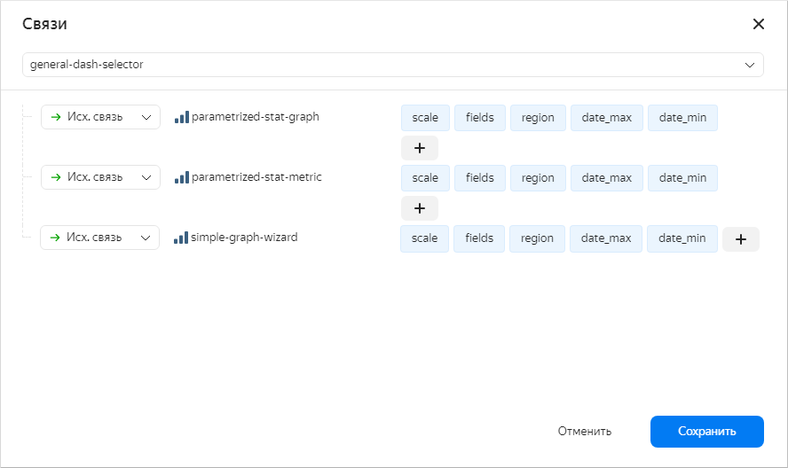

# Внешний селектор на дашборде

## Общая информация {#common-selector}

Чтобы добавить селектор на дашборд, нужно перейти в диалог добавление селектора и выбрать секцию *Внешний селектор*:

После этого необходимо перечислить список параметров селектора и их значения по умолчанию:

Убедиться в том, что селектор связан с другими элементами на дашборде, можно в диалоге *Связей*:

## Специальные параметры {#special-parameters-selector}

Чтобы **в настройках параметров внешнего селектора** указать [относительную дату](../../params.md#relativedate) нужно использовать формат вида `__relative_-7d`.

## Примеры {#examples-selector}

[Дашборд: General](https://dash.yandex-team.ru/osw59jy6s6q2l) +
[Селектор: general-dash-selector](https://charts.yandex-team.ru/editor/gkoxrcwbncrad)

[Дашборд: Post update on change](https://dash.yandex-team.ru/10bn4w2h4f4ax) +
[Селектор: simple-geo-selector](https://charts.yandex-team.ru/editor/Examples/postUpdateOnChange/simple-geo-selector)

## Примечание {#note-selector}

На данный момент для корректной работы нужно перечислять **параметры** и их **дефолтные значения**
**на вкладке Params селектора** и **в настройках параметров внешнего селектора**.
Это связано с тем, что иначе первая загрузка дашборда будет занимать существенно больше времени:
будет выстроено дерево зависимостей всех элементов и пока одни будут загружаться, другие будут их ждать.
Тем не менее, чтобы не синхронизировать вручную параметры с вкладки Params и параметры внешнего селектора,
мы планируем добавить новую вкладку StaticParams или добавить переключение режимов вкладки Params: [CHARTS-1666](https://st.yandex-team.ru/CHARTS-1666).
