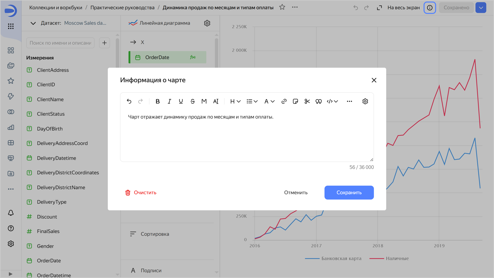
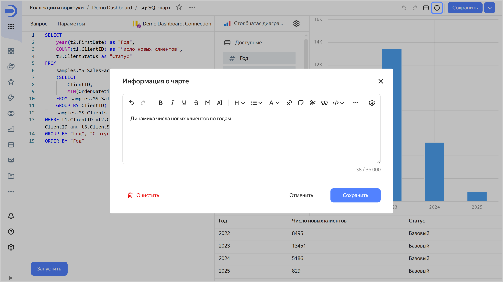
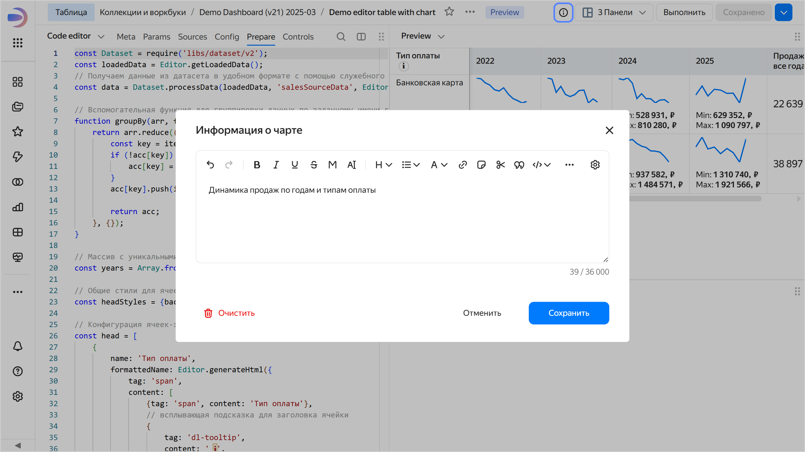
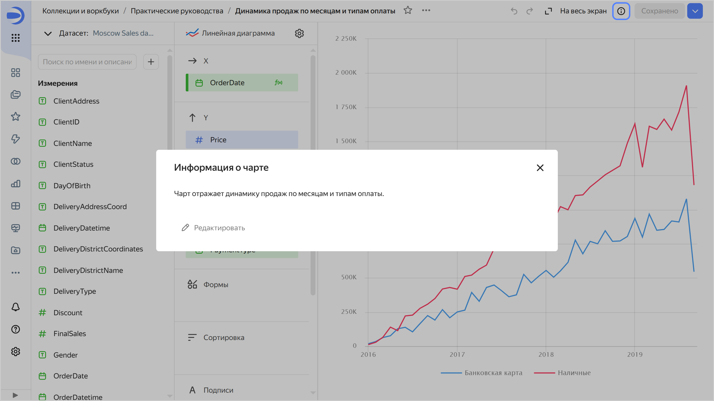
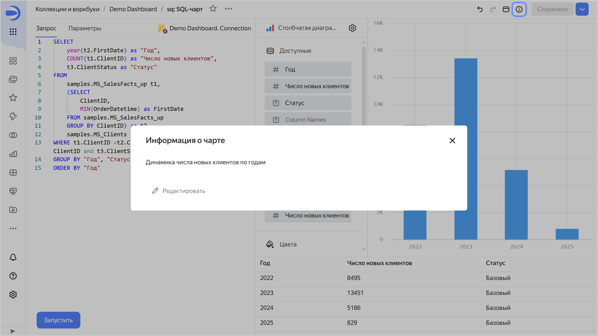
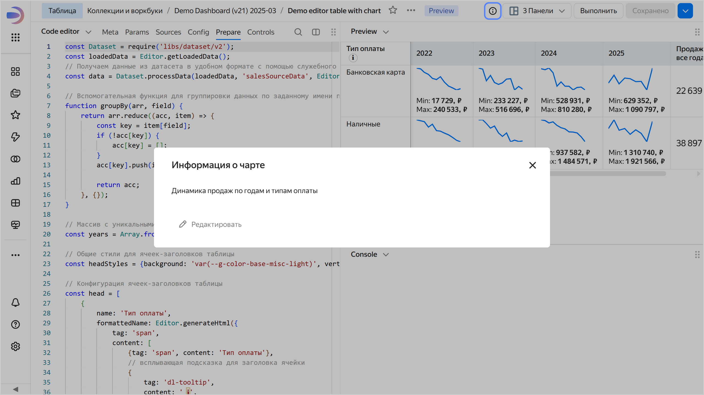

# Добавление информации о чарте в {{ datalens-full-name }}

Чтобы добавить информацию о чарте:

1. Откройте чарт, для которого необходимо добавить информацию.
1. В верхней части экрана нажмите значок .
1. Введите информацию и нажмите **Сохранить**.

   

   

   - Визард {#wizard}
  
     
 
   - QL-чарт {#ql}
  
     

   
   - Editor {#editor}
  
     

   

   

1. В правом верхнем углу экрана нажмите **Сохранить**.

Теперь в правом верхнем углу чарта для всех пользователей появится значок . При нажатии на него откроется окно **Информация о чарте** с информацией.





- Визард {#wizard}

  

- QL-чарт {#ql}

  

- Editor {#editor}

  





Чтобы удалить информацию о чарте, сохраните пустое поле в окне **Информация о чарте**. После этого у всех пользователей значок  отображаться не будет.
