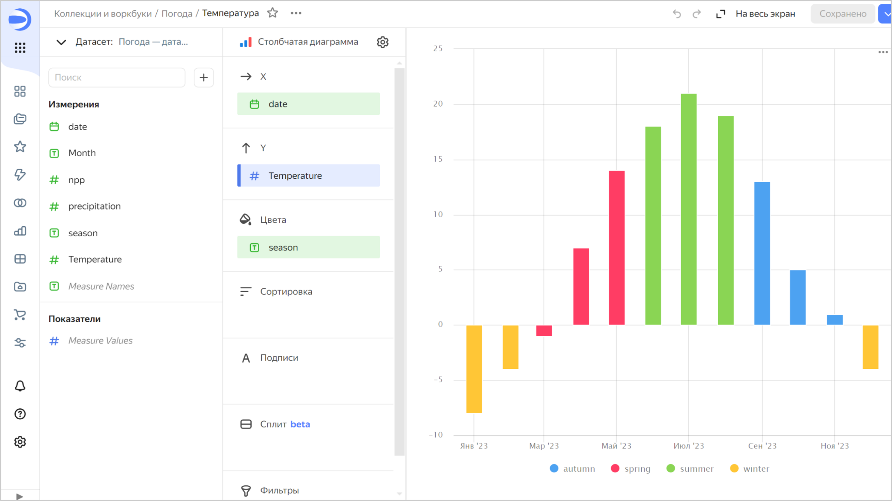
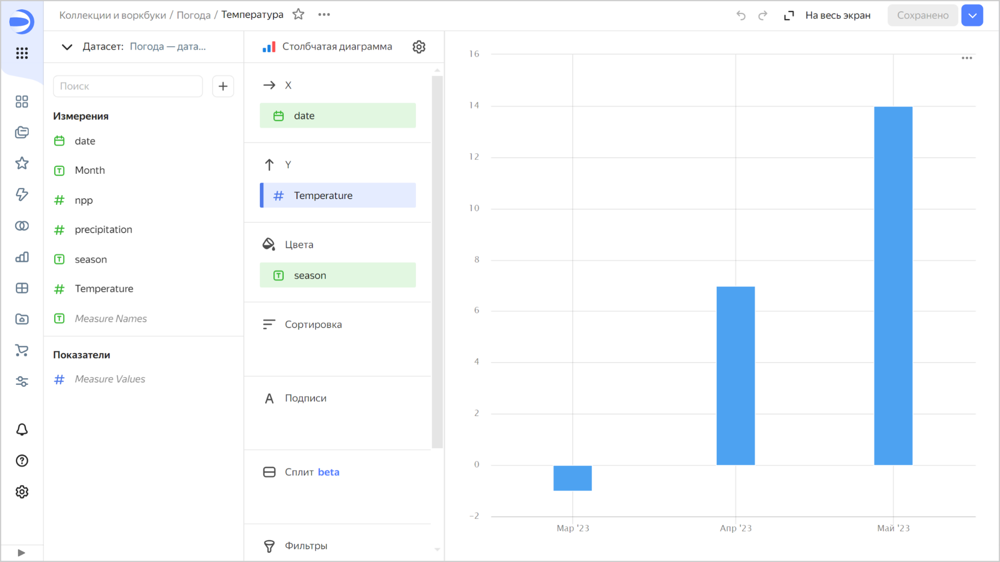

# Добавление ID в качестве параметра

Чтобы передать фильтр в чарт в виде параметра:



1. На панели слева нажмите  **Датасеты** и выберите нужный датасет. Если у вас нет датасета, [создайте его](../../dataset/create-dataset.md#create).
1. В левом верхнем углу переключитесь на вкладку **Поля**.
1. В правой части строки с нужным полем нажмите значок  и выберите **Скопировать ID**.
1. Откройте чарт, в который нужно добавить параметр, и вверху нажмите значок  → **Копировать ссылку**. Вы также можете скопировать URL чарта из адресной строки браузера.
1. Добавьте ID поля к URL чарта в качестве параметра запроса. Должна получиться ссылка вида `{{ link-datalens-wizard }}/yfn1k6yxud7yr-example-chart?17ecb9a1-c8a5-4811-b53e-c8229f88fcba=<значение>`, где:

   * `{{ link-datalens-main }}/wizard/yfn1k6yxud7yr-example-chart` — URL чарта;
   * `17ecb9a1-c8a5-4811-b53e-c8229f88fcba` — ID поля;
   * `<значение>` — одно из значений поля, по которому происходит фильтрация.

   При переходе по такой ссылке чарт откроется с примененным фильтром по указанному полю.







Для фильтрации данных в чарте сформирована ссылка:

`{{ link-datalens-main }}/wizard/3v7xz********-temperatura?season_xw29=spring`, где:

   * `{{ link-datalens-main }}/wizard/3v7xz********-temperatura` — URL чарта;
   * `season_xw29` — ID поля;
   * `spring` — значение поля, по которому происходит фильтрация.

