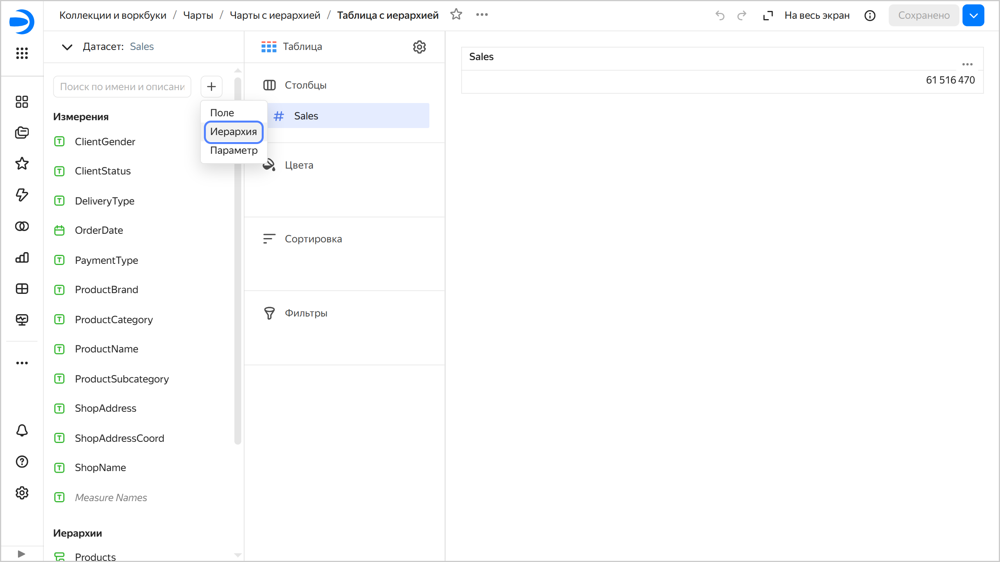
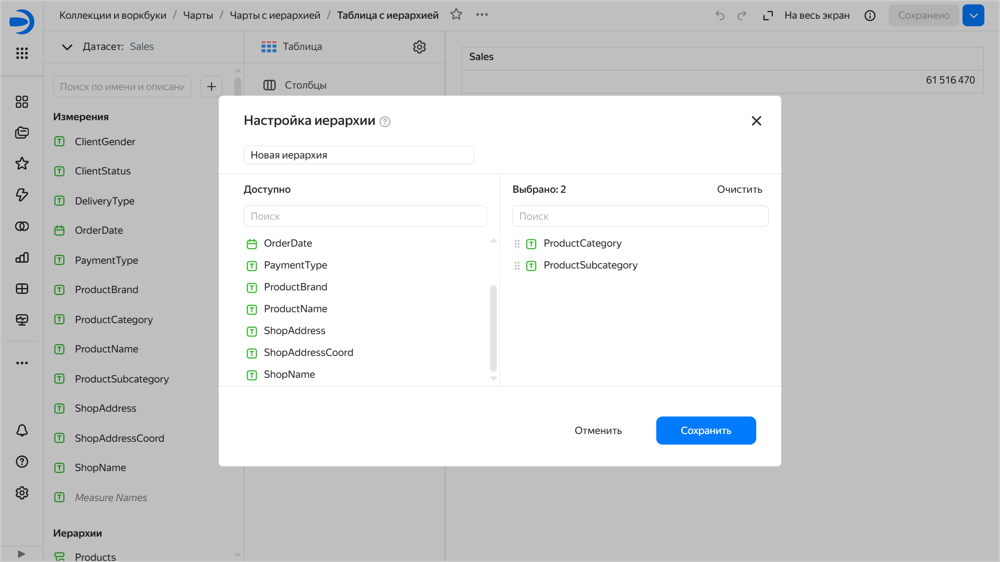
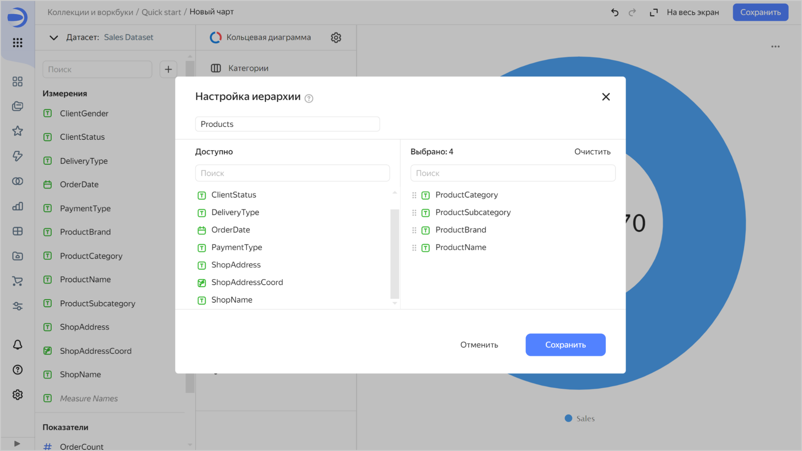

# Добавление иерархии



* Иерархию нельзя использовать в чартах типа **Карта**, **Индикатор** и **Сводная таблица**.
* В чарт можно добавить только одну иерархию.



Чтобы добавить иерархию:



1. На панели слева нажмите  **Чарты** и выберите чарт, в котором необходимо добавить иерархию.

1. В левой части экрана над списком измерений и показателей нажмите значок  и выберите **Иерархия**.

   

1. Введите название иерархии, выберите измерения и расположите их в нужном порядке.

   

1. В правом нижнем углу нажмите кнопку **Сохранить**.
1. Перетащите созданную иерархию в любую доступную секцию. Например, для чарта с типом **Таблица** доступна секция **Столбцы**.
1. Перетащите другие измерения и показатели в нужные секции.
1. В правом верхнем углу экрана нажмите кнопку **Сохранить**.

## Пример добавления иерархии {#add-hierarchy-example}

В качестве источника будет использована демонстрационная база данных {{ CH }} с информацией о продажах товаров в сети московских магазинов. Пример создания подключения и датасета смотрите в [руководстве](../../quickstart.md).

1. В правом верхнем углу датасета нажмите кнопку **Создать чарт**.
1. Выберите тип визуализации **Кольцевая диаграмма**.
1. Добавьте на чарт показатель продаж. Для этого из раздела **Показатели** перетащите поле `Sales` в секцию **Показатели**.
1. В левой части экрана над списком полей датасета нажмите значок  и выберите **Иерархия**.
1. Введите название иерархии `Products` и выберите последовательно измерения: `ProductCategory`, `ProductSubcategory`, `ProductBrand` и `ProductName`.

   

1. В правом нижнем углу нажмите кнопку **Сохранить**.
1. Перетащите созданную иерархию в секцию **Цвет**.

1. Сохраните чарт:

   1. В правом верхнем углу нажмите кнопку **Сохранить**.
   1. В открывшемся окне введите название чарта **Кольцевая диаграмма с иерархией** и нажмите кнопку **Сохранить**.

После добавления иерархии в чарт вы можете переходить между уровнями детализации: **ProductCategory** → **ProductSubcategory** → **ProductBrand** → **ProductName**.

Посмотрите примеры чартов с иерархией на [готовом дашборде](https://datalens.yandex/9fms9uae7ip02?tab=MNb).

#### См. также {#see-also}

* [{#T}](../../dataset/data-types.md#how-to-create-tree).


