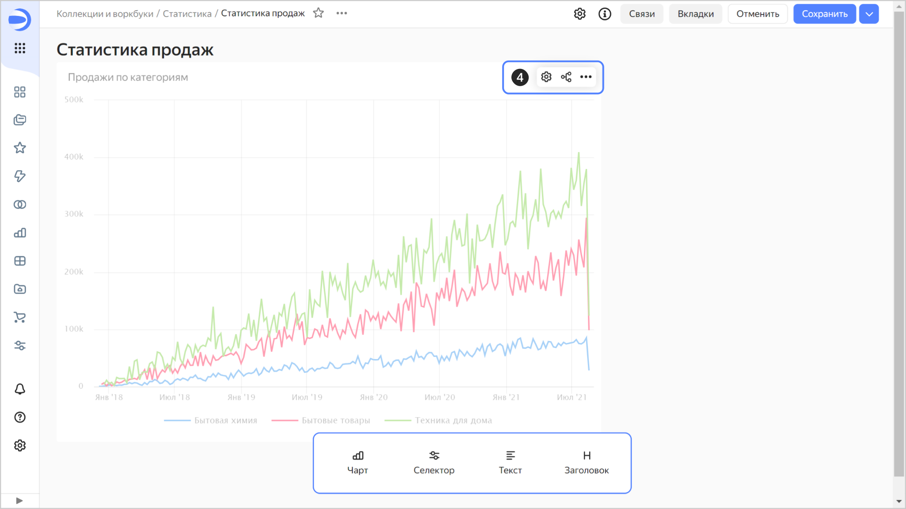
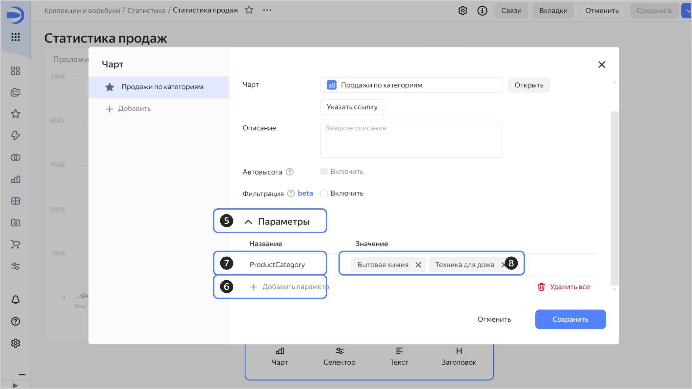
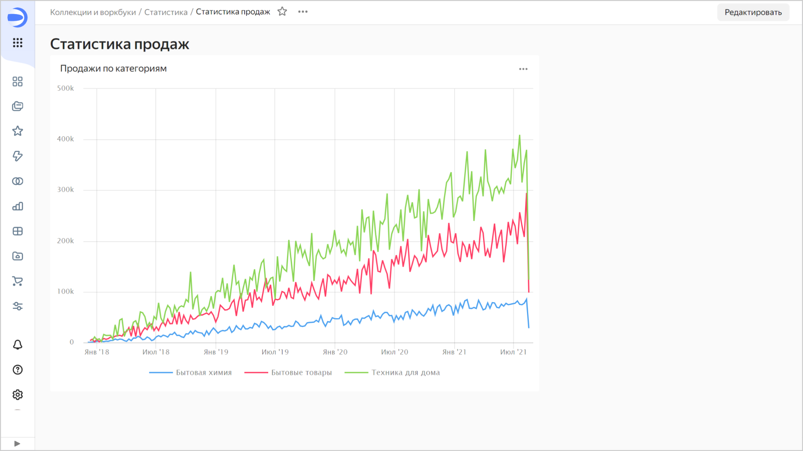
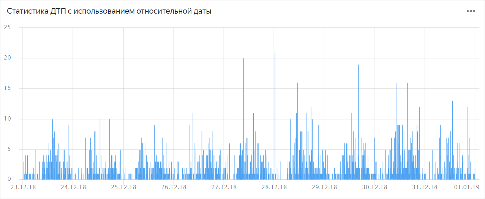

# Добавление параметров в настройках чарта на дашборде

Чтобы установить [параметр](../../dashboard/dashboard_parameters.md):



1. На панели слева нажмите  **Дашборды** и выберите нужный дашборд. Если у вас нет дашборда, [создайте его](../dashboard/create.md).
1. В правом верхнем углу нажмите кнопку **Редактировать**.
1. Выберите чарт, для которого хотите установить новый параметр.
1. В правом верхнем углу чарта нажмите .

   

1. В открывшемся окне нажмите  **Параметры**.
1. Внизу списка нажмите  **Добавить параметр**.
1. В столбце **Название** установите имя (ключ) параметра.
1. В столбце **Значение** нажмите  и установите значение параметра. Вы можете установить несколько значений.

   

1. Нажмите кнопку **Сохранить**.
1. В правом верхнем углу редактирования дашборда нажмите **Сохранить**.









#### Примеры параметров с интервалами {#parameter-interval-examples}



Чтобы установить [интервал](../../dashboard/dashboard_parameters.md#interval) дат и времени с `03-08-2018 09:00:00` по `10-08-2018 10:00:00`, укажите для параметра значение `__interval_2018-08-03T09:00:00_2018-08-10T10:00:00`.





Чтобы взять интервал дат и времени с начала последней недели 2018 года по сегодняшний день, укажите для параметра значение `__interval_2018-12-23___relative_+0d`. 

Чтобы привести статистику на начало года, замените `__relative_-0d` на `__relative_-0y_sy`.



Если не указаны приведения, то для единиц измерения от дня и выше время приводится к началу дня (`00:00:00.000`), а для единиц измерения меньше дня используется текущее время.



