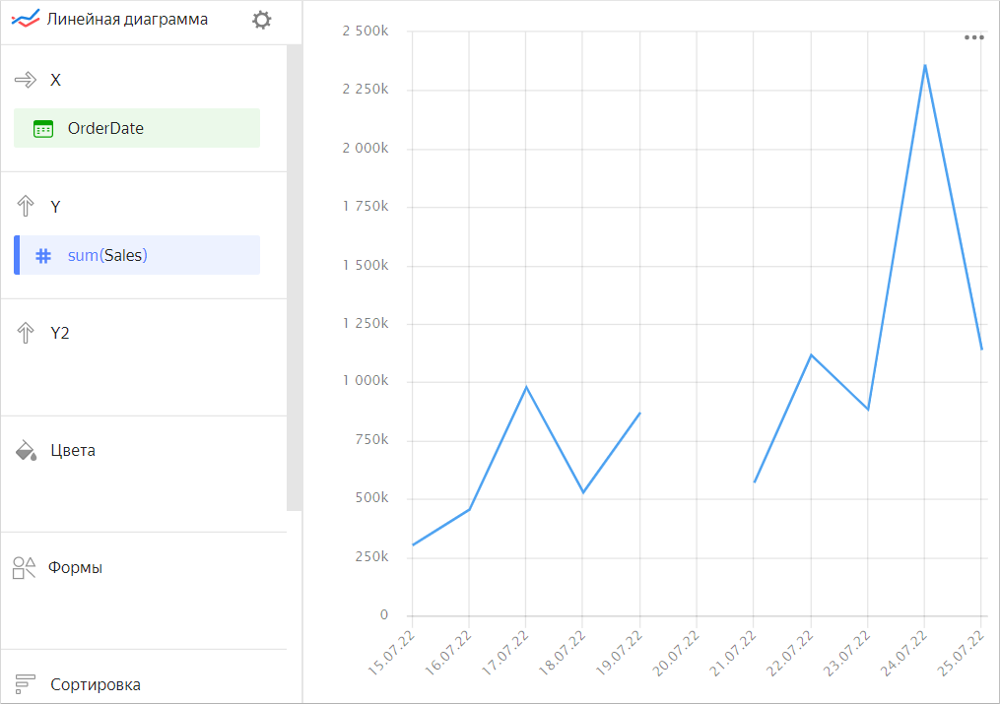
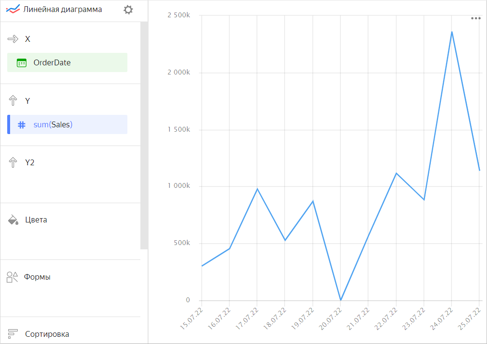
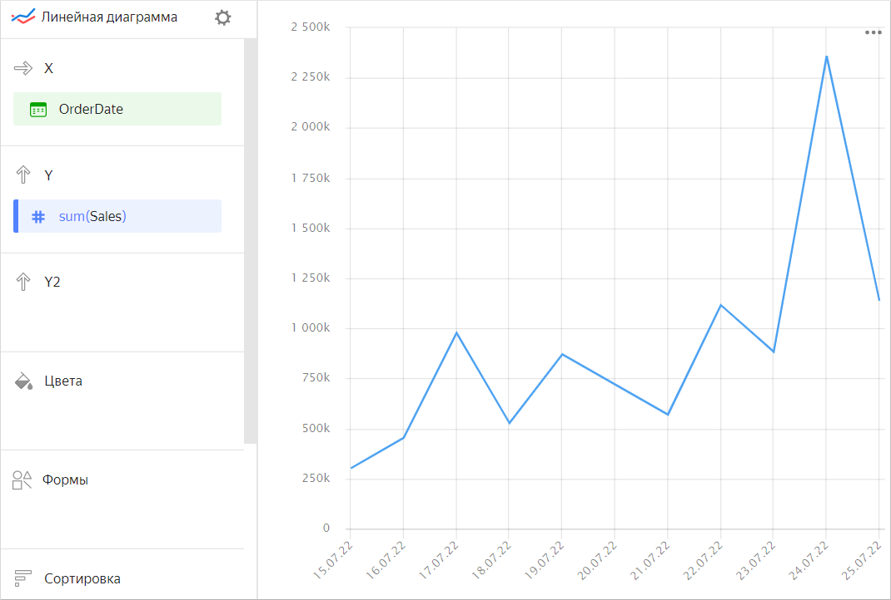

# Настройка отображения пустых (null) значений



Настройка доступна только для тех чартов, у которых есть хотя бы одна ось **X** или **Y**:

* Линейная диаграмма
* Диаграмма с областями (Накопительная и Нормированная)
* Столбчатая диаграмма (в том числе Нормированная)
* Линейчатая диаграмма (в том числе Нормированная)
* Точечная диаграмма



Если в исходных данных есть строка, в которой значение показателя равно `null`, в чарте с настройками по умолчанию график не отобразится в этой точке (будет разрыв линии или пропуск столбца или точки). Например, если в источнике есть строка с датой (`20.07.2022`), а сумма продаж для нее не указана.



| OrderDate | Sales |
| --------- | --------- |
| 15.07.2022 | 301629 |
| 16.07.2022 | 453595 |
| 17.07.2022 | 977583 |
| 18.07.2022 | 527834 |
| 19.07.2022 | 870054 |
| 20.07.2022 | null |
| 21.07.2022 | 569650 |
| 22.07.2022 | 1116034 |
| 23.07.2022 | 883208 |
| 24.07.2022 | 2359483 |
| 25.07.2022 | 1137851 |



Вы можете настроить отображение на диаграмме пустых значений в настройках секции чарта:

1. В секции с показателем, отображение значения которого надо настроить, в правом верхнем углу нажмите значок  (значок появляется при наведении указателя на секцию).
1. В **Пустые значения (null)** выберите `Отображать как 0`.
1. Нажмите **Применить**.

Теперь при построении графика значения `null` будут заменены на `0`.

Если в исходных данных совсем нет строки, настройки секции чарта не изменят отображение показателя на диаграмме. Например, если в источнике нет строки с определенной датой (`20.07.2022`), данные на эту дату не отобразятся.



| OrderDate | Sales |
| --------- | --------- |
| 15.07.2022 | 301629 |
| 16.07.2022 | 453595 |
| 17.07.2022 | 977583 |
| 18.07.2022 | 527834 |
| 19.07.2022 | 870054 |
| 21.07.2022 | 569650 |
| 22.07.2022 | 1116034 |
| 23.07.2022 | 883208 |
| 24.07.2022 | 2359483 |
| 25.07.2022 | 1137851 |


