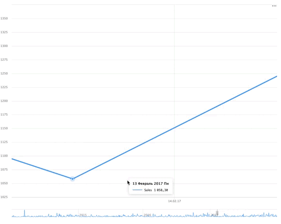

# Настройка навигатора

Настройка навигатора доступна, если:

* Тип чарта: **Линейная диаграмма**, **Накопительная диаграмма с областями** или **Нормированная диаграмма с областями**;
* В секции **X** находится поле с типом `Дата` или `Дата и время`.

Чтобы настроить навигатор:



1. На панели слева нажмите  **Чарты** и выберите чарт, у которого необходимо настроить навигатор.
1. В левой части экрана над чартом нажмите значок .
1. В окне **Настройки чарта** включите опцию **Навигатор**.
1. Выберите режим отображения навигатора:

   * **Все линии** — для отображения в навигаторе всех линий, которые есть в чарте.
   * **Выбрать линии** — для отображения в навигаторе выбранных линий.

1. Укажите **Дефолтный период**. При каждом открытии чарта будет отображаться последний период, соответствующий данной настройке. Укажите значение `0` или оставьте поле пустым для отображения всего диапазона значений.
1. Нажмите **Применить**. Навигатор отобразится внизу чарта.



   .



